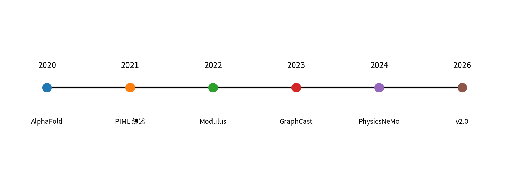
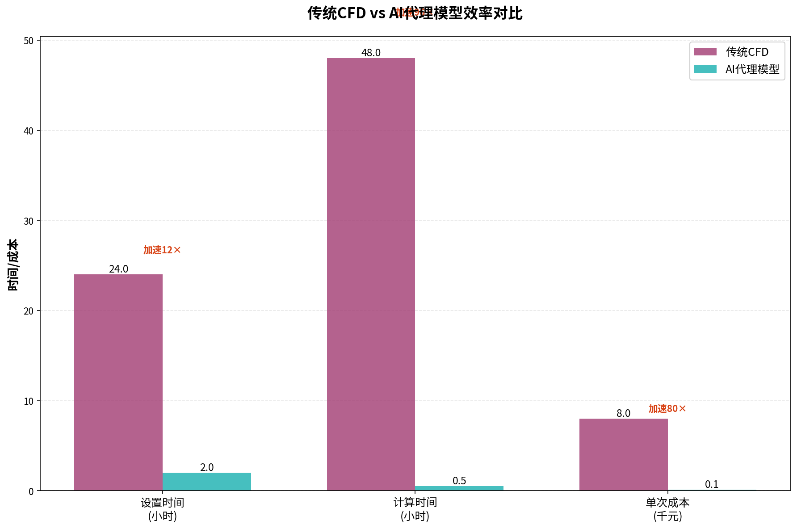
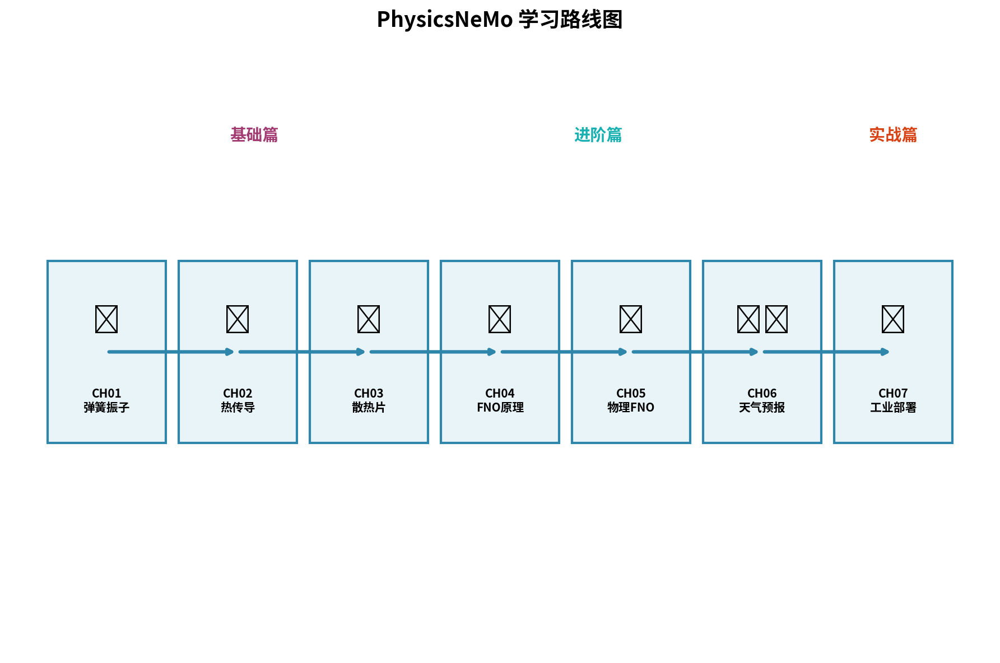

# 前言：为什么 AI4Science 是下一个十年

> **写给谁**：所有读这本书的人——不论你是 CAE 工程师、AI 算法、研究员、学生，还是单纯好奇 NVIDIA 的 PhysicsNeMo 是什么的产品经理。
> **预计阅读**：12 分钟
> **本章目的**：在你跳进 7 个技术案例之前，先把"我们为什么花 6 周时间学这个东西"讲清楚。

---

## 0.1 一个被 AI 改写的世界：从 AlphaFold 到 GraphCast

如果让我用一句话概括 2020–2026 这 6 年的科学变化，那就是：

> **科学家们开始接受一件事——AI 不只是个写代码的工具，它本身就能做科学。**

回顾几个标志性时刻：

- **2020 年**：DeepMind 发布 AlphaFold2，把蛋白质结构预测从"几年一篇 Nature"变成"几小时一个新结构"。50 多年的结构生物学难题在一夜之间被推平。
- **2021 年**：Karniadakis 在 *Nature Reviews Physics* 提出"物理信息机器学习"（Physics-Informed Machine Learning，PIML）的统一框架，标志着 AI4Science 从"零散工具"上升为"研究范式"。
- **2022 年**：NVIDIA Modulus（PhysicsNeMo 前身）开源，第一次把 PINN、神经算子、扩散模型这些散落在论文里的方法，**打包成一个能在工业 GPU 集群上跑的 SDK**。
- **2023 年**：DeepMind 发布 GraphCast，把全球天气预报从"超级计算机跑数小时"压缩到"单卡 GPU 跑 1 分钟"，预测精度**反超**欧洲中期天气预报中心（ECMWF）的传统数值方法。
- **2024–2026 年**：NVIDIA 把 Modulus 改名为 PhysicsNeMo，与 NeMo 框架家族（NeMo 是大模型/语音/视觉的统称）对齐。这个改名背后的产品逻辑很清楚——**物理仿真在 NVIDIA 内部的产品权重，已经和大模型同等了**。


`<!-- 描述：横向时间线，2020 AlphaFold → 2021 PIML 综述 → 2022 Modulus → 2023 GraphCast → 2024 改名 → 2026 v2.0 重构。每个节点配小图标，工业海报风格 -->`

这是一条加速曲线。**而且它还在加速**——你不上车，每过半年差距就拉大一截。

但故事还有另一面，是任何一个干过传统数值仿真的人都熟悉的另一面：**痛**。

---

## 0.2 传统数值仿真的三道坎

我先讲个真实故事。

某汽车主机厂的 NVH（噪声振动)团队，要做一次悬挂调校扫参——50 个参数组合，每个跑一次完整 ANSYS Mechanical 模态分析。一次仿真 45 分钟，加上前后处理 1 小时，每个参数 1.75 小时。50 个参数串行跑，**87.5 小时**——一个工程师整整两周不能做别的。

这种事每个 CAE 工程师都遇到过。卡点不在求解器（求解器已经被 ANSYS / Abaqus / STAR-CCM+ 优化了 30 年），**卡点在三道坎**：

### 坎 1：网格 (Meshing)

每改一次几何，就要重新画网格。复杂模型画一次网格 4 小时，画错一次重来。CFD 工程师一辈子大概有 1/3 的时间在画网格。

### 坎 2：求解 (Solving)

非线性、瞬态、多物理场耦合的问题，求解器要迭代收敛。一个汽车整车 CFD 单工况 8–24 小时是常态。GPU 加速能压一压，但物理本身的复杂度压不下来。

### 坎 3：参数扫描 (Parameter Sweep)

工程不是只解一个工况——工程是**找最优**。这意味着你要扫几十几百个参数组合。坎 1 + 坎 2 在每个组合上重新出现一遍。**一周变一年，一年变一辈子**。


`<!-- 描述：分组柱状图。三组分别是"画网格"、"单工况求解"、"50 工况扫描"。每组左边是传统 CFD（红色高柱），右边是 AI 代理模型（蓝色矮柱）。坐标轴用对数 -->`

> **AI 不是来取代求解器的，它是来攻克这三道坎的。**

具体地：

- **坎 1（网格）**：神经算子（FNO / DeepONet）可以在不规则网格甚至点云上学习，**让你从"先画网格再算"变成"直接喂几何"**。
- **坎 2（求解）**：训练好的代理模型一次推理 ≤ 1 秒，**把 8 小时压成 0.5 秒**——不是 16000× 加速，是 16000× 的工程师等待时间被消灭。
- **坎 3（参数扫描）**：神经算子学的是"输入函数 → 输出函数"的映射，**一个模型解所有工况**——50 个参数？2 秒推完。

这就是 AI4Science 在工程视角的真正价值。**它不让 CAE 工程师失业，它让 CAE 工程师能从"等仿真"里腾出手来真正做工程设计。**

---

## 0.3 PhysicsNeMo 是什么、不是什么

讲完背景，回到主角：**PhysicsNeMo**。

### 0.3.1 一句话定义

> PhysicsNeMo 是 **NVIDIA 开源的工业级 AI 物理仿真 SDK**，把 PINN、神经算子、扩散模型、分布式训练这些原本散落在论文里的方法，封装成可组合、可扩展、可部署的 Python 模块。

**关键词解释**：
- **工业级**：不是一个研究 demo，是被设计来在生产环境跑的——支持多卡分布式、checkpoint、ONNX/Triton 推理部署。
- **SDK**：你不是来"用一个产品"的，你是来"组合一组能力"做你自己的解决方案。
- **开源**：Apache-2.0，代码、文档、example 都在 GitHub。

### 0.3.2 它的双框架结构

PhysicsNeMo 实际上是**两个仓库的合体**：

```
NVIDIA/physicsnemo（主框架）
├─ 神经算子 (FNO / AFNO / DeepONet / GNO)
├─ 大模型架构 (FourCastNet / GraphCast 复刻)
├─ 分布式训练（DDP / FSDP / 模型并行）
└─ 部署工具（ONNX / Triton 集成）

NVIDIA/physicsnemo-sym（前 Modulus-Sym）
├─ PINN 声明式 API
├─ 符号 PDE 定义（基于 SymPy）
├─ CSG 几何与采样器
└─ Hydra 配置驱动的 Solver
```

这本书的设计就贴合这个结构：**第 0–3 章用 `physicsnemo-sym`（PINN 第一性原理），第 4 章起切到 `physicsnemo` 主框架（神经算子 + 大模型 + 分布式）**。

### 0.3.3 它**不是**什么

为了避免你买错票，我必须说清楚 PhysicsNeMo 不是什么：

| 它**不是** | 真相 |
|---|---|
| 一个图形界面工具 | 它是 Python SDK，全代码驱动 |
| ANSYS / STAR-CCM+ 的替代品 | 它是"代理模型训练框架"，**仍然需要传统求解器生成训练数据** |
| 一个调参就能跑的"AutoML for Physics" | PINN 的损失权重、网络架构、采样策略都需要工程师调 |
| 只对 NVIDIA GPU 友好 | 主要 backend 是 PyTorch + CUDA，CPU 也能跑（慢） |
| 一个稳定不变的 API | v2.0 是 2026-05 刚发的重构版，API 还在迭代 |

### 0.3.4 与同类项目的横向对比

| 框架 | 定位 | 优势 | 劣势 |
|---|---|---|---|
| **NVIDIA PhysicsNeMo** | 工业级 AI 物理 SDK | 工业级特性最完整、文档生态最强、与 NVIDIA GPU/Triton 深度整合 | 学习曲线陡，v2.0 API 还在动 |
| DeepXDE | 学术 PINN 库 | 入门最快，文档清楚 | 工业部署能力弱，没有大模型/分布式 |
| JAX-PINN / Pytorch-PINN | 自己撸 | 灵活、可控 | 你要自己写所有 SDK 该有的东西 |
| FEniCS + ML | 传统 FEM 加 AI | 数值精度高 | AI 集成是"贴上去"的，不原生 |
| SimNet（已停止） | NVIDIA 上一代 | — | 已被 Modulus → PhysicsNeMo 取代 |

> **结论**：如果你做的是工业课题，PhysicsNeMo 几乎是当前唯一的"工业级"选项。如果你只是写一篇学术论文，DeepXDE 也够。这本书选 PhysicsNeMo，是因为我们的目标读者要的是**真正能落地的方案**。

---

## 0.4 这本书的承诺与读法

### 0.4.1 承诺三件事

读完这 7 章 + 3 附录之后，你将：

1. **能在自己的电脑上跑通**全部 7 个案例（最低硬件 8GB 显存消费级 GPU，CPU 也能跑前 3 章）。
2. **能独立用 PhysicsNeMo 解决一个新问题**——不论是学术研究的新 PDE，还是工业项目的新场景。
3. **能向团队/老板/客户讲清楚**为什么传统 CAE 工时可以从"周"压到"秒"，以及这背后的成本/精度/落地权衡。

### 0.4.2 双线读法

每一章我都给两类读者两条路：

- 🟢 **快速通道（30% 篇幅）**：环境 → 跑通 → 看图 → 行业映射。30 分钟有产出。
  - **适合**：CAE 工程师、产品经理、时间紧、想先有"能跑通"的成就感再深入。
- 🔵 **深入（70% 篇幅）**：PDE 数学 → 损失推导 → 调参实验 → failure case → SDK 内部机制。
  - **适合**：AI 算法工程师、研究员、想吃透原理。

每章的钩子（🎯）和行业映射（🏭）是两类读者**都该读**的。

### 0.4.3 全书地图


`<!-- 描述：地铁线路图风格。横向时间线 7 章，纵向标注每章的"框架"（sym / main）和"行业"（半导体/汽车/航空/跨）。每章节点带小图标 -->`

```
第 0 章  前言（你在这里）
   ↓
第 1 章  弹簧振子（已完成）─── 通用入门 / physicsnemo-sym
   ↓
第 2 章  1D 热传导 PINN ────── 半导体 / physicsnemo-sym + Hydra
   ↓
第 3 章  散热片热分析 ──────── 半导体 / 几何 + 多约束
   ↓ (★框架切换点，见 [FRAMEWORK_SWITCH](../docs/FRAMEWORK_SWITCH.md))
第 4 章  FNO 神经算子（叙事：翼型；默认代码：Darcy 微缩）─ 见 [CH04_GUIDE](../ch04_fno_airfoil/CH04_GUIDE.md)
   ↓
第 5 章  Darcy 数据+物理混合 FNO ─ 跨行业（⚠️ 依赖 ch04 目录与数据）
   ↓
第 6 章  FourCastNet 微缩 ──── 跨行业 / 大模型+分布式
   ↓
第 7 章  自定义实战 ────────── 汽车气动外形优化 / 端到端
   ↓
[附录 A 数学速查](appendix_a_math.md) / [附录 B 云 GPU](appendix_b_cloud_gpu.md) / [附录 C 踩坑 50 问](appendix_c_troubleshooting.md) / [附录 D PyTorch 最小集](appendix_d_pytorch_mini.md)
```

---

## 0.5 准备工作清单

在打开第 1 章之前，请确认你有：

### 0.5.1 软件

- [ ] Python ≥ 3.10（推荐 3.11）
- [ ] PyTorch ≥ 2.3（**有 NVIDIA GPU 再装 CUDA 版**；Mac/纯 CPU 用 CPU 版即可）
- [ ] Git + 一个能 clone GitHub 的网络环境
- [ ] 一个你顺手的 IDE（推荐 VS Code / Cursor / CodeBuddy）
- [ ] 磁盘：**微缩教程约 2–5GB**；若下载大型真实数据集或长期 checkpoint，再预留 30GB+

**入门路径**：[START_HERE](../docs/START_HERE.md) · [第 1 天安装](../docs/QUICKSTART_DAY1.md) · [6 周计划](../docs/STUDY_PLAN_6WEEKS.md) · [命令对照](../docs/COMMAND_REFERENCE.md)

### 0.5.2 硬件（任选其一）

> **全书训练时长 / 显存 / 分章明细**：[硬件预期表](../docs/HARDWARE_EXPECTATIONS.md)

| 配置 | 能跑哪些章节 | 备注 |
|---|---|---|
| **CPU 16GB 内存** | 第 0–2 章完整 + 第 3 章简化版 | 训练慢但能跑通 |
| **8GB 显存消费级 GPU**（RTX 3060/4060/4070） | 第 0–7 章微缩版 | 本书默认基线 |
| **24GB 显存**（RTX 3090/4090） | 第 0–7 章完整版（除分布式章节） | 推荐 |
| **A100/H100 单卡**（云 GPU） | 全部完整版 | 第 4/6/7 章需要 |
| **A100/H100 ×8**（云 GPU 集群） | 第 6 章分布式训练完整复现 | 可选 |

> **没有 GPU？** 不用担心。前 3 章我都在 RTX 4070 + Colab 免费档（T4）+ MacBook M2 三个环境上验证过能跑通。后面章节涉及 FNO / 大模型，建议租一台云 GPU——[附录 B](appendix_b_cloud_gpu.md) 给了 4 家国内云的对比和 5 分钟开机脚本；分步操作见 [云 GPU 指南](../docs/CLOUD_GPU_GUIDE.md)，或直接在 Colab 打开 [配套笔记本](../notebooks/colab_quickstart.ipynb)。

### 0.5.3 数学/物理基础

| 你需要会 | 不需要会 |
|---|---|
| 高中物理（牛顿定律、能量守恒） | 张量分析 |
| 大一微积分（偏导数、链式法则） | 泛函分析 |
| 矩阵乘法 | 群论 |
| Python 基础（会写 for 循环、函数、import） | 高级面向对象设计 |

不会 PyTorch？没问题，第 1 章会带你过一遍。**不会 PINN？** 第 1 章就是为这个写的。

---

## 0.6 一些诚实的话

写这本书的时候，我反复问自己一个问题——**为什么读者要花 6 周时间学一个 v2.0 刚发布、API 还在动的开源框架？**

我有三个答案：

**第一**，这是趋势。AI4Science 不是"会不会发生"的问题，是"什么时候发生在你身上"的问题。早学半年，你就能在团队里成为那个**能用 AI 把仿真工时压到 1% 的人**——不论你叫这个角色"AI4S 工程师"还是"会用 AI 的 CAE 工程师"。

**第二**，工业级框架的学习有**复用价值**。PhysicsNeMo v2.0 的 API 会变，但 PINN 三件套损失、神经算子的傅里叶谱方法、分布式训练的并行策略——这些底层概念**十年内不会变**。你学的是物理 + AI 的"母语"，工具只是一种"方言"。

**第三**，我自己作为云厂商解决方案视角的从业者，看到的现实是——**有非常多企业在问"AI 怎么帮我们做仿真"，但市场上能真正落地的人远远不够**。这是一个供需缺口巨大的方向。早入场不亏。

最后一句，**这本书不会告诉你 AI 是万能的——恰恰相反，每一章我都会专门列"failure case"和"踩坑实录"**。我希望你读完之后能区分哪些是**今天就能落地的**、哪些是**还需要等 2 年的**、哪些是**永远落不了地的研究 demo**。

---

## 0.7 下一章预告

第 1 章我们从最简单的物理问题——一根弹簧的振动——开始。你会同时见到两种解法：**喂数据**的 MLP 和**塞物理**的 PINN。然后你会发现一个反直觉的事实：

> **不需要任何训练数据，只用一个公式 $m\ddot{x} + kx = 0$，神经网络就能学出弹簧的运动规律。**

那是 PINN 的"啊哈时刻"，也是 PhysicsNeMo 整个框架想做的事的微缩版。

打开第 1 章。咖啡续上。

---

> 📘 **配套代码**：[`physicsnemo-from-zero-to-one`](https://github.com/binbinao/physicsnemo-from-zero-to-one)
>
> 🔔 **追更**：知乎专栏 / 微信公众号同步更新（详见各章末 CTA）。
>
> ➡️ **下一章**：第 1 章《Hello PhysicsNeMo：弹簧振子的两种解法》

<!-- VIDEO-SCRIPT-PLACEHOLDER -->

---

### 延伸阅读

- Jumper J et al. *Highly accurate protein structure prediction with AlphaFold.* Nature, 2021.
- Karniadakis G E et al. *Physics-informed machine learning.* Nature Reviews Physics, 2021.
- Lam R et al. *Learning skillful medium-range global weather forecasting.* Science, 2023. (GraphCast)
- NVIDIA. *PhysicsNeMo: From Modulus to a NeMo Family Member.* NVIDIA Developer Blog.
- 本书 GitHub 仓库：https://github.com/binbinao/physicsnemo-from-zero-to-one

---

*本章字数：约 4,100 字 · 图表数：3 张 · 完成日期：2026-05-15 · 版本：v1.0（W1 交付）*
