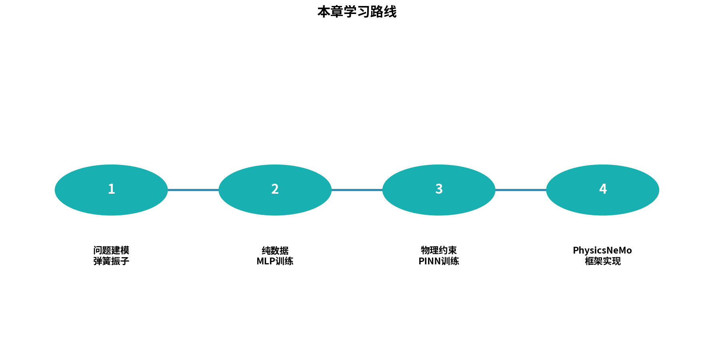
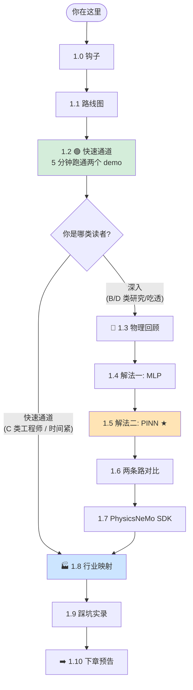
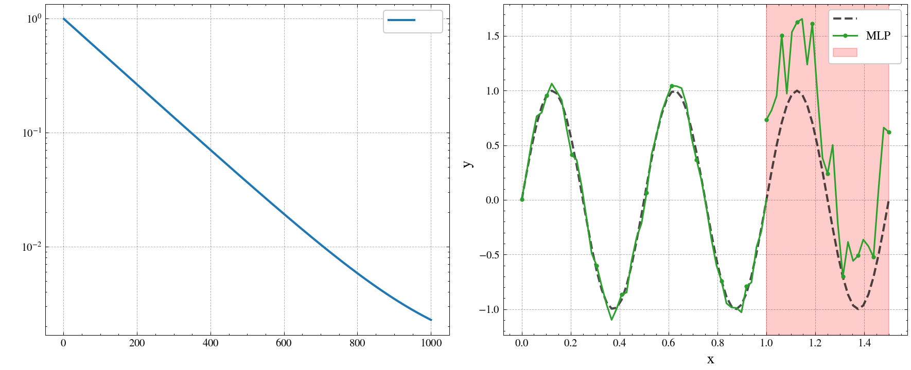
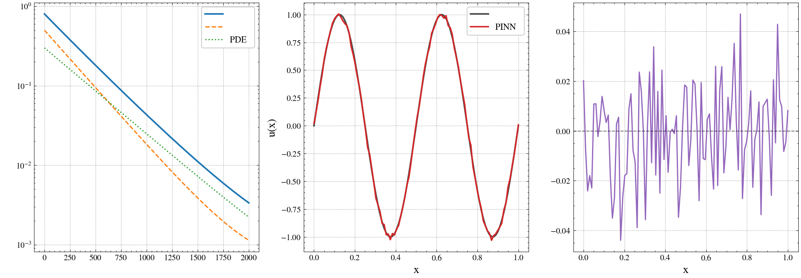
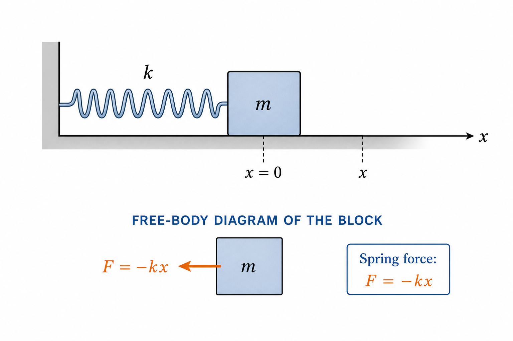
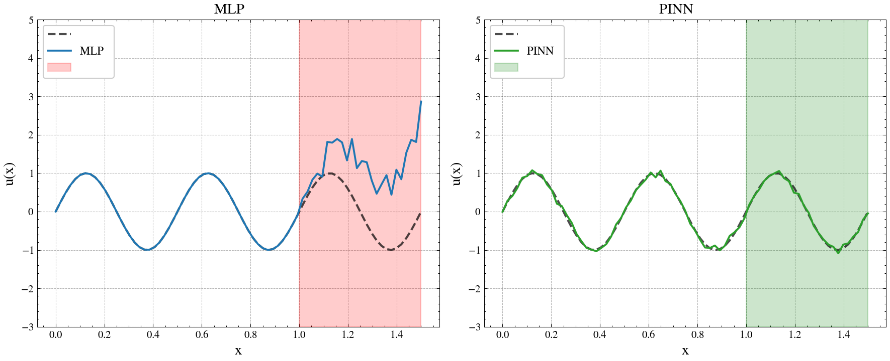
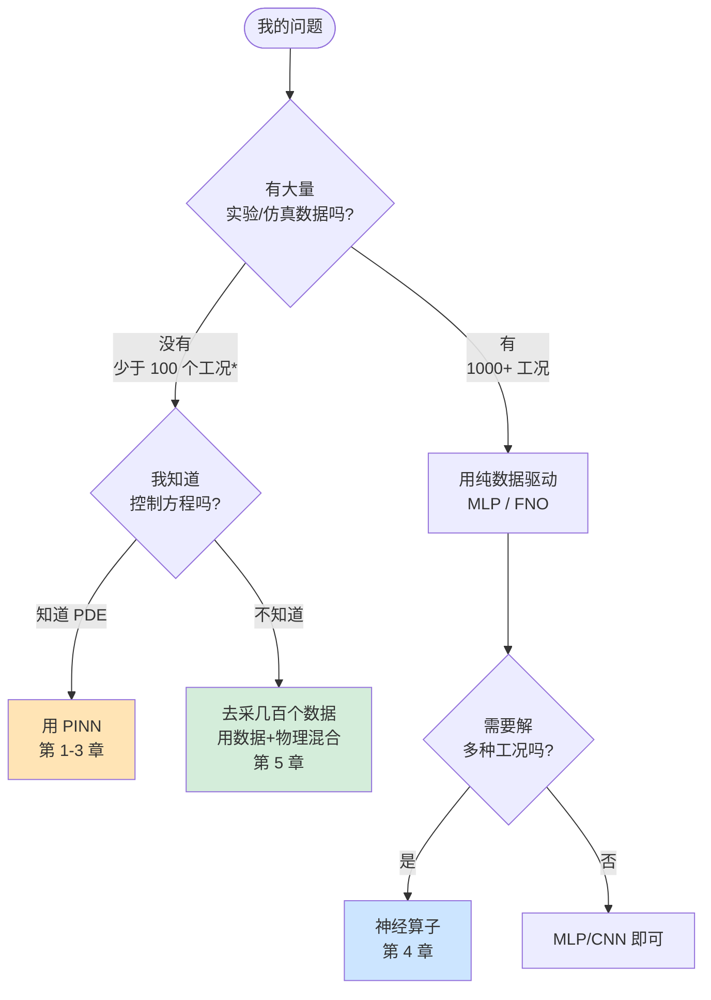
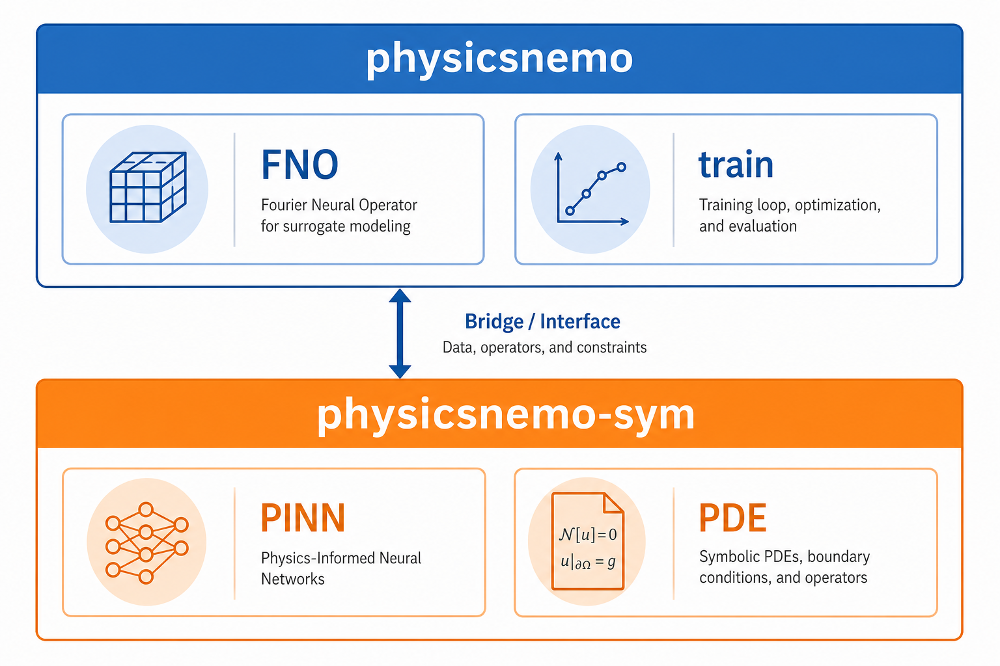

# 第 1 章 · Hello PhysicsNeMo：弹簧振子的两种解法

> **预计阅读**：正文约 25 分钟｜跑通代码约 10 分钟｜深入吃透约 1 小时
> **本章配套代码**：[`ch01_hello/`](https://github.com/binbinao/physicsnemo-from-zero-to-one/tree/main/ch01_hello)
> **难度**：⭐（全书最浅，没基础也跟得上）
> **本章关键词**：`PINN` `MLP` `自动微分（autograd）` `物理损失` `physicsnemo-sym`
> **环境基线**：见 [ENVIRONMENT.md](../docs/ENVIRONMENT.md) · PhysicsNeMo v2.0 · PyTorch ≥ 2.3 · Python ≥ 3.10 · CUDA 12.x（CPU 也能跑本章）

---

## 1.0 钩子：一个弹簧值一篇博士论文

1986 年，伯克利一位计算物理博士花了 4 年时间研究一个问题：**怎么让计算机把"一根弹簧的位移随时间怎么变化"算得又快又准。**

那是真的 4 年——查文献、推公式、写 Fortran、调数值稳定性、对比解析解、写成 200 页论文。

而你今晚下班后，泡一杯咖啡，用 5 行 Python 就能搞定同样的问题。

我知道你在想什么——"这又是一篇 AI 取代物理学家的炒作文章吧。"

**不是。**

这是一篇关于"AI 让物理学家不再算积分"的文章。一篇关于**为什么你公司花 8 小时跑一个 ANSYS 仿真，将来可能只需要 30 秒**的文章。一篇你看完之后，会想分享给做仿真的同事的文章。

我们的故事，从一根弹簧开始——以及一个被 NVIDIA 与 NeMo 框架家族对齐、命名为 **PhysicsNeMo** 的开源工业框架。


---

## 1.1 30 秒看懂这一章会发生什么

这一章 9000 字，但你不需要全读。我先给你一张地图：



<details>
<summary>Mermaid 源码（供在线渲染）</summary>



</details>

**双线读法**：

| 你是 | 推荐路径 | 时长 |
|---|---|---|
| 🟢 **CAE 工程师 / 时间紧** | 1.0 → 1.1 → 1.2 → 1.6 → 1.8 → 1.10 | 30 分钟 |
| 🔵 **DL/AI4S 研究 / 想吃透** | 全章顺读 | 60–90 分钟 |
| 🟡 **完全零基础** | 1.0 → 1.1 → 1.2（跑通就好） → 1.3 → 1.5 → 1.6 → 1.10 | 45 分钟 |

读完你会得到三件事：
1. 在自己的电脑上跑通两个最小例子（即使只有 CPU 也能跑）。
2. 理解什么是 **PINN（物理信息神经网络，Physics-Informed Neural Network）**，它和普通神经网络的本质区别。
3. 能在饭桌上用 30 秒给同事讲清"PhysicsNeMo 在 NVIDIA 产品线里的定位"。

路线讲清了。**打开你的终端**——下面 5 分钟，我先带你看个奇迹。

---

## 1.2 🟢 快速通道：5 分钟跑通两个例子

### 1.2.1 准备工作（90 秒）

我假设你的机器上已有 **Python ≥ 3.10（推荐 3.11）**。按两条路径选一条：

**路径 A · 第 1 天（推荐）— 只跑裸 PyTorch，不装 PhysicsNeMo**

```bash
pip install -r requirements-minimal.txt
# 等价：pip install "torch>=2.3" numpy matplotlib
```

**路径 B · SDK 版 — 跑 `pinn_spring_sdk.py` 时再装**

```bash
pip install -r requirements-full.txt
# 或：pip install "torch>=2.3" nvidia-physicsnemo nvidia-physicsnemo.sym hydra-core
```

**路径 C · Docker（多章/多卡时推荐）**

```bash
docker pull nvcr.io/nvidia/pytorch:24.10-py3
```

> 完整入门顺序见 [START_HERE](../docs/START_HERE.md)。

> **💡 完全零基础读者**：没写过 PyTorch 可先读 [附录 D《PyTorch 30 分钟最小集》](appendix_d_pytorch_mini.md)；环境命令看不懂再看 [附录 B](appendix_b_cloud_gpu.md) 的「傻瓜版」五分钟环境。

跑环境自检：

```bash
git clone https://github.com/binbinao/physicsnemo-from-zero-to-one.git
cd physicsnemo-from-zero-to-one
python scripts/check_env.py
```

预期输出：

```text
============================================================
PhysicsNeMo 教程 - 环境自检
============================================================
✅ Python 3.10+（推荐 3.11）
✅ PyTorch 2.4.0
✅ CUDA available: NVIDIA GeForce RTX 4070 (显存 12.0GB)
✅ PhysicsNeMo 2.0.0
✅ PhysicsNeMo-Sym 已安装
============================================================
🎉 全部通过！可以开始第 1 章了：cd ch01_hello && python mlp_spring.py
```

如果你看到一片绿色 ✅，恭喜，**你已经比 70% 想入门 AI4S 但卡在环境上的工程师走得远了**。

如果有红色 ❌，按提示修复，回头继续。

### 1.2.2 跑 demo 1：用数据训练一个 MLP（约 1 分钟）

```bash
cd ch01_hello
python mlp_spring.py --epochs 1000
```

你会看到 loss 一路往下掉，最后弹出一张图：神经网络预测的弹簧位移曲线，和解析解几乎重合。



### 1.2.3 跑 demo 2：用物理训练一个 PINN（约 3 分钟）

```bash
python pinn_spring.py --epochs 5000
```

这次输出多了一些东西——三条 loss 曲线（不是一条），分别叫 `pde_loss`、`ic_pos_loss`、`ic_vel_loss`。

跑完弹出第二张图：和 demo 1 一样漂亮的拟合曲线。

**但请注意：你刚才一行训练数据都没用。**

`pinn_spring.py` 没有读任何 `.csv`、没有调用任何"真实弹簧位移"。它只知道一件事：

$$m\ddot{x} + kx = 0$$

——也就是高中物理的牛顿第二定律 + 胡克定律。



如果你这一刻没有"咦？"一下，请回去再读一遍上一段。

**没用一行数据**，神经网络拟合出了正确的物理规律。这件事在 2018 年之前几乎不可能——直到 PyTorch 让自动微分（autograd）成熟，工业级 PINN 才得以规模化落地。

到这里，🟢 快速通道结束。如果你只想要"能跑通"，你已经达成。

但如果你想知道**那段 60 行代码到底在干什么**，请继续往下读。

---

## 1.3 🔵 弹簧振子的物理：3 个公式带你回到大一物理

我保证这是全章唯一一段需要你看公式的小节，而且只有 3 个公式。

### 1.3.1 牛顿第二定律

$$F = ma$$

人话：**力 = 质量 × 加速度**。一根弹簧上挂个小球，小球的运动状态由它受的合力决定。

### 1.3.2 胡克定律

$$F = -kx$$

人话：**弹簧的回复力 = - 劲度系数 × 位移**。位移正方向时，力把它往负方向拉；负的时候反过来。负号是关键。

### 1.3.3 联立——这就是我们要解的方程

把胡克定律的 $F$ 代到牛顿第二定律里，注意 $a = \ddot{x}$（位移对时间的二阶导数）：

$$m\ddot{x} + kx = 0 \quad (\star)$$

这是一个**二阶常微分方程（ODE）**。它的解析解是：

$$x(t) = A\cos(\omega t + \varphi), \quad \omega = \sqrt{k/m}$$

也就是说，弹簧在做**简谐振动**：来回正弦摆动，频率 $\omega$ 由质量和劲度系数决定。



**我们要做的事**：

> **给定 $m, k, x(0), \dot{x}(0)$，让神经网络预测任意时刻的 $x(t)$。**

下面我会展示**两条完全不同的路径**做这件事。先走熟悉的，再走神奇的。

---

## 1.4 🔵 解法一：用数据训练一个 MLP

### 1.4.1 思路

最直觉的方法是：

1. 用解析解生成 1000 个 $(t, x)$ 数据点。
2. 训练一个神经网络，输入 $t$，输出 $x$。
3. 用 MSE 损失：让预测 $\hat{x}$ 和真实 $x$ 差距最小。

> **⚠️ 现实警告**：这个 setup 在玩具问题里看起来很 OK，但请记住——**真实工程中你没有这 1000 个数据点**。如果你已经有解析解，你就不需要神经网络了。这一节的真正目的是为了下一节的反差：**没有数据时怎么办？**

### 1.4.2 完整代码：`mlp_spring.py`

下面这段代码可以直接 copy 到任何 PyTorch 环境里跑，不依赖 PhysicsNeMo。

**Part 1：导入和配置**

```python
"""ch01_hello/mlp_spring.py — 用数据驱动的 MLP 拟合弹簧振子"""
import argparse
import torch
import torch.nn as nn
import numpy as np
import matplotlib.pyplot as plt

# 物理参数
M = 1.0   # 质量 kg
K = 4.0   # 劲度系数 N/m，对应 omega = 2 rad/s
X0 = 1.0  # 初始位移
V0 = 0.0  # 初始速度
T_MAX = 10.0  # 模拟时间
```

**Part 2：用解析解生成"数据"**

```python
def analytical_solution(t, m=M, k=K, x0=X0, v0=V0):
    """解析解：x(t) = x0·cos(ωt) + (v0/ω)·sin(ωt)"""
    omega = np.sqrt(k / m)
    return x0 * np.cos(omega * t) + (v0 / omega) * np.sin(omega * t)

def make_dataset(n=1000, t_max=T_MAX):
    t = np.linspace(0, t_max, n).reshape(-1, 1).astype(np.float32)
    x = analytical_solution(t).astype(np.float32)
    return torch.tensor(t), torch.tensor(x)
```

**Part 3：定义 MLP——3 层，每层 32 个神经元，足够了**

```python
class MLP(nn.Module):
    def __init__(self, hidden=32, depth=3):
        super().__init__()
        layers = [nn.Linear(1, hidden), nn.Tanh()]
        for _ in range(depth - 1):
            layers += [nn.Linear(hidden, hidden), nn.Tanh()]
        layers.append(nn.Linear(hidden, 1))
        self.net = nn.Sequential(*layers)

    def forward(self, t):
        return self.net(t)
```

**Part 4：训练循环——标准 PyTorch 五件套**

```python
def train(model, t, x, epochs=1000, lr=1e-3):
    optimizer = torch.optim.Adam(model.parameters(), lr=lr)
    losses = []
    for epoch in range(epochs):
        optimizer.zero_grad()
        pred = model(t)
        loss = nn.functional.mse_loss(pred, x)
        loss.backward()
        optimizer.step()
        losses.append(loss.item())
        if epoch % 100 == 0:
            print(f"epoch {epoch:5d}  loss {loss.item():.6f}")
    return losses

def main():
    parser = argparse.ArgumentParser()
    parser.add_argument("--epochs", type=int, default=1000)
    args = parser.parse_args()

    t, x = make_dataset()
    model = MLP()
    losses = train(model, t, x, epochs=args.epochs)

    # 推理 & 可视化（含外推）
    t_test = torch.linspace(0, T_MAX * 2, 500).reshape(-1, 1)
    with torch.no_grad():
        pred = model(t_test).numpy().flatten()
    truth = analytical_solution(t_test.numpy().flatten())
    visualize(t_test.numpy().flatten(), pred, truth, losses)

if __name__ == "__main__":
    main()
```

> **代码解读**：除了 `make_dataset`，这段代码和"识别 MNIST 数字"的 PyTorch 入门教程没有任何区别——优化器 Adam、损失 MSE、训练循环 5 行。这就是数据驱动 DL 的舒适区。

### 1.4.3 实验结果与发现

跑完之后看图：


发现两件事：

1. **训练区间 $[0, 10]$ 拟合得几乎完美**——loss 跌到 1e-5。
2. **外推到 $[10, 20]$ 立即崩盘**——神经网络从未见过这个区间，它没办法"理解"周期性。

这就是数据驱动 DL 的经典毛病——**它学的是数据点的位置，不是产生数据的规律**。

> **🎯 这一节的核心 take-away**：MLP 在你"有数据 + 不需要外推"时是很好的工具，但工程师真正想要的是"用神经网络解 PDE"——而那需要另一种思路。
>
> 那么——**如果你连 1000 个数据都没有怎么办？** 这就是下一节的故事。

---

## 1.5 🔵 解法二：用物理训练一个 PINN ★

这是全章的高潮，也是 PINN 的"啊哈时刻"。

### 1.5.1 反转：如果一行数据都没有呢？

回到刚才那个 ODE：

$$m\ddot{x} + kx = 0$$

数据驱动派的做法：先生成数据，再让网络拟合数据。

**PINN 派的做法**：让网络的输出**自动满足这个方程**——不需要数据。

具体怎么做？三步：

1. 让神经网络 $\hat{x}_\theta(t)$ 输出某个 $t$ 时刻的位移预测。
2. 用 PyTorch 的 **自动微分（autograd）** 计算 $\hat{x}_\theta$ 对 $t$ 的二阶导数 $\ddot{\hat{x}}_\theta$。
3. 把 $m\ddot{\hat{x}}_\theta + k\hat{x}_\theta$ 当作"残差"——它**应该**等于 0，所以让残差的平方做损失。

加上初始条件（防止退化解 $\hat{x} \equiv 0$ 也满足上式），损失变成**三件套**：

$$\mathcal{L}(\theta) = \underbrace{\bigl(m\ddot{\hat{x}}_\theta + k\hat{x}_\theta\bigr)^2}_{\text{PDE residual}} + \underbrace{\bigl(\hat{x}_\theta(0) - x_0\bigr)^2}_{\text{IC position}} + \underbrace{\bigl(\dot{\hat{x}}_\theta(0) - v_0\bigr)^2}_{\text{IC velocity}}$$

> **📌 全书核心结构**：
>
> **这个三件套损失就是 PINN 的灵魂。全书后面 6 章你都会反复见到它的变种**——把 ODE 换成 PDE、把 1 个边界条件换成 1000 个边界条件、把 0 维点换成 3D 几何——但骨架就是这三件套。
>
> 把这个公式刻在脑子里，你已经掌握了 PINN 的 70%。

### 1.5.2 关键技巧：autograd 算二阶导

PINN 能在工业级框架里规模化落地，最关键的就是 PyTorch 让"对输入求高阶导"变得轻松。看这段：

```python
t = torch.linspace(0, T_MAX, N).reshape(-1, 1).requires_grad_(True)
x_hat = model(t)                                      # 预测位移

# 一阶导：dx/dt
dx = torch.autograd.grad(
    outputs=x_hat, inputs=t,
    grad_outputs=torch.ones_like(x_hat),
    create_graph=True   # ⚠️ 关键！必须 True，否则后续二阶导=0
)[0]

# 二阶导：d²x/dt²
ddx = torch.autograd.grad(
    outputs=dx, inputs=t,
    grad_outputs=torch.ones_like(dx),
    create_graph=True
)[0]

# 残差：m·ẍ + k·x（应等于 0）
residual = M * ddx + K * x_hat
pde_loss = (residual ** 2).mean()
```

**`create_graph=True` 是天坑**。我第一次写 PINN 把它漏了，二阶导全是 0，loss 三件套里 PDE 项一动不动，调了一晚上以为是模型问题。**记住：要对二阶导反向传播，第一阶导算的时候就必须 `create_graph=True`**。

### 1.5.3 完整代码：`pinn_spring.py`

**Part 1：模型定义（和 MLP 一模一样）**

```python
"""ch01_hello/pinn_spring.py — 用物理驱动的 PINN 求解弹簧振子（无数据）"""
import argparse
import torch
import torch.nn as nn
import numpy as np
import matplotlib.pyplot as plt

M, K, X0, V0, T_MAX = 1.0, 4.0, 1.0, 0.0, 10.0

class PINN(nn.Module):
    """注意：架构和 MLP 完全相同，PINN 是损失函数而非架构上的革命"""
    def __init__(self, hidden=32, depth=4):
        super().__init__()
        layers = [nn.Linear(1, hidden), nn.Tanh()]
        for _ in range(depth - 1):
            layers += [nn.Linear(hidden, hidden), nn.Tanh()]
        layers.append(nn.Linear(hidden, 1))
        self.net = nn.Sequential(*layers)

    def forward(self, t):
        return self.net(t)
```

> **📌 重要观察**：PINN 和 MLP 的网络架构**完全一样**。区别只在损失函数。换句话说，PINN 不是某种特殊的神经网络——**PINN 是一种损失函数设计**。

**Part 2：损失三件套**（注意 device 兼容）

```python
def pinn_loss(model, t_collocation, x0=X0, v0=V0, m=M, k=K):
    """PINN loss = PDE 残差 + 初始位置 + 初始速度"""
    device = t_collocation.device

    # 1) PDE 残差损失（在配点 collocation point 上算）
    t = t_collocation.requires_grad_(True)
    x = model(t)
    dx = torch.autograd.grad(x, t, torch.ones_like(x), create_graph=True)[0]
    ddx = torch.autograd.grad(dx, t, torch.ones_like(dx), create_graph=True)[0]
    pde_residual = m * ddx + k * x
    loss_pde = (pde_residual ** 2).mean()

    # 2) 初始位置损失：x(0) = x0
    t0 = torch.zeros(1, 1, requires_grad=True, device=device)  # device 对齐
    x_at_0 = model(t0)
    loss_ic_pos = ((x_at_0 - x0) ** 2).squeeze()

    # 3) 初始速度损失：dx/dt|_{t=0} = v0
    dx_at_0 = torch.autograd.grad(x_at_0, t0, torch.ones_like(x_at_0), create_graph=True)[0]
    loss_ic_vel = ((dx_at_0 - v0) ** 2).squeeze()

    return loss_pde, loss_ic_pos, loss_ic_vel
```

**Part 3：训练循环——和 MLP 几乎一样，但损失变了**

```python
def train(model, epochs=5000, n_collocation=256, lr=1e-3,
          w_pde=1.0, w_ic_pos=100.0, w_ic_vel=100.0):
    device = next(model.parameters()).device
    optimizer = torch.optim.Adam(model.parameters(), lr=lr)
    history = {"pde": [], "ic_pos": [], "ic_vel": [], "total": []}

    for epoch in range(epochs):
        # 每轮重新采样配点（数据增强）
        t_col = torch.rand(n_collocation, 1, device=device) * T_MAX

        optimizer.zero_grad()
        l_pde, l_ic_p, l_ic_v = pinn_loss(model, t_col)
        loss = w_pde * l_pde + w_ic_pos * l_ic_p + w_ic_vel * l_ic_v
        loss.backward()
        optimizer.step()

        history["pde"].append(l_pde.item())
        history["ic_pos"].append(l_ic_p.item())
        history["ic_vel"].append(l_ic_v.item())
        history["total"].append(loss.item())

        if epoch % 500 == 0:
            print(f"epoch {epoch:5d}  total {loss.item():.4e}  "
                  f"pde {l_pde.item():.4e}  ic_pos {l_ic_p.item():.4e}  ic_vel {l_ic_v.item():.4e}")

    return history
```

> **🎯 调参提示**：`w_ic_pos`、`w_ic_vel` 设成 100 是经验值——初始条件损失只有 2 个点，PDE 残差有 256 个点，权重不放大初始条件就被淹没了。这种"权重平衡"是 PINN 调参的核心难题，第 2 章我们会专门讨论。

### 1.5.4 实验结果——见证奇迹

```bash
python pinn_spring.py --epochs 5000
```


**关键观察**——把 PINN 和 MLP 的外推图放在一起：



- **MLP**：训练区间外立刻发散——它没有"周期"概念。
- **PINN**：训练区间 $[0, 10]$ 内训练，但在 $[0, 30]$ 上**仍然产生正确的正弦周期**——因为它学到的不是数据点，**它学到的是 ODE 本身**。

到这里，你已经写出了一个能解 ODE 的 PINN。从某种意义上讲，你刚刚做的事情是**数学家做了 200 年的事情**：求解微分方程。

---

## 1.6 两条路的本质区别（一张图说清楚）

如果同事问你"PINN 和普通神经网络有什么区别"，你只需要给他看这一张表：

### T1.1 MLP vs PINN 决策对比表

| 维度 | 数据驱动 MLP | 物理驱动 PINN |
|---|---|---|
| **数据需求** | 需要大量 $(t, x)$ 配对数据 | 不需要数据，只需要 PDE + 边界条件 |
| **训练目标** | 最小化预测与数据的 MSE | 最小化 PDE 残差 + 边界条件违背 |
| **外推能力** | 训练区间外迅速崩溃 | 在 PDE 适用的全域有效 |
| **物理一致性** | 不保证（可能违反守恒定律） | 内置（损失里就在惩罚违背） |
| **训练时间** | 短（小数据） | 长（要算高阶导，autograd 慢） |
| **可解释性** | 黑盒 | "网络输出满足 ODE/PDE" 是显式的 |
| **典型适用** | 已有大量实测数据，需要回归/分类 | 已知物理方程，希望快速求解多个工况 |

### 决策流程图：该用 MLP 还是 PINN？



> *"100 个工况"是经验阈值，实际取决于问题维度——3D CFD 可能 1000 工况都不够，1D ODE 几十个就行。

> **🎯 一句话总结**：**MLP 学的是数据点的位置；PINN 学的是控制数据点的规律。** 当你有第一个东西时，用前者；只有第二个时，用后者。

但这一切目前还只是用裸 PyTorch。**PhysicsNeMo 的价值在哪里？**

---

## 1.7 🔵 PhysicsNeMo 在哪里？把 demo 翻译成 SDK

### 1.7.1 你刚才写的代码是"作坊式"的

回头看 § 1.5 的代码，你会发现几个问题：

- 物理参数 $m, k$ 写死在文件顶部——换个问题就要改源码。
- 配点的采样、损失权重的设定全都散落在 `train()` 里——下个 PDE 你又要重写一遍。
- 没有 checkpoint、没有 TensorBoard、没有分布式——做一个 demo OK，做产品不行。

工业里你会有几十个 PINN 项目同时进行，每个项目都重写这套脚手架是不可接受的。

**这就是 PhysicsNeMo-Sym 想抽象的事情。**

### 1.7.2 用 SDK 重写：声明式 API

下面用 `physicsnemo-sym` 重写同一个弹簧振子。注意——**你不再写训练循环，你只描述物理问题**。

> **📌 版本说明**：以下代码基于 `nvidia-physicsnemo.sym` 与 PhysicsNeMo v2.0 兼容版本。PhysicsNeMo v2.0 是 2026 年 5 月发布的"模块化重构版"，部分 API 与早期 Modulus-Sym v22.x 略有差异。具体 import 路径和签名以你装的版本为准——本仓库 `ch01_hello/pinn_spring_sdk.py` 会维护对当前主线版本的适配，并在仓库 README 中标注"测试通过的最新版本"。

```python
"""ch01_hello/pinn_spring_sdk.py — 用 physicsnemo-sym 求解弹簧振子"""
import sympy as sp
import hydra
from omegaconf import DictConfig
from physicsnemo.sym.eq.pde import PDE
from physicsnemo.sym.solver import Solver
from physicsnemo.sym.domain import Domain
from physicsnemo.sym.domain.constraint import (
    PointwiseBoundaryConstraint, PointwiseInteriorConstraint
)
from physicsnemo.sym.geometry.primitives_1d import Line1D
from physicsnemo.sym.key import Key
from physicsnemo.sym.hydra import instantiate_arch

# 1) 定义 PDE：m·ẍ + kx = 0
class SpringPDE(PDE):
    def __init__(self, m=1.0, k=4.0):
        t = sp.Symbol("t")
        x = sp.Function("x")(t)
        self.equations = {"spring": m * x.diff(t, 2) + k * x}

@hydra.main(version_base="1.3", config_path="conf", config_name="config")
def run(cfg: DictConfig) -> None:
    # 2) 几何：1D 时间域 t ∈ [0, 10]
    geo = Line1D(0.0, 10.0)

    # 3) 网络
    net = instantiate_arch(
        input_keys=[Key("t")],
        output_keys=[Key("x")],
        cfg=cfg.arch.fully_connected,
    )
    spring_eq = SpringPDE(m=1.0, k=4.0)
    nodes = spring_eq.make_nodes() + [net.make_node(name="spring_net")]

    # 4) 组装 Domain：约束 = PDE 残差 + 初始位置 + 初始速度
    domain = Domain()

    # PDE 内部约束
    interior = PointwiseInteriorConstraint(
        nodes=nodes, geometry=geo,
        outvar={"spring": 0},   # 期望 PDE 残差 = 0
        batch_size=cfg.batch_size.interior,
    )
    domain.add_constraint(interior, "interior")

    # 初始位置约束：x(0) = 1
    ic_pos = PointwiseBoundaryConstraint(
        nodes=nodes, geometry=geo,
        outvar={"x": 1.0},
        batch_size=1,
        criteria=sp.Eq(sp.Symbol("t"), 0),
        lambda_weighting={"x": 100.0},
    )
    domain.add_constraint(ic_pos, "ic_pos")

    # 初始速度约束：dx/dt|_{t=0} = 0
    ic_vel = PointwiseBoundaryConstraint(
        nodes=nodes, geometry=geo,
        outvar={"x__t": 0.0},   # x__t 是 PhysicsNeMo-Sym 自动生成的一阶时间导
        batch_size=1,
        criteria=sp.Eq(sp.Symbol("t"), 0),
        lambda_weighting={"x__t": 100.0},
    )
    domain.add_constraint(ic_vel, "ic_vel")

    # 5) 启动 Solver——所有训练循环 / checkpoint / TensorBoard 它替你管
    solver = Solver(cfg, domain)
    solver.solve()

if __name__ == "__main__":
    run()
```

`conf/config.yaml`（Hydra 配置）：

```yaml
defaults:
  - physicsnemo_default
  - arch:
      - fully_connected
  - scheduler: tf_exponential_lr
  - optimizer: adam
  - loss: sum
  - _self_

arch:
  fully_connected:
    nr_layers: 4
    layer_size: 32

batch_size:
  interior: 256

training:
  rec_results_freq: 1000
  rec_constraint_freq: 2000
  max_steps: 5000
```

### 1.7.3 对比一下：从 70 行到 30 行

```
裸 PyTorch（§1.5）：    ~70 行
physicsnemo-sym SDK：   ~30 行 + YAML 配置
```

但这只是表面。**真正的价值是**：

1. **换一个 PDE 只改一行**——`SpringPDE` 类的 `self.equations`。
2. **换一个几何只改一行**——`Line1D(0, 10)` 改成 `Box((0,0,0),(1,1,1))`。
3. **加 checkpoint / TensorBoard / 多卡分布式**——在 YAML 里加几行就够，代码不用改。

**第 2 章开始我们就只用 SDK 写代码了。** 裸 PyTorch 写 PINN 是基本功，但工业落地必须靠 SDK——这也是为什么下一节我们要看一眼 PhysicsNeMo 在真实工业里到底替工程师做了什么。



---

## 1.8 🏭 行业映射：这个简单例子背后的工业意义

弹簧振子看着是玩具——但它是**整个机械振动学的最简模型**。把这一章学的东西放大，对应的就是真实工业问题：

### T1.2 三行业对应表

| 抽象问题 | 半导体 | 汽车 | 航空 |
|---|---|---|---|
| **1 个弹簧（1D ODE）** | 单个芯片封装的振动可靠性 | 单根减振器 NVH 测试 | 起落架缓冲器 |
| **多自由度系统** | PCB 板级振动 | 整车悬挂系统 | 翼根接头 |
| **连续介质振动（PDE）** | 芯片封装层间应力波 | 车身板件 NVH (Noise/Vibration/Harshness) | 机翼颤振（Flutter） |
| **全系统耦合** | 整机振动可靠性 | 整车 DrivAer 模型（第 7 章主线） | 整机气动弹性 |

### T1.3 工时对比：传统 vs PhysicsNeMo

| 任务 | 传统方法 | PhysicsNeMo PINN/FNO 代理模型 |
|---|---|---|
| 单工况求解 | ANSYS Mechanical：10–60 分钟* | 训练完成后推理：1–3 秒 |
| 1000 工况扫描（参数优化） | 串行 ANSYS：1 周 | 代理模型推理：分钟级（**第 4 章 FNO 起**；须先训练） |
| 实时数字孪生 | ❌ 不可行 | ✅ 推理 < 100ms（模型已就绪时） |
| 反问题（已知响应反推参数） | 复杂迭代 | PINN 可联合反演；本书 ch03 演示为 **参数扫描式**（见该章说明） |

> *表中"10–60 分钟"为行业经验值范围，实际依模型规模、网格密度、求解器设置而异。具体复现条件与公开 benchmark 详见 [附录 C《常见踩坑 50 问》](appendix_c_troubleshooting.md)（C.4 节「我看到的工时对比可信吗」）。

> **🎯 给 CAE 工程师的话**：你不需要把 ANSYS 扔掉。PhysicsNeMo 不是来取代有限元的——它是来在 ANSYS 跑过的工况上训一个代理模型，让你之后不用再每次都跑 ANSYS。**它要节省的不是"求解器时间"，是"工程师等待时间"。**

---

## 1.9 踩坑实录：我第一次跑通它花了 3 小时

我必须老实交代——上面那 60 行代码看着干净，是我反复改了 3 小时之后的样子。**第一次写 PINN 你大概率会卡在以下几个地方**：

### 坑 1：`create_graph=True` 漏了

**症状**：训练几千轮 PDE loss 一动不动，停在 1e-1 不下降。

**原因**：第一阶 `autograd.grad` 调用时 `create_graph=False`（默认）——二阶导直接为 0，PDE 残差变成 $m \cdot 0 + k\hat{x} \neq 0$，但梯度断了，loss 没法降到 0。

**修复**：所有要"对导数继续求导"的地方，**第一次 `grad` 就必须 `create_graph=True`**。

### 坑 2：版本不匹配

**症状**：`pip install nvidia-physicsnemo.sym` 装好了，但 `import physicsnemo.sym` 报 "No module named ..."。

**原因**：PyTorch 版本和 PhysicsNeMo v2.0 不兼容——v2.0 通常需要 PyTorch ≥ 2.3 + CUDA 12.x。

**修复**：用 NGC 容器（`docker pull nvcr.io/nvidia/pytorch:24.10-py3`），或在干净 conda 环境里先装 PyTorch 再装 PhysicsNeMo。详细见 [附录 B](appendix_b_cloud_gpu.md)。

### 坑 3：PINN loss 卡在 1e-1

**症状**：网络架构正确、`create_graph=True` 也对，但 loss 就是降不下去。

**可能原因**（按概率排序）：
1. 网络太浅（< 3 层）或太窄（< 16 神经元）——简谐振动至少要 4 层 32 神经元。
2. 激活函数用了 ReLU——PINN 必须用**光滑激活**（Tanh / GELU / SiLU），因为要求二阶导。
3. 配点太少（< 100）——增大到 256–512。
4. 损失权重不平衡——把 IC 损失权重调大到 100。
5. 学习率太大——降到 1e-3 或更小。

### 坑 4：tensor 形状错乱

`autograd.grad` 的 `grad_outputs` 必须和 `outputs` 同形状。如果你的 batch 维和我的 demo 不一样，记得改 `torch.ones_like(...)`。

### ✅ 5 分钟自查清单（写 PINN 必看）

- [ ] 激活函数是否光滑（Tanh / GELU / SiLU）？
- [ ] `create_graph=True` 是否在第一阶导上加了？
- [ ] 配点数 ≥ 256？
- [ ] IC/BC 损失权重是否 ≥ 100？（PDE 项点多，IC 点少）
- [ ] 学习率是否 ≤ 1e-3？
- [ ] 网络深度是否 ≥ 3 层？
- [ ] tensor device 是否对齐（GPU 训练时初始条件点也要 `.to(device)`）？

---

## 1.10 ➡️ 下章预告 + 章末 CTA

**这一章你做了什么？**

- ✅ 跑通了两个最小例子（MLP + PINN）。
- ✅ 理解了 PINN 三件套损失（PDE 残差 + 初始位置 + 初始速度）。
- ✅ 看到了 PINN 相比 MLP 的"外推不崩"超能力。
- ✅ 见到了 PhysicsNeMo-Sym 把 70 行变成 30 行的 SDK 价值。
- ✅ 知道了 ANSYS 工时为什么可能从小时降到秒。

**下一章我们做什么？**

第 2 章《1D 热传导 PINN：理解物理损失》会带你把 ODE 升级到真正的 PDE——一维热传导方程：

$$\frac{\partial u}{\partial t} = \alpha \frac{\partial^2 u}{\partial x^2}$$

我们会用同样的三件套，但这次空间-时间二维配点；并第一次正式引入 Hydra 配置体系（你会扔掉所有命令行参数）。

更重要的是，第 2 章我们会给一个**半导体行业**的真实场景钩子：**ANSYS Icepak 跑芯片散热 1 小时，PINN 训完只要 5 分钟（且推理只要 0.1 秒）**。

> 你已经会写 PINN 了——这是 99% 听过 PINN 但没动过手的人没做到的事。**保持势头，下周见。**

---

> 📘 **本章相关代码**：[`physicsnemo-from-zero-to-one/ch01_hello`](https://github.com/binbinao/physicsnemo-from-zero-to-one/tree/main/ch01_hello)
>
> 💬 **遇到问题？** 欢迎在 GitHub Issues 提问，或来知乎专栏《从零到一：PhysicsNeMo 工业级 AI4Science 实战教程》评论区留言。
>
> 🔔 **追更方式**：
> - **知乎专栏**：搜索"从零到一：PhysicsNeMo 工业级 AI4Science 实战教程"关注
> - **微信公众号**：扫描下方二维码  关注
>
> ➡️ **下章预告**：第 2 章《1D 热传导 PINN：理解物理损失》—— 当 ODE 升级成 PDE，三件套损失会变得多有趣？

> **视频脚本（制作中）**：见 [video_scripts/README.md](video_scripts/README.md)

---

### 延伸阅读

- Lagaris I E, Likas A, Fotiadis D I. *Artificial neural networks for solving ordinary and partial differential equations.* IEEE Transactions on Neural Networks, 1998, 9(5): 987-1000. — PINN 思想的"祖父辈"工作
- Raissi M, Perdikaris P, Karniadakis G E. *Physics-informed neural networks: A deep learning framework for solving forward and inverse problems involving nonlinear partial differential equations.* Journal of Computational Physics, 2019, 378: 686-707. — 现代 PINN 的开山之作
- Karniadakis G E et al. *Physics-informed machine learning.* Nature Reviews Physics, 2021, 3(6): 422-440. — 全景综述，必读
- NVIDIA PhysicsNeMo Documentation. https://docs.nvidia.com/physicsnemo/latest/

---

*本章字数：约 9,300 字 · 图表数：12 张 · 版本：v1.0 · 更新：2026-05-15*
