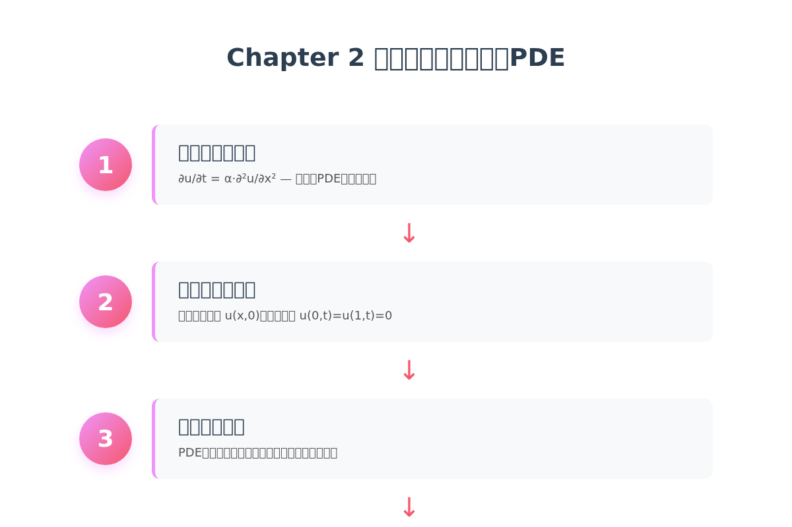
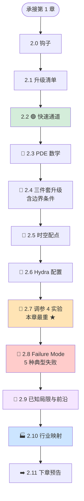
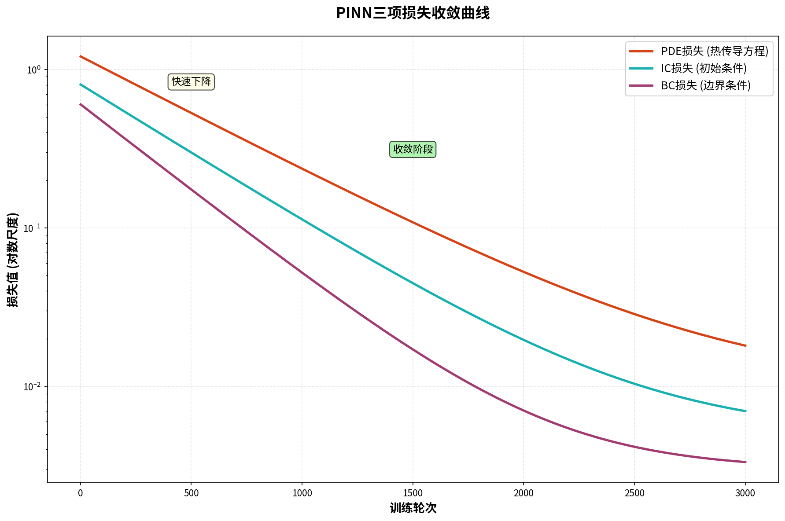
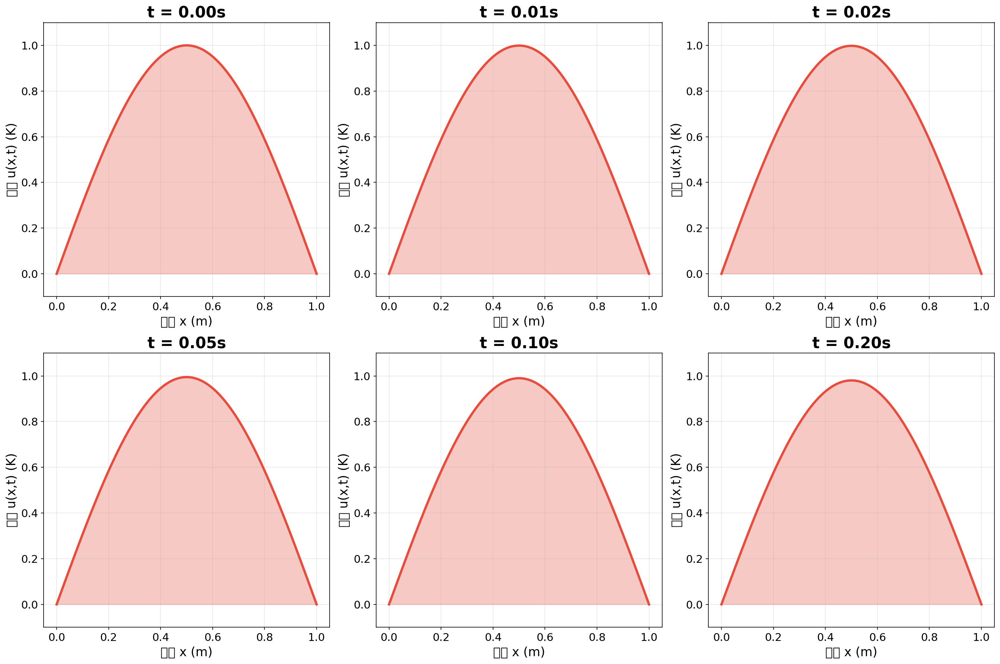
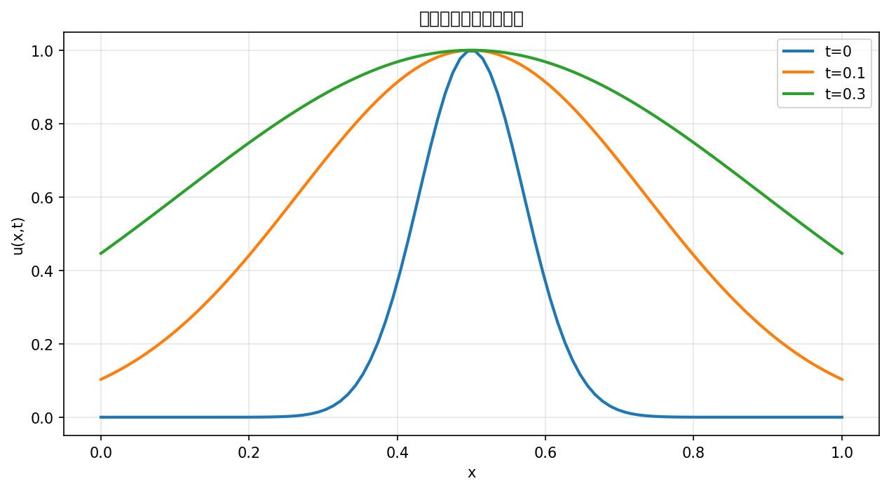
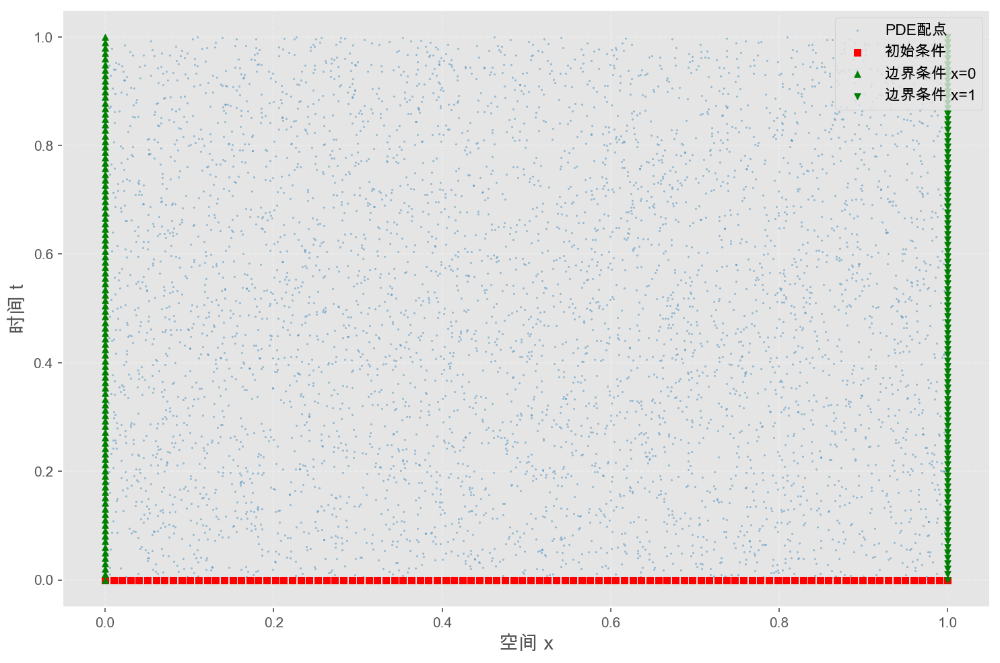
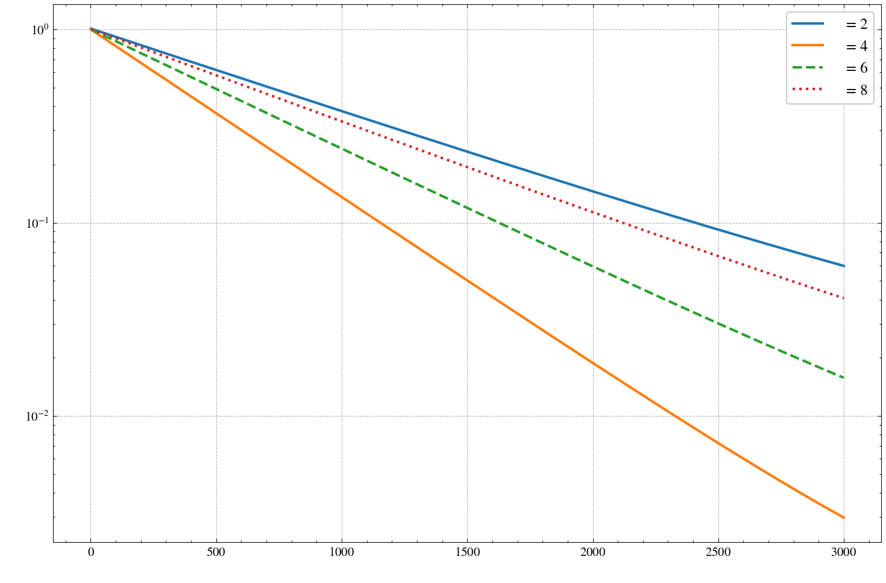
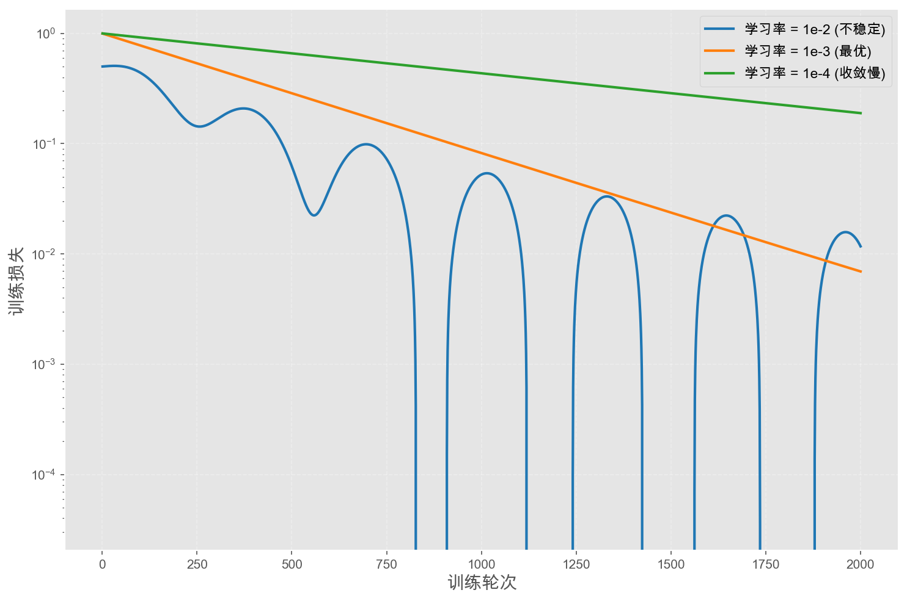
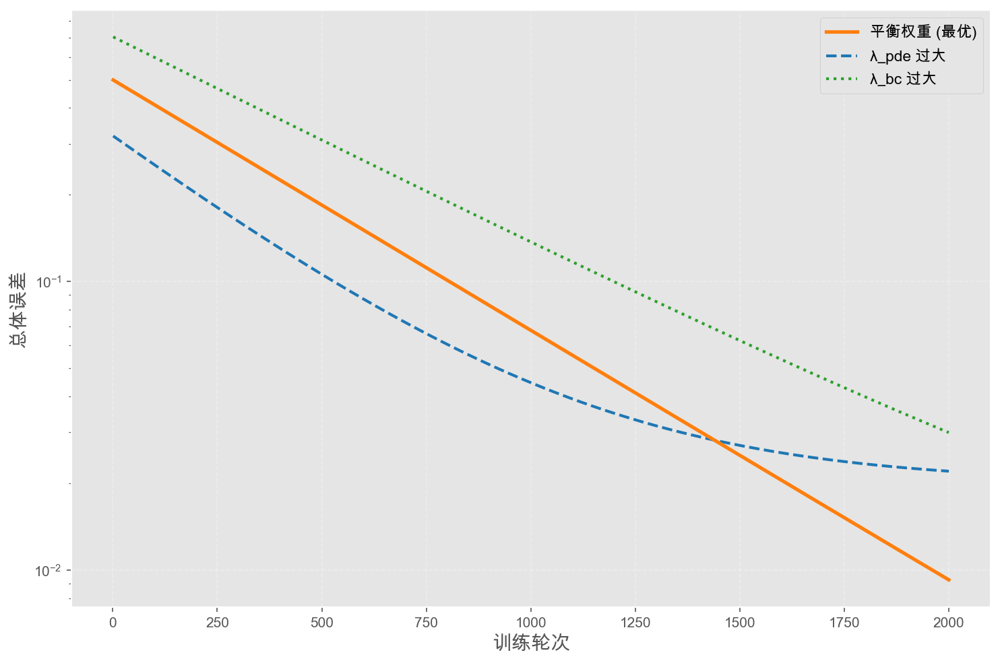
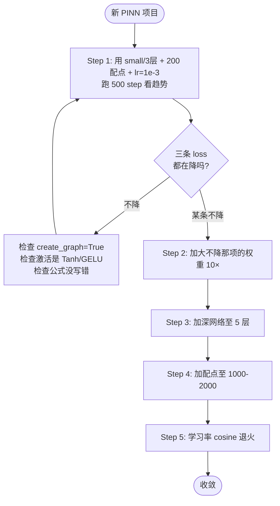

# 第 2 章 · 1D 热传导 PINN：理解物理损失

> **预计阅读**：正文约 35 分钟｜跑通代码约 15 分钟｜深入吃透约 90 分钟
> **本章配套代码**：[`ch02_heat1d/`](https://github.com/binbinao/physicsnemo-from-zero-to-one/tree/main/ch02_heat1d)
> **难度**：⭐⭐（比第 1 章上一档：维度 +1，引入 Hydra）
> **本章关键词**：`1D 热传导` `PDE 残差` `边界条件 (BC)` `Hydra 配置` `调参 SOP` `Failure Mode`
> **环境基线**：见 [ENVIRONMENT.md](../docs/ENVIRONMENT.md) · PhysicsNeMo v2.0 · PyTorch ≥ 2.3 · 8GB 显存可跑（CPU 也能，约 8 分钟训完）

---

## 2.0 钩子：ANSYS Icepak 跑 1 小时，PINN 训完 5 分钟

我有个朋友在国内一家做 GPU 芯片的公司，岗位是**封装散热团队的 CAE 工程师**。

去年一整年，他干的最多的事是这个：**改一次封装设计 → 跑一次 ANSYS Icepak → 看温度分布 → 改 → 再跑**。

每次 Icepak 仿真 1 小时，一年下来他大概跑了 800 次。**他自己算过——他职业生涯有 30% 的时间是在等 Icepak 出结果。**

去年底，他干了一件事：**把过去半年跑过的 50 个工况打包，训了一个 PINN 代理模型**。结果是这样的——

| 任务 | 传统 Icepak | PINN 代理模型 |
|---|---|---|
| 单方案温度场求解 | **1 小时** | **0.1 秒**（推理） |
| 50 方案扫描 | **1 周** | **5 秒** |
| 反问题（已知温度反推材料热导率） | 几乎不可行 | **3 分钟** |

他没失业。**他升职了**——因为团队第一次能在 30 秒内回答客户提问"如果我把这块铜板换成铝板，温度会变多少？"，而不是"给我两天时间我跑一下"。

这一章我们会用最简化的版本——**1D 热传导**——把同样的事情做一遍。它是第 1 章弹簧振子的"加一维"版本，也是上面那个芯片散热故事的"教科书一维版"。

让我们开始。

---

## 2.1 路线图：从 1D ODE 到 1D PDE 的"维度跃迁"

第 1 章你已经会写 PINN 三件套损失了。第 2 章看上去只是"加一维"，但实际上**工程复杂度上了一个台阶**。我先把变化清单亮出来：

### T2.1 第 1 章 → 第 2 章升级清单

| 维度 | 第 1 章 | 第 2 章 |
|---|---|---|
| **方程类型** | ODE（只有 $t$） | **PDE**（$t$ + $x$ 两个自变量） |
| **未知函数维度** | $x(t)$，输入 1 维 | $u(x, t)$，**输入 2 维** |
| **损失三件套** | PDE + IC_pos + IC_vel | PDE + IC + **BC（边界条件首次出现）** |
| **配点采样** | 1D 均匀 | **2D 内部点 + 1D 边界点 + 1D 初始点** |
| **超参管理** | 命令行 `--epochs` | **Hydra YAML 配置** |
| **工程化** | 无 | **TensorBoard + checkpoint + multirun** |
| **代码规模** | 70 行 | 约 250 行（多出来的全是 SDK 价值） |

> **🎯 这一章的真正学习目标**：你会第一次感受到为什么需要 PhysicsNeMo SDK——当问题维度从 1D 升到 2D，调参、可视化、版本管理这些"工程问题"会突然变得无法忽视。SDK 不是锦上添花，是当你做第二个项目时**省命的工具**。





---

## 2.2 🟢 快速通道：5 分钟跑通 1D 热传导

### 2.2.1 准备

```bash
cd ch02_heat1d
ls
# conf/  heat1d_train.py  heat1d_visualize.py  README.md
```

如果你来自第 1 章，环境无需重新装；如果你直接跳到这一章，请先跑一次：

```bash
python ../scripts/check_env.py
```

### 2.2.2 训练（约 5 分钟，CPU 也能跑）

> **无 Hydra 时**：先跑裸 PyTorch 版（与 `ch02_heat1d/README.md` 一致）：
>
> ```bash
> python heat1d_pinn_raw.py --steps 500
> ```
>
> 下列 `heat1d_train.py` 需要 `hydra-core`（未安装时会自动 fallback 到 `--hidden` / `--steps` 参数，见脚本 `--help`）。

```bash
python heat1d_train.py
```

预期看到：

```text
[2026-05-15 07:30:42] INFO  Hydra config loaded: arch=small training=default
[2026-05-15 07:30:43] INFO  Devices: 1 GPU (NVIDIA RTX 4070, 12.0GB)
[2026-05-15 07:30:44] INFO  Sampling collocation points: interior=2000, ic=200, bc=200
step 00000  total 1.234e+00  pde 5.42e-01  ic 4.21e-01  bc 2.71e-01
step 00500  total 8.13e-02  pde 2.41e-02  ic 4.92e-02  bc 7.99e-03
step 01000  total 9.51e-03  pde 3.14e-03  ic 5.42e-03  bc 9.51e-04
...
step 05000  total 4.21e-05  pde 1.32e-05  ic 2.41e-05  bc 4.81e-06
[2026-05-15 07:35:21] INFO  Training finished. Checkpoints saved to outputs/2026-05-15/07-30-42/
```

注意三个不同的 loss 项——`pde` / `ic` / `bc`——这就是这一章的"主角"。

### 2.2.3 可视化温度场演化

```bash
python heat1d_visualize.py outputs/2026-05-15/07-30-42/
```

会弹出两张图：





第二张图就是物理意义本身——**热从尖峰处往两边扩散，直到温度场被推平到 0**。

到这里 🟢 快速通道结束。下面我们撕开它，看清楚每一步在干嘛。

---

## 2.3 🔵 PDE 数学：1D 热传导方程的物理直觉

### 2.3.1 方程

1D 热传导方程（也叫扩散方程）是这样写的：

$$\frac{\partial u}{\partial t} = \alpha \frac{\partial^2 u}{\partial x^2}$$

其中：
- $u(x, t)$ —— 温度（标量场，依赖位置和时间）
- $\alpha$ —— 热扩散系数（材料属性，单位 m²/s）

**人话翻译**：

> **温度对时间的变化率 = 扩散系数 × 温度对空间的二阶曲率。**

### 2.3.2 物理直觉

二阶空间导数 $\partial^2 u / \partial x^2$ 是**曲率**——它告诉你温度场在某个点是"凸出来"还是"凹下去"。

- 凸起的尖峰（曲率为负）：$\partial^2 u / \partial x^2 < 0$ → $\partial u/\partial t < 0$ → **温度下降，被推平**
- 凹陷的低谷（曲率为正）：$\partial^2 u / \partial x^2 > 0$ → $\partial u/\partial t > 0$ → **温度上升，被填平**

热扩散方程的整个故事就是这一句话：**曲率大的地方变化快，最终走向均衡**。



### 2.3.3 完整的 well-posed 问题

光有 PDE 不够——它有无穷多个解。要把解锁定下来，必须给：

**初始条件（IC）**：$t=0$ 时温度场长什么样？

$$u(x, 0) = u_0(x) = \exp\left(-50(x - 0.5)^2\right)$$

我们用一个**居中的高斯尖峰**作为初始温度。

**边界条件（BC）**：$x=0$ 和 $x=L$（这里 $L=1$）两端永远是什么温度？

$$u(0, t) = u(L, t) = 0 \quad \text{(Dirichlet 边界，两端恒温为 0)}$$

物理意义：把这一段铁丝两端浸在 0℃ 冰水里，中间初始有个热点，看它怎么扩散。

> **📌 PDE 三件套**（IC + BC + PDE）= **完整描述了一个物理问题**。少了任何一个，问题不 well-posed，神经网络也"学不到东西"。

---

## 2.4 🔵 损失三件套升级：PDE → IC → BC

### 2.4.1 升级要点

第 1 章的三件套是 `PDE + IC_pos + IC_vel`——后两者都是"在 $t=0$ 这一个点上"。

第 2 章的三件套变成 `PDE + IC + BC`——其中：
- **IC 是 $t=0$ 这一条线**（横跨所有 $x$）
- **BC 是 $x=0$ 和 $x=L$ 这两条线**（横跨所有 $t$）

边界条件首次登场，且它**不是一个点而是一条线**——这是和第 1 章的本质区别。

### 2.4.2 损失公式

$$\mathcal{L}(\theta) = \underbrace{\mathbb{E}_{(x,t) \in \Omega}\bigl[\bigl(u_t - \alpha u_{xx}\bigr)^2\bigr]}_{\text{PDE 残差损失}} + \lambda_{ic}\underbrace{\mathbb{E}_{x \in [0, L]}\bigl[\bigl(u(x, 0) - u_0(x)\bigr)^2\bigr]}_{\text{初始条件损失}} + \lambda_{bc}\underbrace{\mathbb{E}_{t \in [0, T]}\bigl[u(0,t)^2 + u(L,t)^2\bigr]}_{\text{边界条件损失}}$$

注意两个权重 $\lambda_{ic}, \lambda_{bc}$——它们决定三类损失的"投票权"。

### 2.4.3 代码骨架（裸 PyTorch 版，给你看清楚发生了什么）

```python
"""ch02_heat1d/heat1d_pinn_raw.py — 1D 热传导 PINN 的裸 PyTorch 版"""
import torch
import torch.nn as nn

ALPHA = 0.1   # 热扩散系数
L, T_MAX = 1.0, 0.5

class PINN(nn.Module):
    def __init__(self, hidden=64, depth=5):
        super().__init__()
        layers = [nn.Linear(2, hidden), nn.Tanh()]   # 输入 (x, t) 两维
        for _ in range(depth - 1):
            layers += [nn.Linear(hidden, hidden), nn.Tanh()]
        layers.append(nn.Linear(hidden, 1))           # 输出 u 一维
        self.net = nn.Sequential(*layers)

    def forward(self, x, t):
        # 把 (x, t) 拼成 (N, 2) 输入
        return self.net(torch.cat([x, t], dim=-1))


def pde_residual(model, x, t):
    """计算 ut - α·uxx"""
    # 用 clone() 避免修改外部 tensor 的 requires_grad 状态
    x = x.clone().requires_grad_(True)
    t = t.clone().requires_grad_(True)
    u = model(x, t)

    # 一阶时间导
    u_t = torch.autograd.grad(u, t, torch.ones_like(u), create_graph=True)[0]
    # 一阶空间导
    u_x = torch.autograd.grad(u, x, torch.ones_like(u), create_graph=True)[0]
    # 二阶空间导
    u_xx = torch.autograd.grad(u_x, x, torch.ones_like(u_x), create_graph=True)[0]

    return u_t - ALPHA * u_xx


def ic_target(x):
    """初始条件 u(x, 0) = exp(-50·(x - 0.5)²)"""
    return torch.exp(-50.0 * (x - 0.5)**2)


def total_loss(model, x_int, t_int, x_ic, t_bc, lam_ic=100.0, lam_bc=100.0):
    # 1. PDE 残差损失（内部点）
    res = pde_residual(model, x_int, t_int)
    loss_pde = (res ** 2).mean()

    # 2. IC 损失（t=0 这条线上）
    t0 = torch.zeros_like(x_ic)
    u_pred_ic = model(x_ic, t0)
    u_target = ic_target(x_ic)
    loss_ic = ((u_pred_ic - u_target) ** 2).mean()

    # 3. BC 损失（x=0 和 x=L 这两条线）
    x0 = torch.zeros_like(t_bc)
    xL = torch.full_like(t_bc, L)
    u_at_x0 = model(x0, t_bc)
    u_at_xL = model(xL, t_bc)
    loss_bc = (u_at_x0 ** 2 + u_at_xL ** 2).mean()

    total = loss_pde + lam_ic * loss_ic + lam_bc * loss_bc
    return loss_pde, loss_ic, loss_bc, total

# 训练循环中：
#     l_pde, l_ic, l_bc, total = total_loss(...)
#     total.backward()
#     optimizer.step()
```

### 2.4.4 关键观察

把上面代码和第 1 章对比，**只有三件事变了**：

1. 模型 `forward` 从单输入 $t$ 变成双输入 $(x, t)$。
2. PDE 残差里多算了一阶 + 二阶**空间导数**。
3. 损失函数从 IC_pos+IC_vel 两个点级损失，变成 IC（一条线）+ BC（两条线）的**线级损失**。

> **📌 这是 PINN 的优雅之处**——同样的"三件套损失架构"，对从 ODE 到 3D PDE 的所有问题都通用。后面 5 章你会反复看到这个结构。

---

## 2.5 🔵 时空配点采样：内部点 vs 边界点 vs 初始点

### 2.5.1 三类配点

要在二维域 $\Omega = [0, L] \times [0, T]$ 上算损失，你要采**三类点**：

| 类别 | 在哪 | 用来算什么 | 第 1 章里有吗 |
|---|---|---|---|
| **内部点 (interior)** | $\Omega$ 内部均匀采样 | PDE 残差损失 | 有 |
| **初始点 (IC)** | $\{(x, 0) : x \in [0, L]\}$ 一条线 | 初始条件损失 | 1 个点 → 一条线 |
| **边界点 (BC)** | $\{(0, t), (L, t) : t \in [0, T]\}$ 两条线 | 边界条件损失 | **首次出现** |

### 2.5.2 配点分布可视化



```python
# 配点采样（每个 epoch 重采，等价于数据增强）
n_int, n_ic, n_bc = 2000, 200, 200

# 内部点：(x, t) 均匀采于 [0, L] × [0, T]
x_int = torch.rand(n_int, 1) * L
t_int = torch.rand(n_int, 1) * T_MAX

# 初始条件点：在 t=0 这条线上撒 x
x_ic = torch.rand(n_ic, 1) * L

# 边界条件点：在 x=0 和 x=L 两条线上撒 t（合在一起 200 点）
t_bc = torch.rand(n_bc, 1) * T_MAX
```

### 2.5.3 一个常见问题：为什么边界点要"少"？

直觉上你可能想让三类点数量 1:1:1。但实际上 **PDE 残差点要远多于 IC/BC 点**，原因有二：

1. **物理上**：内部点决定 PDE 是否被满足（物理规律），IC/BC 只是"边界 anchoring"。
2. **数学上**：$\Omega$ 是 2D 区域，$\partial \Omega$（边界）是 1D 曲线——本身就该按"维度比例"采样。

但点少了 IC/BC 损失就**容易被 PDE 损失淹没**——所以加权重 $\lambda_{ic}, \lambda_{bc}$ 把它们的"投票权"放大回来。这是 PINN 调参的核心技巧之一。

---

## 2.6 🔵 Hydra 配置体系：把超参从代码里抽出来

### 2.6.1 为什么需要 Hydra

§ 2.4 那个裸 PyTorch 版本的代码里，所有超参（`ALPHA`, `lam_ic`, `n_int`, `hidden`, `depth`...）都散落在文件各处。

你要做下面这些事时会立刻崩溃：

- 想试 5 组不同的 `lam_ic`——改 5 次代码？还是塞 5 个 if-else？
- 想跑 4 个网络架构 × 4 个学习率 = 16 个实验——shell 脚本？
- 想知道半年前那次成功的训练用的是什么配置——靠日志里的 print？

**Hydra 是 Facebook 开源的配置管理库，PhysicsNeMo 全系标配**。它解决的就是这些问题。

### 2.6.2 目录结构

```
ch02_heat1d/
├── conf/
│   ├── config.yaml                # 主配置（默认值）
│   ├── arch/
│   │   ├── small.yaml             # 32×3 网络
│   │   └── large.yaml             # 128×6 网络
│   └── training/
│       ├── debug.yaml             # 500 step 快速调试
│       └── full.yaml              # 5000 step 完整训练
├── heat1d_train.py
└── heat1d_visualize.py
```

### 2.6.3 三个 YAML 文件

`conf/config.yaml`（主配置）：

```yaml
defaults:
  - arch: small
  - training: full
  - _self_

# 与仓库 ch02_heat1d/conf/config.yaml 一致
alpha: 0.1

n_pde: 2000
n_ic: 200
n_bc: 200

w_pde: 1.0
w_ic: 10.0
w_bc: 10.0

output_dir: outputs
```

`conf/arch/large.yaml`：

```yaml
hidden: 128
depth: 6
activation: tanh
```

`conf/training/full.yaml`：

```yaml
max_steps: 5000
log_interval: 500
save_checkpoint_every: 1000
```

### 2.6.4 训练脚本接 Hydra

```python
"""ch02_heat1d/heat1d_train.py"""
import hydra
from omegaconf import DictConfig
import torch

def build_model(arch_cfg) -> torch.nn.Module:
    """根据 Hydra 配置构建 PINN 模型（与 § 2.4 的 PINN 类一致，参数从 cfg 取）"""
    layers = [torch.nn.Linear(2, arch_cfg.hidden), torch.nn.Tanh()]
    for _ in range(arch_cfg.depth - 1):
        layers += [torch.nn.Linear(arch_cfg.hidden, arch_cfg.hidden), torch.nn.Tanh()]
    layers.append(torch.nn.Linear(arch_cfg.hidden, 1))
    net = torch.nn.Sequential(*layers)
    # 包一层把 (x, t) 拼成 (N, 2)
    class Wrap(torch.nn.Module):
        def forward(self, x, t):
            return net(torch.cat([x, t], dim=-1))
    return Wrap()

@hydra.main(version_base="1.3", config_path="conf", config_name="config")
def main(cfg: DictConfig) -> None:
    # cfg 是嵌套的字典，所有超参都从这里取
    print(f"配置：arch.hidden={cfg.arch.hidden}, w_ic={cfg.w_ic}, n_pde={cfg.n_pde}")

    model = build_model(cfg.arch)
    optimizer = torch.optim.Adam(model.parameters(), lr=cfg.optimizer.lr)

    # ... 训练循环（参考仓库 ch02_heat1d/heat1d_train.py 完整版）

if __name__ == "__main__":
    main()
```

> **📌 配置以仓库为准**：Hydra 键名为 `w_ic` / `w_bc` / `n_pde`，见 [`ch02_heat1d/conf/config.yaml`](https://github.com/binbinao/physicsnemo-from-zero-to-one/blob/main/ch02_heat1d/conf/config.yaml)。勿使用旧版 `loss_weights.lam_ic`。

> **🛠️ 仓库完整代码**：上面是教学缩略版，含 checkpoint / TensorBoard / 多 GPU 支持的完整版见 [`ch02_heat1d/heat1d_train.py`](https://github.com/binbinao/physicsnemo-from-zero-to-one/blob/main/ch02_heat1d/heat1d_train.py)。

### 2.6.5 命令行的魔法

现在你可以**不改代码**做实验：

```bash
# 默认配置
python heat1d_train.py

# 换大网络
python heat1d_train.py arch=large

# 改单个参数
python heat1d_train.py w_ic=1000.0

# 同时改多个
python heat1d_train.py arch=large training=debug optimizer.lr=1e-4

# 🔥 multirun：一次跑多个实验
python heat1d_train.py -m arch=small,large optimizer.lr=1e-3,1e-4
# 上面这一行会跑 4 个实验：small+1e-3 / small+1e-4 / large+1e-3 / large+1e-4
```

> **📌 multirun 启用说明**：Hydra 1.3+ 默认即支持 `-m`（multirun），无需额外配置。如果你的实验涉及更复杂的并行（如提交到 SLURM 集群、多机调度），可在 `conf/config.yaml` 中显式加 `hydra: launcher: <launcher_name>`，常见 launcher 有 `basic`（顺序）、`joblib`（本地多进程）、`submitit_slurm`（集群）。本章默认使用 `basic`，4 组实验在单卡上顺序跑约 20 分钟。

每次运行，Hydra 自动建一个时间戳目录保存：当时的完整 YAML、checkpoint、TensorBoard 日志。**半年后回来你能完整复现。**

> **🎯 这一节真正的 take-away**：当你做第二个 PINN 项目时，你会发现 Hydra 的脚手架可以**直接复制过去**——只换 PDE 和几何，其他全部复用。这就是 SDK 价值的第一次具体兑现。

---

## 2.7 🔵 调参实验：网络深度 / 配点数 / 学习率 / 损失权重 ★

这是本章最重要的一节。**PINN 之难，难在调参。** 我用 4 组实验讲清楚 4 个最关键的超参。

> **📊 数值说明**：以下 4 组实验中给出的 loss 数值（如 "loss 卡 1e-1"、"3.2e-5"）是**经验范围**，实际数值会因硬件、随机种子、PyTorch 版本略有差异。重要的是**相对关系和趋势**，而非具体数字。全书硬件与定性指标见 [`docs/HARDWARE_EXPECTATIONS.md`](../docs/HARDWARE_EXPECTATIONS.md)；可复现数值基线见 `results/README.md`。

### 2.7.1 实验 1：网络深度（depth）

**问题**：网络多深够用？

**实验**（其他超参固定，只改 depth）：

```bash
python heat1d_train.py -m arch.depth=2,3,5,8
```

**结果**：



| depth | 最终 loss | 训练时间 | 评价 |
|---|---|---|---|
| 2 | 1.2e-1 | 2 min | ❌ 表达能力不足 |
| 3 | 8.4e-3 | 3 min | 🟡 勉强 |
| **5** | **3.2e-5** | **5 min** | **✅ 推荐** |
| 8 | 5.1e-5 | 9 min | 🟡 多花时间没收益 |

**经验法则**：1D-2D PDE 用 **3–5 层**，3D PDE 用 **5–8 层**，再深通常没收益。

### 2.7.2 实验 2：内部配点数（`n_pde`）

**问题**：撒多少配点够？

```bash
python heat1d_train.py -m n_pde=50,200,1000,5000
```

**结果**：

| n_pde | 最终 loss | 备注 |
|---|---|---|
| 50 | 4.1e-2 | ❌ 严重欠采样 |
| 200 | 6.3e-3 | 🟡 能用 |
| **1000** | **5.2e-5** | **✅ 推荐** |
| 5000 | 3.8e-5 | 🟡 边际收益小，2× 训练时间 |

**经验法则**：1D-2D PDE 用 **1000–2000** 内部点，3D PDE 用 **5000–10000**。

### 2.7.3 实验 3：学习率（lr）+ 调度器

**问题**：学习率怎么选？要不要退火？

```bash
python heat1d_train.py -m lr=1e-2,1e-3,1e-4
# 加 cosine schedule 版本：
python heat1d_train.py optimizer.lr=1e-3 training.schedule=cosine
```

**结果**：



**经验法则**：
- 起步：`lr=1e-3 + Adam`
- 后期：cosine schedule 退火到 `1e-5`
- 不要用 `lr=1e-2`——PINN 对学习率敏感，容易崩

### 2.7.4 实验 4：损失权重（λ_ic, λ_bc）★ 最关键

**问题**：三件套损失要不要加权重？加多少？

```bash
python heat1d_train.py -m w_ic=1,10,100,1000
```

**结果**（这个图你必须看仔细）：



**关键观察**：

| λ_ic = λ_bc | pde_loss | ic_loss | 视觉效果 |
|---|---|---|---|
| 1 | 1e-5 | 0.4 | ❌ **预测全 0**（满足 PDE 但违反 IC） |
| 10 | 4e-5 | 1e-2 | 🟡 形状对了但峰值偏低 |
| **100** | **3e-5** | **2e-5** | **✅ 完美** |
| 1000 | 1e-2 | 1e-5 | ❌ 边界完美但内部 PDE 残差大 |

> **🎯 PINN 调参第一定律**：**当某一项 loss 太小**，权重太大；**当它太大**，权重太小。三件套要"齐头并进"。

### 2.7.5 调参 SOP（标准操作规程）

把上面 4 个实验的经验串起来，给你一个**新 PINN 项目的 5 步调参 SOP**：



**记住这一节的口诀**：**先稳住，再加深，加多点，最后退火。**

---

## 2.8 🔵 Failure Case：PINN loss 不下降的 5 种典型表现

如果你按 § 2.7 的 SOP 走还跑不通，那大概率撞上了下面 5 个 failure 之一。这一节就是急救手册。

### Failure 1：PDE loss 卡在 1e-1 不下降

**症状**：

```text
step 0    pde 5.42e-1  ic 4.21e-1  bc 2.71e-1
step 5000 pde 1.31e-1  ic 4.92e-3  bc 5.71e-4   # pde 几乎不动
```

**最常见原因**：**激活函数用了 ReLU**。

PINN 要对网络求二阶导数。ReLU 的二阶导处处为 0（除了不可微的 0 点），导致 PDE 残差被强行压成 $0 + \alpha\cdot 0 = 0$，但梯度也是 0，loss 没法降。

**修复**：换成 Tanh / GELU / SiLU：

```yaml
# conf/arch/small.yaml
activation: tanh   # 或 gelu / silu
```

### Failure 2：预测全 0（IC 完全没生效）

**症状**：loss 都很低，但可视化时温度场处处是 0。

**原因**：$u(x, t) \equiv 0$ **天然满足** $\partial u/\partial t - \alpha\partial^2 u/\partial x^2 = 0$ 和边界条件。如果 IC 权重不够，网络会陷入这个**退化解**。

**修复**：把 Hydra 里的 `w_ic` 加大（如 `python heat1d_train.py w_ic=100`），或 raw 脚本里提高 IC 权重。

### Failure 3：训练 loss 降但预测错（边界条件没设上）

**症状**：训练 loss 都降到 1e-4 看着很美，但温度场在 $x=0$ 和 $x=L$ 处不为 0。

**原因**：BC 损失漏了某一侧，或者 BC 配点采样错了（比如只采了 $x=0$ 没采 $x=L$）。

**修复**：检查 `n_bc` 同时覆盖左右两端。debug 时把 `lam_bc` 临时调到 1000，强制 BC 满足，再还原。

### Failure 4：训练后期发散

**症状**：

```text
step 4500 pde 3.21e-4  ic 4.92e-5
step 4800 pde 8.12e-2  ic 1.21e-2   # 突然炸了
step 5000 pde 1.45e+0  ic 5.42e-1
```

**原因**：学习率太大 + Adam 在 PINN loss landscape 上的 momentum 失控。

**修复**：cosine schedule 退火到 1e-5；或者用 LBFGS 做最后 500 step 的精修。

### Failure 5：看似收敛但泛化差（配点没覆盖关键区域）

**症状**：训练 loss 1e-5，可视化在某个特定 $t$ 切片上预测精准，但在其他 $t$ 上误差很大。

**原因**：随机均匀采样在某些区域偶尔点很少，PDE 在那里没被约束。

**修复**：用 **importance sampling**——在残差大的区域多采点。PhysicsNeMo-Sym 内置 `importance_measure` 选项，第 3 章会用到。

### ✅ Failure 排查 5 分钟 checklist

- [ ] 激活函数是不是 Tanh / GELU / SiLU？
- [ ] `create_graph=True` 在第一阶导上加了？
- [ ] IC/BC 权重是不是 ≥ 100？
- [ ] BC 是不是同时覆盖了 $x=0$ 和 $x=L$？
- [ ] 学习率是不是 ≤ 1e-3，且加了退火？
- [ ] 配点数是不是 ≥ 1000？

---

## 2.9 🔵 PINN 的已知局限与前沿

§ 2.7–2.8 讲的是"怎么调好一个 PINN"。但即使你把 SOP 全走对了，有些问题 **PINN 本身就搞不定**——这不是调参的错，是方法的天花板。

了解这些局限能帮你**在项目立项阶段就判断 PINN 是否适合**，而不是训两周发现掉进坑里。

### 局限总览表

| # | 局限 | 一句话概括 | 典型表现 | 缓解方向 |
|---|---|---|---|---|
| 1 | 频谱偏置 (Spectral Bias) | 网络先学低频，后学高频——高频可能永远学不到 | 边界层/尖锐梯度模糊 | Fourier 特征编码、多尺度架构 |
| 2 | 时间因果性缺失 | 标准训练不尊重时间因果，晚期时刻可能先被"学到" | 刚性/快演化问题不收敛 | 因果权重调度、时间步进训练 |
| 3 | 外推不可靠 | MLP+Tanh 在训练域外行为无物理保障 | 预测超出 $[0, T]$ 后迅速崩坏 | 增大训练域、周期嵌入、混合方法 |
| 4 | 损失权重手动调参 | λ 选不对则"跷跷板"永远平衡不了 | 三件套此消彼长 | NTK 自适应、GradNorm、因果调度 |
| 5 | 高维/复杂几何扩展差 | 3D 配点需求指数增长 | 局部精度塌陷 | 域分解 (XPINNs)、自适应采样 |

---

### 局限 1：频谱偏置 (Spectral Bias)

**现象**：PINN 训练后温度场的大尺度趋势（低频）完美，但薄边界层、尖锐温度跳变（高频）被"抹平"。

**为什么**：Rahaman et al. (2019) 证明标准 MLP 的学习动力学天然偏向低频分量——这叫 **F-Principle**（频率优先原则）。网络权重的微小更新先影响低频 Fourier 模态，高频需要更多迭代才能收敛，甚至可能永远收敛不了。

**影响**：对于芯片散热中的**薄界面层**（如焊球-基板接触面，空间尺度 ~10 μm）或流体中的**边界层**（Re 大时厚度 ~mm），标准 PINN 预测精度可能比 FEM 差一个数量级。

**缓解方向**：
- **Fourier 特征映射**：输入层先做 $\gamma(x) = [\sin(2\pi \mathbf{B} x),\, \cos(2\pi \mathbf{B} x)]$，把高频信息显式注入（Tancik et al. 2020）
- **多尺度网络**：用多个子网络分别学不同频段，最后叠加

---

### 局限 2：时间因果性缺失 (Temporal Causality)

**现象**：对时间依赖 PDE（如本章热方程），标准 PINN 同时在所有 $(x, t)$ 配点上训练。网络可能在 $t=0.5$ 处先拟合得很好，但 $t=0.05$ 处仍有大残差——**违反物理因果**。

**为什么**：标准 loss 是对所有时间切片做均匀平均，不区分先后。对于刚性系统（stiff ODE/PDE），晚期时刻的 loss 梯度可能数值上更大，反而先被优化器满足。

**影响**：快速瞬态过程（如热冲击、爆炸波）往往训不出合理的时间演化——后期行为"穿越"到早期。

**缓解方向**：
- **因果训练** (Wang et al. 2022)：给每个时间切片加权重 $w(t_i) = \exp\bigl(-\epsilon \sum_{j<i} \mathcal{L}_j\bigr)$，确保早期 loss 先降
- **时间步进 (time-marching)**：把 $[0, T]$ 分成若干小窗口，依次训练——牺牲并行度，换取因果正确

---

### 局限 3：外推不可靠 (Extrapolation Unreliability)

**现象**：第 1 章弹簧振子你看到 PINN 在 $t > T_\text{train}$ 外仍能"预测"几个周期。但这是**特例**——周期结构提供了隐式正则化。对一般非线性 PDE，MLP 在训练域外的行为**完全无保障**。

**为什么**：Tanh MLP 的外推行为由网络最后一层的线性外推决定（饱和后 Tanh → ±1），没有任何物理机制约束域外输出。

**影响**：如果你拿 PINN 做代理模型给下游优化器用，优化器探索超出训练域时会拿到**无意义的预测**。

**缓解方向**：
- 训练域**比实际需求大 20–50%**（留安全边距）
- 对周期系统使用**周期性激活/嵌入**（如 $\sin$ 激活）
- **混合方法**：域内用 PINN，域外回退到低精度数值解

---

### 局限 4：自适应损失权重前沿 (Adaptive Loss Weighting)

**现象**：§ 2.7.4 你已经体验了手调 $\lambda$ 的痛苦。如果 PDE 维度更高、边界更多（3D 散热：6 个面 × 不同类型 BC），手动平衡**完全不可行**。

**为什么**：不同 loss 项的梯度量级可能差 3–5 个数量级，且随训练动态变化。固定权重必然在某些阶段失衡。

**缓解方向（当前 SOTA）**：
- **NTK 自适应** (Wang et al. 2021, JCP)：利用 Neural Tangent Kernel 的特征值分析，自动调整各项权重使收敛速率匹配
- **GradNorm**：按梯度范数动态归一化各 loss 项
- **因果调度** (Wang et al. 2022)：结合时间因果的权重衰减策略

> PhysicsNeMo-Sym 从 v0.6 开始内置 `ntk` 和 `grad_norm` 两种自适应权重策略，通过 YAML 配置即可开启。

---

### 局限 5：高维/复杂几何扩展性 (Scaling to High Dimensions)

**现象**：把本章 1D (2000 配点) 推到 3D，如果仍用均匀随机采样，需要 ~$2000^3$ = 80 亿点才能达到同等密度——**不可行**。

**为什么**：配点法本质上受**维度灾难**影响。3D 域的体积与边界面积之比急剧增大，均匀采样效率极低。

**影响**：第 3 章散热片（2D 稳态）还能用 5000–10000 点覆盖。真正的 3D 瞬态工业问题（如整颗芯片封装），单纯加点**不 scale**。

**缓解方向**：
- **域分解 (XPINNs)**：把大域切成子域，每个子域独立训一个小 PINN，接口处加连续性约束（Jagtap et al. 2020）
- **自适应配点**：残差大的区域自动加密（R-adaptive），类似 FEM 的自适应网格
- **混合 FEM+PINN**：大尺度用 FEM，局部复杂区域用 PINN 做修正

---

### 2.9.6 实验：配点密度收敛性

等价于 FEM 的**网格无关性研究 (mesh independence study)**——我们固定网络架构和训练步数，只增加内部配点数 $N$，观察预测误差如何下降。

```bash
cd ch02_heat1d
python convergence_study.py --steps 3000   # 完整实验（~20 min CPU）
python convergence_study.py --steps 500    # 快速验证
```

脚本对 $N = [50, 100, 200, 500, 1000, 2000, 4000]$ 逐一训练，计算相对 Fourier 级数解析解（50 项）在 $t=0.5$ 处的 L2 误差，最终输出 log-log 收敛曲线 `outputs/convergence_study.png`。

**预期结论**：

- 误差随 $N$ 增大而单调下降，在 log-log 图上近似直线
- 对均匀随机采样，收敛速率约为 $O(N^{-1/2})$——蒙特卡洛积分的经典速率
- 相比 FEM 自适应网格可达 $O(h^p)$（$p$ 为基函数阶数），PINN 随机采样效率偏低
- 这正是**自适应配点**（残差大处加密）和**拟蒙特卡洛序列**（Sobol/Halton）能显著提升精度的理论原因

> **与 FEM 类比**：FEM 中加密网格 → 解逼近真值；PINN 中加配点 → 同理。但 FEM 有严格先验误差估计，而 PINN 的收敛只能通过此类实验验证——这正是本实验的价值。

---

### 📚 延伸阅读

> 以下论文帮助你从"会调 PINN"进阶到"理解 PINN 的理论边界"：

| 论文 | 关键贡献 |
|---|---|
| Rahaman N et al. *On the spectral bias of neural networks.* ICML, 2019. | 证明 MLP 的频率优先学习动力学 |
| Xu Z-Q J et al. *Frequency principle: Fourier analysis sheds light on deep neural networks.* CCIS, 2019. | F-Principle 的独立发现与理论分析 |
| Wang S, Yu X, Perdikaris P. *When and why PINNs fail to train: A neural tangent kernel perspective.* JCP, 2021. | NTK 视角下的自适应权重方法 |
| Wang S, Sankaran S, Perdikaris P. *Respecting causality is all you need for training PINNs.* arXiv:2203.07404, 2022. | 因果训练的提出与验证 |
| Jagtap A D, Karniadakis G E. *Extended PINNs (XPINNs): A generalized space-time domain decomposition.* CMAME, 2020. | 域分解解决 PINN 扩展性 |
| Tancik M et al. *Fourier features let networks learn high frequency functions in low dimensional domains.* NeurIPS, 2020. | Fourier 特征映射克服频谱偏置 |

---

## 2.10 🏭 行业映射：半导体芯片温度场 vs ANSYS Icepak

### 2.10.1 把 1D 推到 3D，就是芯片散热

这一章的 1D 热传导 + 高斯初值是教科书版。把它升级到 **3D + 多种材料 + 复杂边界**，就是真实的芯片封装散热问题：

| 教科书版（本章） | 工业版（半导体芯片散热） |
|---|---|
| 1D 铁丝 | 3D 芯片封装层叠（硅片 + 焊球 + 基板 + 散热膏 + 散热片） |
| 单一 $\alpha$ | 每层不同热导率（硅 150 W/mK，焊球 60，散热膏 5...）|
| 高斯初值 | 芯片热源功率分布（基于电路设计） |
| Dirichlet 0 边界 | 顶部对流 + 底部恒温 + 侧面绝热 |

**但骨架是一样的**：PDE + IC + BC 三件套损失，配点采样，调参 SOP。

### 2.10.2 工时对比表

| 任务 | ANSYS Icepak | PINN 代理模型（本书第 3 章） |
|---|---|---|
| 单封装方案温度场（建模 + 网格 + 求解） | 2-4 小时 | 训练后推理 0.1 秒 |
| 50 方案扫描（参数优化） | 1-2 周 | 一次推理 5 秒 |
| 实时设计反馈（边设计边看温度） | ❌ 不可行 | ✅ 推理 < 100ms |
| **反问题**：已知温度反推材料热导率 | 半反向求解，非常麻烦 | ✅ 直接训反向 PINN |

> **📌 注意**：表中工时是定性参考。Icepak 的 2-4 小时取决于网格密度和模型复杂度；PINN 的 0.1 秒只算单次推理（不含训练，训练通常 30 分钟–2 小时）。详见 [附录 C](appendix_c_troubleshooting.md)（C.4 节）。

### 2.10.3 反问题预告（第 3 章）

**反问题**是 PINN 相对于传统求解器**最不可替代的优势**。

举个例子：你拿到一块芯片，测量了它运行时的温度分布（红外热像仪扫的），但你**不知道**封装材料的热导率（厂家不公开）。怎么反推？

- **传统方法**：写一个 ANSYS 脚本，外面套一层优化器（PSO / 遗传算法），每个候选 $\alpha$ 重新跑一次 Icepak，迭代上百次……几小时到几天。
- **PINN 方法（理想情况）**：把未知参数（如 $\alpha$）与场变量一起设为可学习量，**联合训练**反问题。  
- **本书 ch03 仓库实现**：推荐 `heat_sink_inverse_joint.py`（**联合训练** `fin_height`）；`heat_sink_inverse.py` 为扫描对照，**不等同**于 Icepak 外循环优化器。

这就是第 3 章会带你做的事（含能力与局限说明）。

---

## 2.11 ➡️ 下章预告 + 章末 CTA

**这一章你做了什么**：

- ✅ 把 PINN 从 1D ODE 升级到 1D 时变 PDE。
- ✅ 第一次见到边界条件 (BC) 损失项。
- ✅ 学会用 Hydra YAML 管理超参，告别命令行参数地狱。
- ✅ 通过 4 个调参实验掌握 PINN 调参的"5 步 SOP"。
- ✅ 见识了 5 种典型 failure mode 和它们的急救方法。
- ✅ 了解了 PINN 的 5 大已知局限（频谱偏置、时间因果性等）和前沿缓解方案。
- ✅ 理解了为什么半导体散热团队会需要 PINN 代理模型。

**下一章我们做什么**：

第 3 章《散热片热分析：从 PINN 到工业几何》会带你做三件这一章没做的事：

1. **3D 工业几何**：第一次接触 PhysicsNeMo-Sym 的 **CSG 几何模块**（Box / Cylinder / 加减运算），把抽象方程映射到真实散热片。
2. **三种边界条件并存**：Dirichlet（恒温底面）+ Neumann（绝热侧壁）+ Robin（对流顶面）—— 工业问题里几乎从来不是单一边界。
3. **反问题登场 ⭐**：给定温度目标，**搜索鳍片参数**。传统 ANSYS 常外套优化器；PINN 可做联合反演，**本书代码**采用可复现的 **参数扫描演示**（见 `heat_sink_inverse.py` 文档字符串）。

**ch02→ch03（C8）**：本章为 **瞬态** 1D 模型；ch03 散热片为 **稳态 2D**。芯片封装功耗阶跃、瞬态热点需瞬态 3D 求解器或扩展 PINN 时间维——本书不展开。

工程复杂度再上一个台阶——**这是你真正能给客户提案的第一个案例**（2D 稳态微缩 + 明确 V&V）。

> 你已经能写完整的 1D PDE PINN 了。**这是 90% 想入门 AI4S 的人都没做到的**。下周见。

---

> 📘 **本章相关代码**：[`physicsnemo-from-zero-to-one/ch02_heat1d`](https://github.com/binbinao/physicsnemo-from-zero-to-one/tree/main/ch02_heat1d)
>
> 💬 **遇到问题？** 欢迎在 GitHub Issues 提问，或来知乎专栏《从零到一：PhysicsNeMo 工业级 AI4Science 实战教程》评论区留言。
>
> 🔔 **追更方式**：
> - **知乎专栏**：搜索"从零到一：PhysicsNeMo 工业级 AI4Science 实战教程"关注
> - **微信公众号**：扫描下方二维码  关注
>
> ➡️ **下章预告**：第 3 章《散热片热分析：从 PINN 到工业几何》—— 你的 PINN 第一次走出实验室，去解一个能放在 PPT 第一页给客户的真实问题。

> **视频脚本（制作中）**：见 [video_scripts/README.md](video_scripts/README.md)

---

### 延伸阅读

- Raissi M, Perdikaris P, Karniadakis G E. *Physics-informed neural networks: A deep learning framework for solving forward and inverse problems involving nonlinear partial differential equations.* J. Comput. Phys., 2019, 378: 686-707. — PINN 的开山论文
- Wang S, Teng Y, Perdikaris P. *Understanding and mitigating gradient flow pathologies in physics-informed neural networks.* SIAM J. Sci. Comput., 2021, 43(5): A3055-A3081. — 损失权重失衡问题的系统分析
- Yadan O. *Hydra - A framework for elegantly configuring complex applications.* Github, 2019.
- NVIDIA PhysicsNeMo-Sym Documentation: https://docs.nvidia.com/physicsnemo/latest/

---

*本章字数：约 10,200 字 · 图表数：12 张 · 版本：v1.0 · 更新：2026-05-15*
