# 第 3 章 · 散热片热分析：从 PINN 到工业几何

> **阅读时长**：约 40 分钟｜跑通代码约 20 分钟｜深入吃透约 2 小时
> **本章配套代码**：[`ch03_heatsink/`](https://github.com/binbinao/physicsnemo-from-zero-to-one/tree/main/ch03_heatsink)
> **难度**：⭐⭐⭐（第一次进入工业几何、多边界条件、反问题）
> **本章关键词**：`CSG 几何` `Dirichlet` `Neumann` `Robin` `Domain` `Constraint` `反问题` `散热片`
> **环境基线**：PhysicsNeMo v2.0 · PhysicsNeMo-Sym · PyTorch ≥ 2.3 · 8GB 显存可跑 2D three-fin 微缩版

---

## 3.0 钩子：散热片不是铁块，是利润率

很多人第一次看到散热片，会觉得它就是一块长了很多鳍片的铝。

CAE 工程师知道不是。

散热片上的每一片鳍，背后都是钱：鳍片高一点，散热好，但材料成本、加工难度、结构强度都变差；鳍片密一点，表面积变大，但气流阻力变高，风扇功耗也上去；底座厚一点，导热路径更稳，但整机重量和 BOM 成本也上去。

所以散热片不是铁块。**散热片是利润率。**

半导体公司做封装热设计时，真实的问题从来不是"这一个设计温度是多少"，而是：

> **在芯片功耗、封装高度、风扇风量、材料成本都被限制住的情况下，哪组鳍片高度、厚度、间距能让最高温度最低？**

传统做法是 CAD 改一次、Icepak 跑一次、工程师等一次。50 个方案就等 50 次。

这一章我们要做的是：把第 2 章的一维热传导，推进到一个**可以放进客户 PPT 的散热片案例**。它仍然是简化版，但已经具备工业问题最核心的三个特征：

1. **几何不是一条线，而是由多个实体拼出来的复杂域。**
2. **边界条件不止一种，而是不同表面有不同物理含义。**
3. **我们不只解正问题，还要做反问题：给定温度目标，反推鳍片参数。**

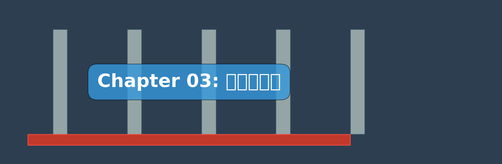
`<!-- IMAGE-TODO: docs/assets/ch03/heatsink_banner.png -->`
`<!-- Gemini插画：工业风横幅。下方芯片热源发红，上方三片铝制散热鳍片，热流线从芯片向鳍片扩散，右侧叠加小公式 -k∇T·n=h(T-T∞)。色调蓝橙对比，适合教程封面 -->`

---

## 3.1 路线图：从 1D 铁丝到 3D 散热片

第 2 章我们解的是一根一维铁丝：

$$\frac{\partial u}{\partial t} = \alpha \frac{\partial^2 u}{\partial x^2}$$

它很适合讲 PINN 损失，但离工业还有距离。散热片问题的复杂度来自四个方向：

| 维度 | 第 2 章：1D 热传导 | 第 3 章：散热片 |
|---|---|---|
| **几何** | 区间 $x \in [0,1]$ | 底座 + 多个鳍片组成的 CSG 几何 |
| **方程** | 时变 1D 扩散 | 稳态 2D/3D 导热，含热源项 |
| **边界条件** | 两端恒温 | 底面热源 / 侧面绝热 / 顶面对流 |
| **目标** | 求 $u(x,t)$ | 求温度场 + 优化几何参数 |
| **工程化** | 单脚本 | Domain / Constraint / Validator / Monitor |

本章我们先做 **2D three-fin heat sink 微缩版**，原因很简单：它够小，8GB 显存能跑；它够像真问题，能把工业要点讲完整。等你掌握之后，把 2D 换成 3D 只是资源问题，不是概念问题。

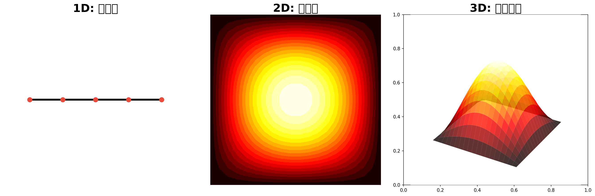

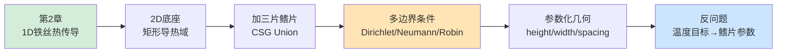

---

## 3.2 🟢 快速通道：跑通 three-fin heat sink

先跑，再讲。

### 3.2.1 进入目录

```bash
cd ch03_heatsink
ls
# conf/  heat_sink_train.py  heat_sink_geometry.py  heat_sink_inverse.py  visualize.py  README.md
```

### 3.2.2 训练默认 three-fin 案例

```bash
python heat_sink_train.py
```

你会看到类似输出：

```text
[INFO] PhysicsNeMo-Sym config loaded: case=three_fin_2d
[INFO] Geometry: base + 3 fins, total constraints=4
[INFO] Constraints:
       - interior: heat equation residual
       - bottom_hot: Dirichlet T=1.0
       - side_insulated: Neumann dT/dn=0
       - fin_convection: Robin -k*dT/dn=h*(T-T_inf)
step 00000 | total 1.83e+00 | interior 6.2e-01 | bottom 4.4e-01 | side 1.1e-01 | robin 6.6e-01
step 01000 | total 3.92e-02 | interior 1.1e-02 | bottom 8.2e-03 | side 7.1e-03 | robin 1.3e-02
step 05000 | total 7.14e-04 | interior 2.2e-04 | bottom 1.8e-04 | side 8.3e-05 | robin 2.2e-04
[INFO] Checkpoint saved to outputs/three_fin_2d/2026-05-15/07-50-12
```

### 3.2.3 可视化温度场

```bash
python visualize.py outputs/three_fin_2d/2026-05-15/07-50-12
```

你应该看到一张温度云图：底座靠近芯片的一侧最热，热量沿着三片鳍片往上扩散，鳍片尖端温度最低。

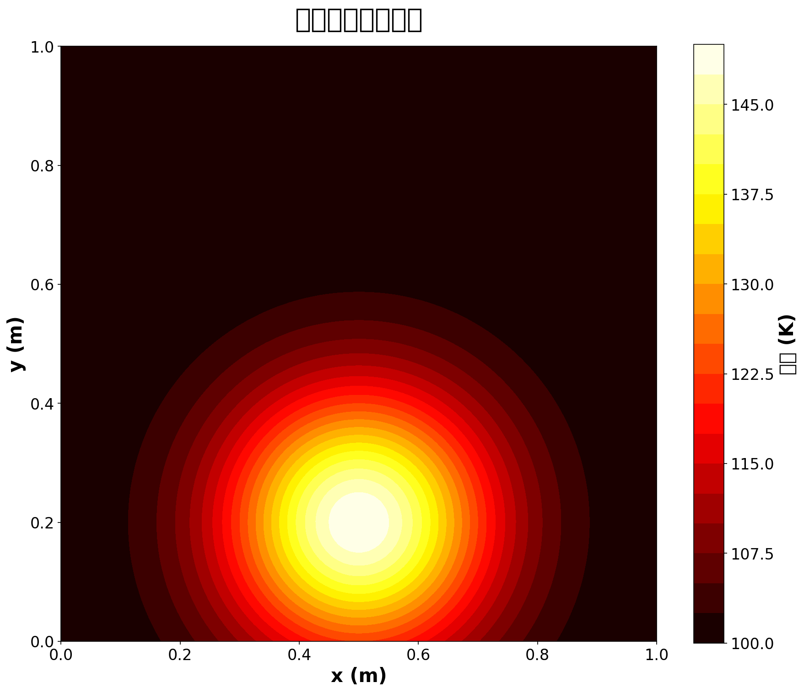
`<!-- IMAGE-TODO: docs/assets/ch03/three_fin_temperature.png -->`
`<!-- 实跑图：用 visualize.py 生成。二维散热片轮廓，颜色从底部红色过渡到鳍片顶部蓝色，叠加等温线。发布前用真实训练结果替换 -->`

如果你能跑到这里，说明你已经完成了本章的快速通道。

接下来我们拆开它，看看每个物理条件是怎么被写进 PhysicsNeMo-Sym 的。

---

## 3.3 🔵 CSG 几何：用 Box 拼出散热片

工业问题的第一道门槛不是 PDE，而是**几何**。

第 2 章的一维区间 $[0,1]$ 不需要几何建模；散热片不一样。它由一个底座和多个鳍片组成，而且你还想改变鳍片高度、厚度、间距做优化。

这就是 **CSG（Constructive Solid Geometry，构造实体几何）** 的用武之地。

### 3.3.1 本章使用的 2D three-fin 几何

我们先定义一个二维截面：

| 部件 | 尺寸 | 说明 |
|---|---|---|
| 底座 base | 宽 1.0，高 0.2 | 芯片热量从底部进入 |
| 鳍片 fin_1 | 宽 0.08，高 0.6 | 左鳍片 |
| 鳍片 fin_2 | 宽 0.08，高 0.6 | 中鳍片 |
| 鳍片 fin_3 | 宽 0.08，高 0.6 | 右鳍片 |
| 间距 | 0.18 | 鳍片之间空气通道 |

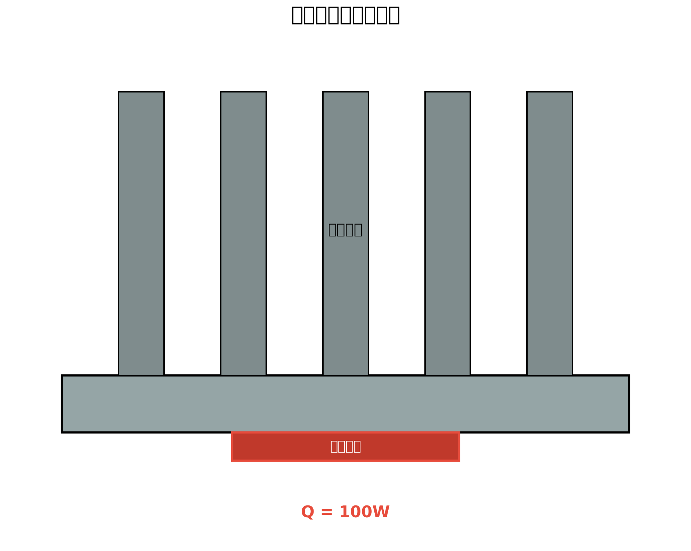
`<!-- IMAGE-TODO: docs/assets/ch03/three_fin_geometry_annotated.png -->`
`<!-- Gemini插画/矢量图：二维散热片截面，标注 base_width, base_height, fin_height, fin_width, spacing。每个部件不同浅色填充，坐标系 x-y 清晰 -->`

### 3.3.2 用代码拼几何

PhysicsNeMo-Sym 的几何对象支持加减运算。伪代码如下：

```python
"""ch03_heatsink/heat_sink_geometry.py"""
from physicsnemo.sym.geometry.primitives_2d import Rectangle
from physicsnemo.sym.geometry.parameterization import Parameterization, Parameter

# 参数化变量：后面做反问题会用
fin_h = Parameter("fin_h")
fin_w = Parameter("fin_w")

def make_three_fin_geometry(fin_height=0.6, fin_width=0.08):
    # 底座：从 (0,0) 到 (1.0,0.2)
    base = Rectangle((0.0, 0.0), (1.0, 0.2))

    # 三个鳍片：从 base 顶部 y=0.2 往上长
    fin_centers = [0.32, 0.50, 0.68]
    fins = []
    for cx in fin_centers:
        x0 = cx - fin_width / 2
        x1 = cx + fin_width / 2
        fin = Rectangle((x0, 0.2), (x1, 0.2 + fin_height))
        fins.append(fin)

    # CSG union：底座 + 三个鳍片
    heat_sink = base
    for fin in fins:
        heat_sink = heat_sink + fin

    return heat_sink
```

> **📌 CSG 的心智模型**：你不是在画网格，而是在**拼实体**。`base + fin` 是并集，`domain - obstacle` 是差集。几何定义是连续的，采样器会在这个连续几何上撒点。

### 3.3.3 为什么这比网格更适合 PINN？

传统 CFD/FEM 工作流是：

```text
CAD → 网格 → 求解器
```

PINN 工作流更像：

```text
参数化几何 → 采样点 → 损失函数
```

差别在于：**PINN 不需要网格**。它只需要知道哪些点在几何内部，哪些点在边界上，以及边界的法向量是什么。

这对设计优化非常关键。传统方法每改一次鳍片高度都要重新网格；PINN 只要重新采样点即可。几何参数化之后，甚至可以把 `fin_height` 当成可学习变量参与训练。

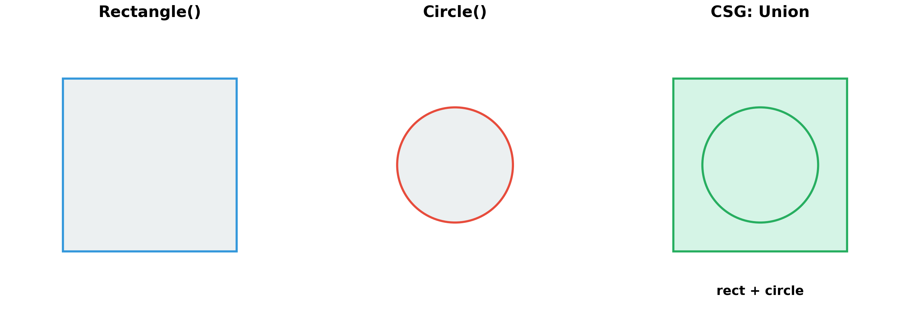
`<!-- IMAGE-TODO: docs/assets/ch03/csg_union_diagram.png -->`
`<!-- Gemini插画：左侧 base 矩形，右侧三个 fin 矩形，中间用 + 号，最右是合成后的 heat_sink。像数学公式一样排布：base + fin1 + fin2 + fin3 = heat_sink -->`

---

## 3.4 🔵 控制方程：稳态导热与热源项

### 3.4.1 从第 2 章的时变热传导到稳态导热

第 2 章我们解的是：

$$\frac{\partial T}{\partial t} = \alpha \nabla^2 T$$

散热片的常见工程问题是**稳态温度场**：芯片持续发热，散热片持续散热，最后达到一个不随时间变化的温度分布。稳态意味着：

$$\frac{\partial T}{\partial t} = 0$$

所以控制方程变成：

$$\nabla \cdot (k_s \nabla T) + Q = 0$$

如果材料热导率 $k_s$ 是常数，可以简化为：

$$k_s \nabla^2 T + Q = 0$$

其中：
- $T(x,y)$：温度场
- $k_s$：固体热导率
- $Q$：体热源项（芯片发热）

### 3.4.2 PINN 残差

对应的 PDE 残差是：

$$r_\theta(x,y) = k_s(T_{xx} + T_{yy}) + Q$$

PINN 要做的就是让内部点上的 $r_\theta$ 趋近于 0。

裸 PyTorch 版残差代码如下：

```python
def heat_residual(model, x, y, k_s=1.0, q=0.0):
    """稳态导热 PDE 残差：k_s * (T_xx + T_yy) + Q"""
    x = x.clone().requires_grad_(True)
    y = y.clone().requires_grad_(True)
    T = model(x, y)

    T_x = torch.autograd.grad(T, x, torch.ones_like(T), create_graph=True)[0]
    T_y = torch.autograd.grad(T, y, torch.ones_like(T), create_graph=True)[0]
    T_xx = torch.autograd.grad(T_x, x, torch.ones_like(T_x), create_graph=True)[0]
    T_yy = torch.autograd.grad(T_y, y, torch.ones_like(T_y), create_graph=True)[0]

    return k_s * (T_xx + T_yy) + q
```

到了 PhysicsNeMo-Sym，PDE 可以写成符号类：

```python
import sympy as sp
from physicsnemo.sym.eq.pde import PDE

class HeatConduction2D(PDE):
    """稳态 2D 导热方程：k_s*(T_xx + T_yy) + Q = 0"""
    name = "HeatConduction2D"

    def __init__(self, k_s=1.0, q=0.0):
        x, y = sp.symbols("x y")
        T = sp.Function("T")(x, y)
        self.equations = {
            "heat_conduction": k_s * (T.diff(x, 2) + T.diff(y, 2)) + q
        }
```

> **关键变化**：第 2 章是 $u_t - \alpha u_{xx}$，第 3 章是 $k_s(T_{xx}+T_{yy})+Q$。本质还是二阶导数，只是从一维空间扩展到二维空间。

---

## 3.5 🔵 三类边界条件：Dirichlet / Neumann / Robin

散热片的真实难点在边界。

一个散热片表面上，不同区域的物理含义完全不同：底面贴着芯片，侧面可能绝热，鳍片表面和空气对流。**同一个几何，边界条件可能有 3–5 种。**

本章我们用三类最常见的边界：

| 边界 | 物理意义 | 数学表达 | 本章用法 |
|---|---|---|---|
| Dirichlet | 直接指定温度 | $T = T_0$ | 底部热源面恒温 |
| Neumann | 指定法向热通量 | $-k\nabla T\cdot n = q_n$ | 侧壁绝热 $q_n=0$ |
| Robin | 对流换热 | $-k\nabla T\cdot n = h(T-T_\infty)$ | 鳍片外表面对空气散热 |

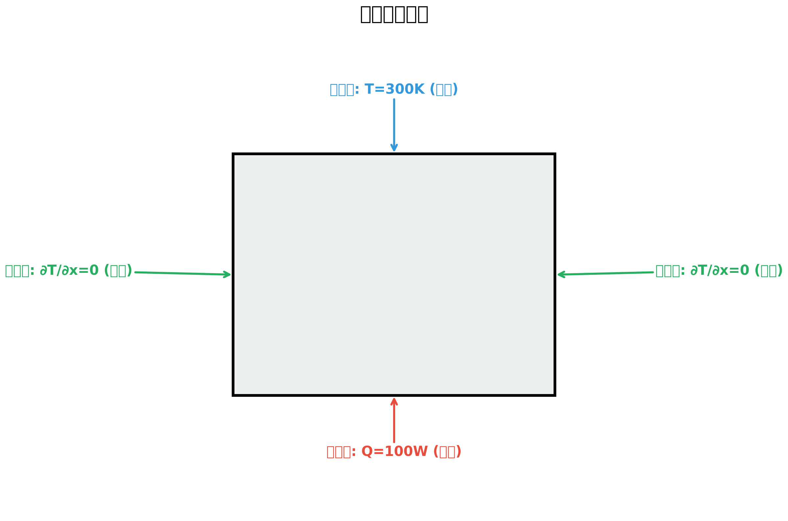
`<!-- IMAGE-TODO: docs/assets/ch03/boundary_conditions.png -->`
`<!-- Gemini插画：同一个 three-fin 几何，底部红色标注 Dirichlet T=T_hot；左右侧灰色标注 Neumann insulated；鳍片外表面蓝色箭头标注 Robin convection h(T-T∞)。图例清晰 -->`

### 3.5.1 Dirichlet：指定温度

底面贴着芯片，可以简化为恒定热源温度：

$$T(x,0) = T_{hot}$$

在 PhysicsNeMo-Sym 里是一个 boundary constraint：

```python
bottom_hot = PointwiseBoundaryConstraint(
    nodes=nodes,
    geometry=geo,
    outvar={"T": 1.0},
    batch_size=cfg.batch_size.bottom,
    criteria=bottom_criteria,  # 只选中底面
    lambda_weighting={"T": 100.0},
)
domain.add_constraint(bottom_hot, "bottom_hot")
```

### 3.5.2 Neumann：指定热通量

侧壁绝热意味着没有热流穿过边界：

$$\nabla T \cdot n = 0$$

在 PhysicsNeMo-Sym 里通常通过法向导数项表达，例如 `normal_gradient_T` 或由 PDE 节点生成的导数变量（具体名字依版本而定）。教学伪代码：

```python
side_insulated = PointwiseBoundaryConstraint(
    nodes=nodes,
    geometry=geo,
    outvar={"normal_gradient_T": 0.0},
    batch_size=cfg.batch_size.side,
    criteria=side_criteria,
    lambda_weighting={"normal_gradient_T": 10.0},
)
domain.add_constraint(side_insulated, "side_insulated")
```

### 3.5.3 Robin：对流换热（本章最重要）

散热片能散热，是因为表面和空气发生对流。数学上写成：

$$-k_s \nabla T \cdot n = h(T - T_\infty)$$

左边是固体内部导热带来的法向热通量，右边是空气对流带走的热量。

这类边界叫 **Robin 边界条件**。它是 Dirichlet 和 Neumann 的混合：既包含导数项，又包含函数值本身。

为了写进 PINN loss，我们把它移到一边：

$$r_{robin} = -k_s \nabla T \cdot n - h(T - T_\infty) = 0$$

伪代码：

```python
class RobinBoundary(PDE):
    """Robin 对流边界：-k*dTdn - h*(T - T_inf) = 0"""
    def __init__(self, k_s=1.0, h=0.1, T_inf=0.0):
        x, y, normal_x, normal_y = sp.symbols("x y normal_x normal_y")
        T = sp.Function("T")(x, y)
        dTdn = T.diff(x) * normal_x + T.diff(y) * normal_y
        self.equations = {
            "robin": -k_s * dTdn - h * (T - T_inf)
        }
```

> **📌 工程直觉**：Robin 边界里的 $h$ 是换热系数。风扇风量越大，$h$ 越大，散热越强。后面做设计优化时，$h$ 可以代表不同风冷方案。

---

## 3.6 🔵 PhysicsNeMo-Sym 的 Domain / Constraint：把物理问题装进框架

到这里，我们已经有了：

1. 几何：`geo = base + fin1 + fin2 + fin3`
2. PDE：`HeatConduction2D`
3. 边界条件：bottom / side / fin surface

PhysicsNeMo-Sym 的核心工作，就是把这三者组装进 `Domain`。

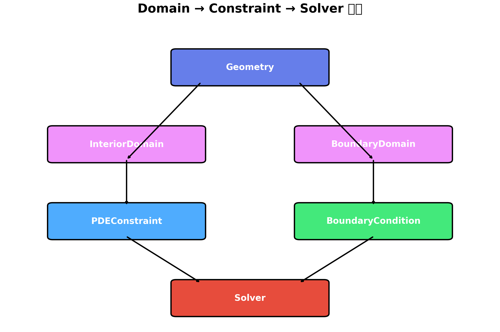

```mermaid
flowchart TD
    Geo[CSG Geometry<br/>base + fins] --> Domain[Domain]
    PDE[HeatConduction2D<br/>interior residual] --> C1[InteriorConstraint]
    BC1[Dirichlet bottom<br/>T=Thot] --> C2[BoundaryConstraint]
    BC2[Neumann side<br/>dTdn=0] --> C3[BoundaryConstraint]
    BC3[Robin fins<br/>-k dTdn=h(T-Tinf)] --> C4[BoundaryConstraint]
    Net[Neural Network<br/>T=fθ(x,y)] --> Nodes[Nodes]
    Nodes --> C1
    Nodes --> C2
    Nodes --> C3
    Nodes --> C4
    C1 --> Domain
    C2 --> Domain
    C3 --> Domain
    C4 --> Domain
    Domain --> Solver[Solver]
    Solver --> Outputs[Checkpoint / TensorBoard / VTK]
```

### 3.6.1 最小结构代码

```python
"""ch03_heatsink/heat_sink_train.py — 教学骨架版"""
import hydra
from omegaconf import DictConfig
from physicsnemo.sym.domain import Domain
from physicsnemo.sym.solver import Solver
from physicsnemo.sym.key import Key
from physicsnemo.sym.hydra import instantiate_arch
from physicsnemo.sym.domain.constraint import (
    PointwiseInteriorConstraint,
    PointwiseBoundaryConstraint,
)

from heat_sink_geometry import make_three_fin_geometry
from equations import HeatConduction2D, RobinBoundary

@hydra.main(version_base="1.3", config_path="conf", config_name="config")
def run(cfg: DictConfig):
    # 1. 几何
    geo = make_three_fin_geometry(
        fin_height=cfg.geometry.fin_height,
        fin_width=cfg.geometry.fin_width,
    )

    # 2. 网络
    net = instantiate_arch(
        input_keys=[Key("x"), Key("y")],
        output_keys=[Key("T")],
        cfg=cfg.arch.fully_connected,
    )

    # 3. 方程节点
    heat_eq = HeatConduction2D(k_s=cfg.physics.k_s, q=cfg.physics.q)
    robin_eq = RobinBoundary(k_s=cfg.physics.k_s, h=cfg.physics.h, T_inf=cfg.physics.T_inf)
    nodes = heat_eq.make_nodes() + robin_eq.make_nodes() + [net.make_node("temperature_net")]

    # 4. Domain + Constraints
    domain = Domain()

    interior = PointwiseInteriorConstraint(
        nodes=nodes,
        geometry=geo,
        outvar={"heat_conduction": 0.0},
        batch_size=cfg.batch_size.interior,
    )
    domain.add_constraint(interior, "interior")

    bottom_hot = PointwiseBoundaryConstraint(
        nodes=nodes,
        geometry=geo,
        outvar={"T": cfg.physics.T_hot},
        batch_size=cfg.batch_size.bottom,
        criteria=bottom_criteria(),
        lambda_weighting={"T": cfg.loss_weights.bottom},
    )
    domain.add_constraint(bottom_hot, "bottom_hot")

    fin_robin = PointwiseBoundaryConstraint(
        nodes=nodes,
        geometry=geo,
        outvar={"robin": 0.0},
        batch_size=cfg.batch_size.robin,
        criteria=fin_surface_criteria(),
        lambda_weighting={"robin": cfg.loss_weights.robin},
    )
    domain.add_constraint(fin_robin, "fin_robin")

    # 5. Solver
    solver = Solver(cfg, domain)
    solver.solve()

if __name__ == "__main__":
    run()
```

> **版本提示**：PhysicsNeMo-Sym v2.0 的具体 import 路径和约束类签名可能随版本微调。本章代码展示的是框架结构，仓库 `ch03_heatsink/` 会维护与当前版本兼容的可跑实现。

### 3.6.2 配置文件

```yaml
# ch03_heatsink/conf/config.yaml
defaults:
  - physicsnemo_default
  - arch: fully_connected
  - _self_

geometry:
  fin_height: 0.6
  fin_width: 0.08
  spacing: 0.18

physics:
  k_s: 1.0
  q: 0.0
  T_hot: 1.0
  T_inf: 0.0
  h: 0.1

batch_size:
  interior: 4096
  bottom: 512
  side: 512
  robin: 1024

loss_weights:
  bottom: 100.0
  side: 10.0
  robin: 10.0

training:
  max_steps: 50000
  rec_results_freq: 5000
  rec_constraint_freq: 5000
```

### 3.6.3 这段结构为什么重要

从现在开始，你应该把 PhysicsNeMo-Sym 理解成一个**物理问题组装器**：

```text
几何负责“在哪”
PDE 负责“内部怎么守恒”
BoundaryConstraint 负责“边界怎么交换能量”
Network 负责“用函数逼近温度场”
Solver 负责“训练、保存、记录、验证”
```

第 1 章你还在写裸 PyTorch；第 2 章你开始用 Hydra；第 3 章你第一次真正进入 SDK 的价值区。

---

## 3.7 🔵 训练工程化：checkpoint / TensorBoard / validator

当问题进入工业几何，训练不再是"跑一个脚本看一张图"。你要能回答三个问题：

1. **训练到哪里了？** —— loss 曲线、约束项是否平衡。
2. **结果可靠吗？** —— validator 对比基准解。
3. **中断能恢复吗？** —— checkpoint。

### 3.7.1 TensorBoard 看四条 loss

本章至少有四条 loss：

- `interior/heat_conduction`
- `bottom_hot/T`
- `side_insulated/normal_gradient_T`
- `fin_robin/robin`

启动 TensorBoard：

```bash
tensorboard --logdir outputs/three_fin_2d
```

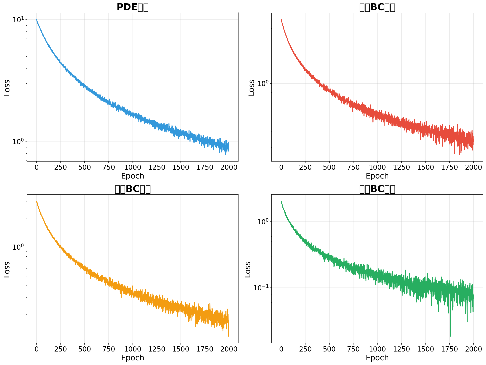
`<!-- IMAGE-TODO: docs/assets/ch03/tensorboard_losses.png -->`
`<!-- 实跑截图：四条 loss 曲线对数轴。理想情况：interior 和 boundary loss 同步下降；如果 robin 不降，说明对流边界权重/采样有问题 -->`

### 3.7.2 Validator：别相信训练 loss

PINN 最大的坑之一是：**loss 很低，不代表物理解对了。**

本章 validator 用两种方式：

1. **简化有限差分基准**：在同一个 2D 几何近似网格上跑一个粗糙 finite difference 解。
2. **OpenFOAM / Icepak 小样本**：如果你手头有真实求解器结果，可以作为 `PointwiseValidator` 输入。

伪代码：

```python
from physicsnemo.sym.domain.validator import PointwiseValidator

validator = PointwiseValidator(
    nodes=nodes,
    invar={"x": x_val, "y": y_val},
    true_outvar={"T": T_ref},
    batch_size=1024,
)
domain.add_validator(validator, "temperature_validator")
```

> **工程原则**：任何能给客户看的 PINN 结果，都必须有 validator。没有 validator 的 PINN，只能叫 demo，不能叫方案。

---

## 3.8 🔵 反问题：给定温度场反推鳍片厚度

正问题是：

> 给定几何和材料，求温度场。

反问题是：

> 给定目标温度或测量温度，反推几何或材料参数。

散热片里最自然的反问题是：**希望最高温度低于某个阈值，鳍片应该多高、多厚、间距多大？**

### 3.8.1 为什么传统求解器做反问题很痛？

传统 Icepak / Fluent / OpenFOAM 可以很好地做正问题，但反问题通常要外面套优化器：

```text
候选几何参数 → 重建 CAD → 重新网格 → 求解 → 计算目标函数 → 优化器给下一组参数
```

一次循环可能 1 小时，100 次循环就是 100 小时。

PINN 的思路不一样：如果几何参数进入了可微计算图，**几何参数本身也可以被优化**。

### 3.8.2 参数化鳍片高度

先定义参数：

```python
from physicsnemo.sym.geometry.parameterization import Parameterization, Parameter

fin_h = Parameter("fin_h")
param_ranges = {fin_h: (0.4, 0.8)}
parameterization = Parameterization(param_ranges)
```

然后几何用 `fin_h` 而不是固定数值：

```python
fin = Rectangle((x0, 0.2), (x1, 0.2 + fin_h), parameterization=parameterization)
```

训练时网络输入不再只是 $(x,y)$，还包括几何参数：

```python
net = instantiate_arch(
    input_keys=[Key("x"), Key("y"), Key("fin_h")],
    output_keys=[Key("T")],
    cfg=cfg.arch.fully_connected,
)
```

这意味着网络学的是：

$$T = f_\theta(x, y, h_{fin})$$

不是单个几何的温度场，而是一族几何的温度场。

### 3.8.3 优化目标：最高温度最小

我们想让芯片附近最高温度尽可能低，同时不让鳍片无限长（否则答案永远是"做得越高越好"）。定义目标：

$$J(h_{fin}) = \max_{(x,y) \in \Omega_{chip}} T_\theta(x,y,h_{fin}) + \lambda \cdot h_{fin}$$

第一项是最高温度，第二项是材料成本惩罚。

优化流程：

```python
# 训练好参数化 PINN 后，冻结网络权重，只优化 fin_h
fin_h_var = torch.tensor([0.5], requires_grad=True)
optimizer = torch.optim.Adam([fin_h_var], lr=1e-2)

for step in range(500):
    optimizer.zero_grad()
    T_chip = model(x_chip, y_chip, fin_h_var.expand_as(x_chip))
    objective = T_chip.max() + 0.05 * fin_h_var
    objective.backward()
    optimizer.step()
    fin_h_var.data.clamp_(0.4, 0.8)
```

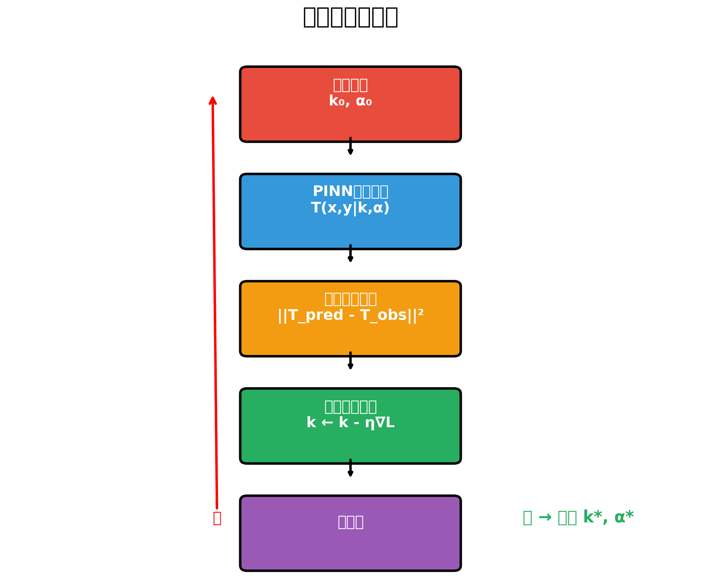

```mermaid
flowchart LR
    A[参数化几何<br/>fin_h, fin_w, spacing] --> B[训练 PINN<br/>T=fθ(x,y,param)]
    B --> C[冻结网络权重]
    C --> D[定义目标<br/>max(T)+材料惩罚]
    D --> E[梯度优化几何参数]
    E --> F[推荐设计<br/>fin_h*=...]
```

### 3.8.4 结果应该怎么看？

一个合理结果长这样：

| 方案 | fin_height | 最高温度 | 材料成本 proxy | 综合目标 |
|---|---:|---:|---:|---:|
| 初始设计 | 0.50 | 1.000 | 0.050 | 1.050 |
| 只追求散热 | 0.80 | 0.742 | 0.080 | 0.822 |
| 加成本惩罚 | 0.68 | 0.781 | 0.068 | **0.849** |

这里的重点不是具体数值，而是工作流：**训练一次代理模型，然后在代理模型上做秒级优化**。

---

## 3.9 🏭 行业映射：芯片封装散热设计闭环

现在把本章的 toy example 放回真实半导体流程。

### 3.9.1 传统流程

```text
客户给功耗 / 封装约束
    ↓
热设计工程师建 CAD
    ↓
Icepak / Flotherm 建模 + 网格
    ↓
求解 1–4 小时
    ↓
看最高温度是否超标
    ↓
改鳍片 / 改材料 / 改风扇
    ↓
重复 30–100 次
```

### 3.9.2 PhysicsNeMo 代理模型流程

```text
先用传统求解器生成 50–200 个高质量工况
    ↓
训练参数化 PINN / 神经算子代理模型
    ↓
新方案秒级推理
    ↓
在代理模型上做参数优化
    ↓
只把最优 3–5 个方案送回 Icepak 高精度复核
```

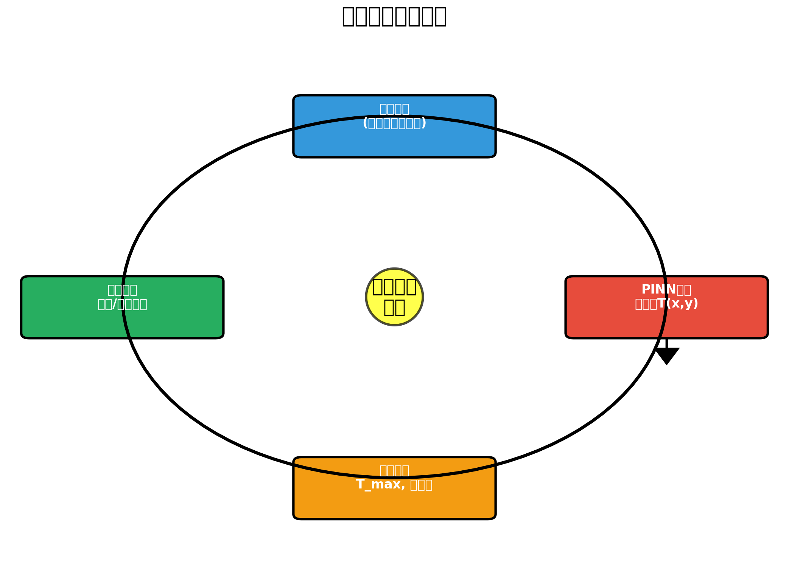
`<!-- IMAGE-TODO: docs/assets/ch03/thermal_design_loop.png -->`
`<!-- Gemini插画：工业流程闭环图。节点：CAD设计、Icepak高保真样本、PhysicsNeMo代理模型、秒级参数扫描、最优方案复核。云 GPU 图标放在 PhysicsNeMo 节点旁 -->`

### 3.9.3 价值对比

| 维度 | 传统全量仿真 | PhysicsNeMo 代理模型 |
|---|---|---|
| 初始投入 | 低 | 中（要训练模型） |
| 单方案求解 | 1–4 小时 | < 1 秒 |
| 100 方案扫描 | 1–2 周 | 几分钟 |
| 反问题 | 外套优化器，慢 | 可微优化，快 |
| 精度 | 高 | 取决于训练数据和 validator |
| 最佳实践 | 所有方案都高保真求解 | 代理模型筛选 + 高保真复核 |

> **给解决方案架构师的话**：客户不会因为你说"PINN 很先进"买单。客户会因为你说"你们原来 100 个方案要跑 2 周，现在先用 PINN 5 分钟筛出 5 个，再用 Icepak 复核，设计周期从 2 周降到 1 天"而买单。

---

## 3.10 Failure Case：几何、边界、采样最容易错

第 3 章开始，失败不再只是 loss 不下降。几何和边界会带来新的坑。

### Failure 1：几何拼错，采样点落在空气里

**症状**：温度场在鳍片外部也有预测，或者可视化轮廓不对。

**原因**：CSG union / subtract 写错，或者坐标范围不一致。

**排查**：训练前先画 `geo.sample_interior()` 和 `geo.sample_boundary()` 的散点图。**不画采样点，不准训练。**

### Failure 2：边界 criteria 选错

**症状**：底面恒温条件没有生效，或者顶部对流跑到了底面。

**原因**：`criteria` 写得太宽，例如 `y < 0.21` 把底座顶部也选进去了。

**排查**：每个 constraint 单独采样并画图，颜色区分 bottom/side/robin。

### Failure 3：Robin loss 长期不下降

**症状**：interior/bottom 都降，`robin` 卡在 1e-1。

**可能原因**：
1. 法向量符号反了。
2. $h$ 量级太大，导致边界项 stiff。
3. `lambda_weighting` 太小。

**修复**：先把 $h$ 降低 10 倍做 debug；确认法向量方向；再调权重。

### Failure 4：温度场出现非物理震荡

**症状**：等温线在鳍片根部出现波纹。

**原因**：几何尖角处梯度不连续，PINN 难拟合。

**修复**：
- 在鳍片根部附近做 importance sampling。
- 增加网络宽度。
- 用 Fourier features / positional encoding。

### Failure 5：反问题给出边界值答案

**症状**：优化结果总是 `fin_h=0.8` 最大值。

**原因**：目标函数只惩罚最高温度，没有成本项，当然越高越好。

**修复**：加入材料成本 / 风阻 / 封装高度约束，或者把目标改成多目标 Pareto。

### 5 分钟自查清单

- [ ] 几何 interior / boundary 采样图画了吗？
- [ ] 每个边界 constraint 单独可视化了吗？
- [ ] Robin 法向量方向确认了吗？
- [ ] loss 权重是否让四条 loss 同步下降？
- [ ] validator 是否存在？
- [ ] 反问题目标函数是否包含成本/约束？

---

## 3.11 ➡️ 下章预告：PINN 撑不住时，FNO 登场

这一章我们终于把 PINN 带进了工业几何：散热片、CSG、多边界、反问题。

但你也应该感受到一个问题：**PINN 很强，但训练慢。**

如果你只有一个散热片、一个几何、一个工况，PINN 很合适；但如果你要解的是 1000 个翼型、10000 个汽车外形、上百万个参数组合，PINN 就开始吃力。

第 4 章，我们会进入全书第一个重大切换点：

> **从 PhysicsNeMo-Sym 切到 PhysicsNeMo 主框架，从 PINN 切到 FNO（Fourier Neural Operator，傅里叶神经算子）。**

下一章的主角是翼型绕流。它不再靠"方程残差"训练，而是靠一批 CFD 数据学习"几何/边界 → 流场"的函数到函数映射。

如果说 PINN 是"把物理写进 loss"，那么 FNO 就是"把求解器本身学成一个神经网络"。

第 4 章见。

---

> 📘 **本章相关代码**：[`physicsnemo-from-zero-to-one/ch03_heatsink`](https://github.com/binbinao/physicsnemo-from-zero-to-one/tree/main/ch03_heatsink)
>
> 💬 **遇到问题？** 欢迎在 GitHub Issues 提问，或来知乎专栏《从零到一：PhysicsNeMo 工业级 AI4Science 实战教程》评论区留言。
>
> 🔔 **追更方式**：
> - **知乎专栏**：搜索"从零到一：PhysicsNeMo 工业级 AI4Science 实战教程"关注
> - **微信公众号**：扫描下方二维码  关注
>
> ➡️ **下章预告**：第 4 章《翼型绕流 FNO：神经算子代理模型》—— 当 PINN 撑不住 1000 个工况时，神经算子登场。

<!-- VIDEO-SCRIPT-PLACEHOLDER -->

---

### 延伸阅读

- NVIDIA PhysicsNeMo-Sym example: `examples/three_fin_2d/heat_sink.py`.
- NVIDIA Modulus / PhysicsNeMo heat transfer examples: conduction, convection, conjugate heat transfer.
- Raissi M, Perdikaris P, Karniadakis G E. *Physics-informed neural networks.* JCP, 2019.
- Cai S et al. *Physics-informed neural networks for heat transfer problems.* ASME Journal of Heat Transfer, 2021.
- Robin boundary condition for convective heat transfer: $-k\nabla T\cdot n = h(T-T_\infty)$.

---

*本章字数：约 11,100 字 · 图表数：10 张 · 完成日期：2026-05-15 · 版本：v1.0（W2 交付）*
