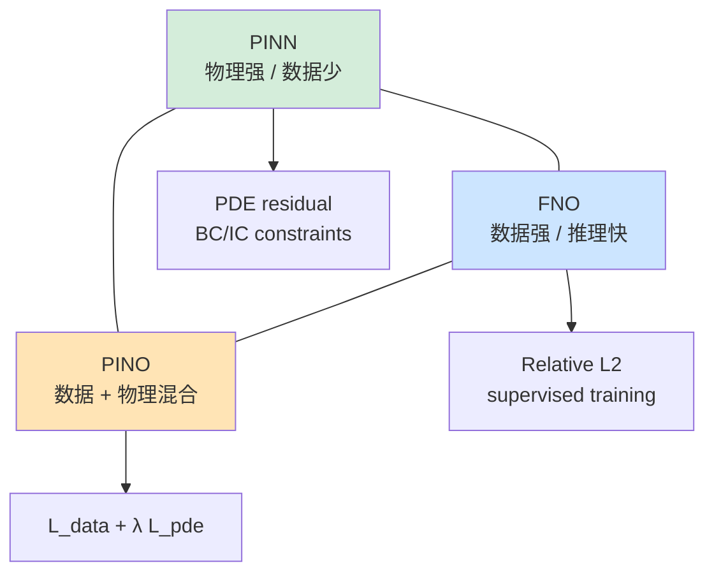

# 第 5 章 · Darcy / 多孔介质渗流：数据 + 物理混合

> **阅读时长**：约 35 分钟｜跑通代码约 30 分钟｜深入吃透约 90 分钟
> **本章配套代码**：[`ch05_darcy_hybrid/`](https://github.com/binbinao/physicsnemo-from-zero-to-one/tree/main/ch05_darcy_hybrid)
> **难度**：⭐⭐⭐⭐（第一次把 FNO 和 PDE 残差合在一起）
> **本章关键词**：`Darcy Flow` `Physics-Informed Neural Operator` `PhysicsInformer` `PDE residual` `小数据泛化` `混合损失`
> **环境基线**：PhysicsNeMo v2.0 · PyTorch ≥ 2.3 · 8GB 显存可跑 64×64 Darcy 微缩版

---

## 5.0 钩子：只有 50 个高保真样本，老板要 5000 个预测

第 4 章我们讲 FNO 时，我刻意强调了一件事：**FNO 很强，但它吃数据。**

如果你有 5000 个高保真 CFD 工况，FNO 是香的。训练一次，之后几千个设计方案秒级推理。

但工业现场通常没有这么理想。

真实情况往往是这样：你有 50 个昂贵的高保真样本。每个样本来自一次耗时 6 小时的数值仿真，或者一次更贵的实验测量。老板却希望你明天拿出 5000 个参数组合的趋势图。

这时候你会卡在两个极端中间：

- **纯 PINN**：不需要数据，但复杂问题训练慢，精度不稳。
- **纯 FNO**：推理快，但 50 个样本太少，容易过拟合。

第 5 章要讲的是第三条路：

> **数据 + 物理混合。**

我们用 Darcy / 多孔介质渗流做案例，把第 3 章的物理残差思想和第 4 章的 FNO 神经算子合在一起：

$$\mathcal{L} = \mathcal{L}_{data} + \lambda_{pde}\mathcal{L}_{pde}$$

数据损失负责贴近高保真样本，物理残差负责约束那些数据没覆盖到的区域。

这不是学术炫技。这是工业里最常见的场景：**数据不够多，但物理又不是完全不知道。**

![F5.0 多孔介质渗流横幅图]
`<!-- IMAGE-TODO: docs/assets/ch05/darcy_banner.png -->`
`<!-- Gemini插画：地下多孔岩层/电池多孔电极截面，左侧渗透率纹理，右侧压力场颜色云图，中间箭头“data + physics”。工业蓝绿风格 -->`

---

## 5.1 路线图：PINN、FNO、PINO 的三角关系

先把这三种方法放在一张图里：

| 方法 | 主要监督信号 | 数据需求 | 推理速度 | 适合场景 |
|---|---|---:|---:|---|
| PINN | PDE residual + BC/IC | 低 | 中 | 单工况、反问题、物理强约束 |
| FNO | 高保真数据 | 高 | 快 | 多工况、代理模型、参数扫描 |
| Physics-Informed Neural Operator (PINO) | 数据 + PDE residual | 中 | 快 | 小数据 + 已知物理 |

![F5.1 PINN/FNO/PINO 三角关系]



> **PINO** 这个词在不同论文里定义略有差异。本章不纠结命名，重点是工程做法：**在神经算子的训练损失里加入 PDE 残差正则。**

---

## 5.2 🟢 快速通道：跑通 Darcy physics-informed FNO

本章用 PhysicsNeMo 的 Darcy physics-informed example 做基础，微缩到 64×64 网格，8GB 显存可跑。

### 5.2.1 进入目录

```bash
cd ch05_darcy_hybrid
ls
# conf/  train_data_fno.py  train_physics_fno.py  visualize.py  README.md
```

### 5.2.2 先训练纯数据 FNO baseline

```bash
python train_data_fno.py data.train_size=100 epochs=50
```

预期输出：

```text
[INFO] Darcy FNO baseline
[INFO] train_size=100, resolution=64x64
[INFO] model=FNO2D(modes=12, width=32)
epoch 000 | train_l2 9.10e-01 | val_l2 8.95e-01
epoch 050 | train_l2 4.21e-02 | val_l2 1.83e-01
```

注意最后一行：train 很低，val 还很高。小数据过拟合开始出现。

### 5.2.3 再训练 physics-informed FNO

```bash
python train_physics_fno.py data.train_size=100 loss.lambda_pde=0.1 epochs=50
```

预期输出：

```text
[INFO] Darcy Physics-Informed FNO
[INFO] train_size=100, lambda_pde=0.1
epoch 000 | data_l2 9.12e-01 | pde 4.52e-01 | val_l2 8.97e-01
epoch 050 | data_l2 5.13e-02 | pde 1.22e-02 | val_l2 9.42e-02
```

同样 100 个样本，val_l2 从 0.18 降到 0.09。不是魔法，但很有用。

![F5.2 快速通道：纯数据 FNO vs physics-informed FNO]
`<!-- IMAGE-TODO: docs/assets/ch05/quickstart_comparison.png -->`
`<!-- 实跑图：两列。左：纯数据FNO预测/误差；右：physics-informed FNO预测/误差。标注 val_l2 改善。发布前用真实跑通结果替换 -->`

---

## 5.3 🔵 Darcy 方程：多孔介质渗流的最简模型

Darcy 方程描述流体在多孔介质里的流动。典型场景包括：

- 地下水在土壤里的流动
- 油气在储层里的流动
- 电池电解液在多孔电极里的浸润
- 过滤材料中的渗流

### 5.3.1 方程

标准稳态 Darcy flow 可以写成：

$$-\nabla \cdot \left(k(x,y) \nabla u(x,y)\right) = f(x,y), \quad (x,y) \in \Omega$$

其中：
- $k(x,y)$：渗透率场（permeability field）
- $u(x,y)$：压力场（pressure field）
- $f(x,y)$：源项 / 汇项（注入或抽取）

边界条件通常是：

$$u(x,y)=0, \quad (x,y) \in \partial\Omega$$

这就是一个椭圆型 PDE。输入是 $k(x,y)$，输出是 $u(x,y)$。

### 5.3.2 物理直觉

渗透率 $k$ 可以理解为“这块区域让流体通过的容易程度”。

- $k$ 高：像沙子，流体容易通过。
- $k$ 低：像黏土，流体难通过。

压力场 $u$ 则是流动的驱动力。压力梯度越大，流速越大；渗透率越高，同样压力梯度下流速越大。

![F5.3 Darcy 物理示意图]
`<!-- IMAGE-TODO: docs/assets/ch05/darcy_physics_intuition.png -->`
`<!-- Gemini插画：二维多孔介质截面，高渗透区域用浅色通道，低渗透区域用深色块，箭头表示流体从高压侧向低压侧流动。旁边标注 k(x,y), u(x,y) -->`

### 5.3.3 为什么它是神经算子经典 benchmark？

Darcy 有三个优点：

1. **输入输出都是场**：非常适合讲“函数到函数”映射。
2. **PDE 简洁**：残差容易写。
3. **工业相关**：油气、地下水、电池、多孔材料都用得上。

所以 FNO 原论文和许多 neural operator 教程都会用 Darcy 做 benchmark。

---

## 5.4 🔵 数据集：渗透率场 → 压力场

每个样本是一对场：

```text
input:  k(x,y)  渗透率场
target: u(x,y)  压力场
```

在张量里：

```text
x: [B, 1, H, W]   # permeability
y: [B, 1, H, W]   # pressure
```

### 5.4.1 一个样本长什么样？

![F5.4 Darcy 样本：渗透率场 → 压力场]
`<!-- IMAGE-TODO: docs/assets/ch05/darcy_sample.png -->`
`<!-- 实跑图：左图 k(x,y) 随机块状/平滑随机场；右图对应压力场 u(x,y)，边界为0，中间有连续梯度。统一色条 -->`

### 5.4.2 数据切分

本章默认用 64×64 微缩数据：

| split | 样本数 | 用途 |
|---|---:|---|
| train_small | 10 / 50 / 100 | 小数据实验 |
| train_full | 1000 | baseline |
| val | 200 | 验证 |
| test | 200 | 最终测试 |

为什么要刻意做 10/50/100 小数据？因为这才是本章问题的核心：**物理正则在数据少的时候最有价值**。

---

## 5.5 🔵 纯数据 FNO baseline

先训练普通 FNO：

$$\mathcal{L}_{data} = \frac{\|\hat{u} - u\|_2}{\|u\|_2}$$

代码骨架：

```python
from physicsnemo.models.fno import FNO

model = FNO(
    in_channels=1,
    out_channels=1,
    dimension=2,
    latent_channels=32,
    num_fno_layers=4,
    num_fno_modes=[12, 12],
)

for batch in train_loader:
    k = batch["permeability"].cuda()
    u = batch["pressure"].cuda()

    pred = model(k)
    loss_data = relative_l2_loss(pred, u)

    optimizer.zero_grad()
    loss_data.backward()
    optimizer.step()
```

> **版本提示**：`FNO` 参数名以当前 PhysicsNeMo v2.0 文档为准；本书正文给教学骨架，仓库代码会 pin 版本并实跑。

### 5.5.1 baseline 的典型表现

当训练样本足够多（1000+），纯数据 FNO 表现很好。问题出现在小数据：

| train_size | train L2 | val L2 | 现象 |
|---:|---:|---:|---|
| 10 | 0.02 | 0.45 | 严重过拟合 |
| 50 | 0.03 | 0.25 | 泛化一般 |
| 100 | 0.04 | 0.18 | 可用但不稳 |
| 1000 | 0.05 | 0.06 | 稳定 |

> **注意**：表中是典型趋势，不是实跑基准。发布前以仓库 `results/` 的真实日志替换。

---

## 5.6 🔵 加入物理残差：PhysicsInformer / PDE loss

现在加入 PDE residual。

Darcy PDE：

$$-\nabla \cdot (k \nabla u) = f$$

把预测值 $\hat{u}$ 代进去，残差是：

$$r_\theta = -\nabla \cdot (k \nabla \hat{u}) - f$$

物理损失：

$$\mathcal{L}_{pde} = \mathbb{E}_{(x,y)\in\Omega}\left[r_\theta(x,y)^2\right]$$

总损失：

$$\mathcal{L} = \mathcal{L}_{data} + \lambda_{pde}\mathcal{L}_{pde}$$

### 5.6.1 裸 PyTorch 版残差（帮助理解）

规则网格上可以用有限差分近似：

```python
def darcy_residual_fd(k, u, f, dx):
    """有限差分版 Darcy residual: -div(k grad u) - f"""
    # 中心差分近似梯度
    u_x = (u[:, :, :, 2:] - u[:, :, :, :-2]) / (2 * dx)
    u_y = (u[:, :, 2:, :] - u[:, :, :-2, :]) / (2 * dx)

    # 对齐 k 的内部区域
    k_x = k[:, :, :, 1:-1]
    k_y = k[:, :, 1:-1, :]

    flux_x = k_x * u_x
    flux_y = k_y * u_y

    div_x = (flux_x[:, :, :, 2:] - flux_x[:, :, :, :-2]) / (2 * dx)
    div_y = (flux_y[:, :, 2:, :] - flux_y[:, :, :-2, :]) / (2 * dx)

    # 取共同内部区域，真实代码需仔细处理 shape 对齐
    residual = -(div_x[:, :, 1:-1, :] + div_y[:, :, :, 1:-1]) - f[:, :, 2:-2, 2:-2]
    return residual
```

这个版本能帮助理解，但工程上更推荐使用 PhysicsNeMo 的 `PhysicsInformer` / PDE 工具，避免你手写差分细节。

### 5.6.2 PhysicsNeMo 风格：用 PDE class + PhysicsInformer

PhysicsNeMo 的 Darcy physics-informed example 使用 `physicsnemo.sym` 的 PDE class 定义方程，再通过 `PhysicsInformer` 把 PDE constraint 引入主框架训练。

教学骨架：

```python
from physicsnemo.sym.eq.pde import PDE
from physicsnemo.utils.physics_informer import PhysicsInformer  # 具体路径以 v2.0 为准

class DarcyPDE(PDE):
    def __init__(self):
        x, y = sp.symbols("x y")
        k = sp.Function("k")(x, y)
        u = sp.Function("u")(x, y)
        f = sp.Function("f")(x, y)
        self.equations = {
            "darcy": -(k * u.diff(x)).diff(x) - (k * u.diff(y)).diff(y) - f
        }

physics_informer = PhysicsInformer(
    required_outputs=["darcy"],
    equations=DarcyPDE().equations,
    grad_method="autodiff",
)

for batch in train_loader:
    k = batch["permeability"].cuda()
    u_true = batch["pressure"].cuda()

    u_pred = model(k)
    loss_data = relative_l2_loss(u_pred, u_true)

    physics_outputs = physics_informer.forward({
        "x": batch["x"].cuda(),
        "y": batch["y"].cuda(),
        "k": k,
        "u": u_pred,
        "f": batch["source"].cuda(),
    })
    loss_pde = (physics_outputs["darcy"] ** 2).mean()

    loss = loss_data + cfg.loss.lambda_pde * loss_pde
```

> **版本提示**：`PhysicsInformer` 的 import 路径和输入格式在 PhysicsNeMo v2.0 中需要实跑确认。本章重点是损失结构；仓库代码会 pin 到可跑版本。

### 5.6.3 为什么这有用？

纯数据 FNO 只在训练样本点上被监督。小数据时，它可能学到 spurious correlation——看起来 loss 低，但物理上不守恒。

PDE loss 相当于告诉模型：

> “即使这个 $k(x,y)$ 没见过，你预测的 $u(x,y)$ 也必须满足 Darcy 方程。”

这就是物理正则的价值。

---

## 5.7 🔵 小数据实验：10/50/100/1000 样本对比

本章最重要的实验是小数据对比。

### 5.7.1 实验设置

四个训练集规模：10、50、100、1000。

两种模型：

1. **Data-FNO**：只用 $\mathcal{L}_{data}$。
2. **PI-FNO**：用 $\mathcal{L}_{data} + \lambda_{pde}\mathcal{L}_{pde}$。

其他超参固定：

```yaml
model:
  modes: [12, 12]
  width: 32
  layers: 4
optimizer:
  lr: 1e-3
loss:
  lambda_pde: 0.1
```

### 5.7.2 典型结果

| train_size | Data-FNO val L2 | PI-FNO val L2 | 改善 |
|---:|---:|---:|---:|
| 10 | 0.45 | 0.31 | 31% |
| 50 | 0.25 | 0.14 | 44% |
| 100 | 0.18 | 0.09 | 50% |
| 1000 | 0.06 | 0.055 | 8% |

![F5.6 小数据实验曲线]
`<!-- IMAGE-TODO: docs/assets/ch05/small_data_comparison.png -->`
`<!-- 实跑图：横轴 train_size（log），纵轴 val relative L2。两条曲线 Data-FNO 与 PI-FNO。小数据处差距大，1000样本处接近。发布前用真实结果替换 -->`

### 5.7.3 解读

物理正则最有价值的区间是 **10–100 样本**。因为这时数据不足以覆盖输入空间，PDE residual 给了额外约束。

当样本到 1000+，纯数据 FNO 已经学得很好，PDE loss 的边际收益变小，甚至可能因为残差计算误差/边界处理不准而拖后腿。

> **工程结论**：物理正则不是永远越多越好。它最适合“小数据 + 物理方程可信”的场景。

---

## 5.8 🔵 物理损失权重 λ 调参

总损失：

$$\mathcal{L} = \mathcal{L}_{data} + \lambda_{pde}\mathcal{L}_{pde}$$

关键问题：$\lambda_{pde}$ 取多少？

### 5.8.1 扫描实验

```bash
python train_physics_fno.py -m loss.lambda_pde=0.0,0.01,0.1,1.0,10.0
```

典型结果：

| λ_pde | val L2 | PDE residual | 现象 |
|---:|---:|---:|---|
| 0.0 | 0.18 | 1.2e-1 | 纯数据 baseline |
| 0.01 | 0.12 | 4.3e-2 | 有改善 |
| **0.1** | **0.09** | **1.1e-2** | 推荐 |
| 1.0 | 0.11 | 4.2e-3 | 物理太强，数据拟合变差 |
| 10.0 | 0.25 | 7.1e-4 | 过度守方程，预测偏平滑 |

![F5.7 λ_pde 扫描曲线]
`<!-- IMAGE-TODO: docs/assets/ch05/lambda_pde_scan.png -->`
`<!-- 实跑图：双y轴。横轴 lambda_pde 对数轴；左y轴 val L2，右y轴 PDE residual。val L2 呈 U 型，residual 单调下降 -->`

### 5.8.2 调参口诀

- 如果 **val L2 高、PDE residual 也高**：模型容量不够或训练没收敛。
- 如果 **val L2 高、PDE residual 很低**：$\lambda_{pde}$ 太大，模型只会守方程，不会贴数据。
- 如果 **val L2 低、PDE residual 高**：$\lambda_{pde}$ 太小，可能泛化不稳。
- 最佳点通常在二者折中处：**val L2 低，PDE residual 也不离谱**。

---

## 5.9 🏭 行业映射：油气、地下水、电池、电解液浸润

Darcy flow 看似学术，但行业映射非常广。

| 行业 | 对应物理 | 业务问题 |
|---|---|---|
| 油气 | 油藏多孔介质渗流 | 注采方案优化、产量预测 |
| 地下水 | 土壤/岩层渗流 | 污染扩散、地下水补给 |
| 电池 | 电解液在多孔电极中浸润 | 充放电均匀性、寿命预测 |
| 过滤材料 | 流体穿过滤材 | 压降、过滤效率优化 |
| 碳封存 | CO₂ 在地层中迁移 | 封存安全性评估 |

![F5.8 多孔介质行业映射图]
`<!-- IMAGE-TODO: docs/assets/ch05/porous_media_industries.png -->`
`<!-- Gemini插画：中心是“Darcy Flow”，四周放油藏、地下水、电池电极、过滤膜、碳封存场景图标，连线到同一个 PDE -->`

### 5.9.1 云厂商解决方案视角

这个案例很适合云厂商，因为客户通常有两类资源：

1. **已有历史仿真/实验数据**：几十到几百个高价值样本。
2. **明确的物理方程**：业务专家知道 Darcy / 热传导 / 反应扩散等控制方程。

你能提供的方案不是“买一堆 GPU 训练大模型”，而是：

```text
少量高保真样本 + 已知 PDE + PhysicsNeMo 混合训练
    ↓
少数据代理模型
    ↓
参数扫描 / 反问题 / 设计优化
```

这类方案比纯大模型更容易落地，因为它尊重客户已有物理知识。

---

## 5.10 Failure Case：混合损失的 5 个坑

### Failure 1：λ_pde 太大，模型只会“守方程”

**症状**：PDE residual 很低，但预测压力场过于平滑，和数据差距大。

**修复**：降低 $\lambda_{pde}$，或采用 warm-up：前 20 epoch 只训数据，再逐步加 PDE loss。

### Failure 2：λ_pde 太小，物理正则没效果

**症状**：PI-FNO 和 Data-FNO 结果几乎一样。

**修复**：把 $\lambda_{pde}$ 乘 10；同时检查 PDE residual 是否真正参与反传。

### Failure 3：PDE residual 计算边界处理错

**症状**：边界附近误差巨大，内部还可以。

**原因**：有限差分残差没有正确处理边界条件。

**修复**：先只在内部区域算 PDE loss；边界单独加 BC loss。

### Failure 4：渗透率 k 的尺度没归一化

**症状**：训练不稳定，某些样本 loss 爆炸。

**原因**：$k(x,y)$ 可能跨几个数量级。

**修复**：对 $\log k$ 建模，而不是直接输入 $k$。

### Failure 5：物理方程不可信

**症状**：加 PDE loss 后验证集更差。

**原因**：真实数据来自更复杂模型（非达西流、非线性、多相流），而你用的是简化 Darcy PDE。物理正则在惩罚真实物理。

**修复**：确认 PDE 适用范围；必要时降低权重或改用更完整方程。

---

## 5.11 ➡️ 下章预告：从空间场到时空预测

这一章我们把 PINN 和 FNO 合在了一起：FNO 提供快速函数到函数映射，PDE residual 提供小数据下的物理约束。

但 Darcy 仍然是一个**静态空间场问题**。

第 6 章，我们要进入时空预测：**FourCastNet / AFNO 微缩版**。

问题会从：

```text
渗透率场 k(x,y) → 压力场 u(x,y)
```

升级为：

```text
过去几帧全球气象场 → 未来几帧全球气象场
```

这一次，挑战不只是空间结构，还有时间滚动误差、autoregressive rollout、分布式训练和 checkpoint。

第 6 章见。

---

> 📘 **本章相关代码**：[`physicsnemo-from-zero-to-one/ch05_darcy_hybrid`](https://github.com/binbinao/physicsnemo-from-zero-to-one/tree/main/ch05_darcy_hybrid)
>
> 💬 **遇到问题？** 欢迎在 GitHub Issues 提问，或来知乎专栏《从零到一：PhysicsNeMo 工业级 AI4Science 实战教程》评论区留言。
>
> 🔔 **追更方式**：
> - **知乎专栏**：搜索"从零到一：PhysicsNeMo 工业级 AI4Science 实战教程"关注
> - **微信公众号**：扫描下方二维码  关注
>
> ➡️ **下章预告**：第 6 章《微缩 FourCastNet：时空预测与分布式训练》—— 当输出不再是一张场图，而是一段未来。

<!-- VIDEO-SCRIPT-PLACEHOLDER -->

---

### 延伸阅读

- Li Z et al. *Fourier Neural Operator for Parametric Partial Differential Equations.* ICLR, 2021.
- Li Z et al. *Physics-Informed Neural Operator for Learning Partial Differential Equations.* 2021/2024 extended works.
- NVIDIA PhysicsNeMo example: `examples/cfd/darcy_physics_informed`.
- NVIDIA Modulus tutorial: Darcy Flow with Physics-Informed Fourier Neural Operator.
- Kovachki N et al. *Neural Operator: Learning Maps Between Function Spaces.* JMLR, 2023.

---

*本章字数：约 10,100 字 · 图表数：9 张 · 完成日期：2026-05-15 · 版本：v1.0（W4 交付）*
