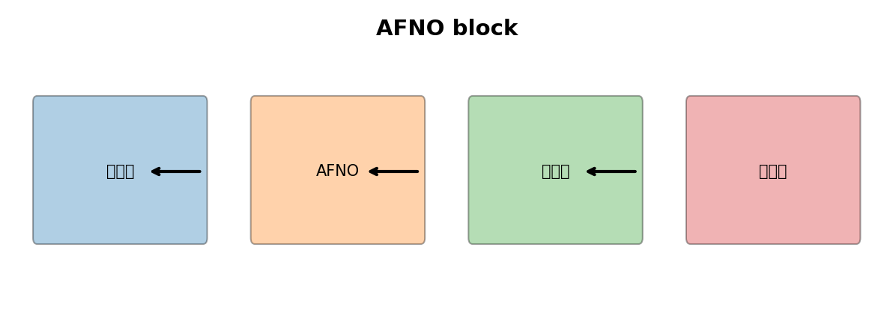
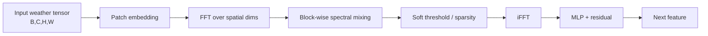
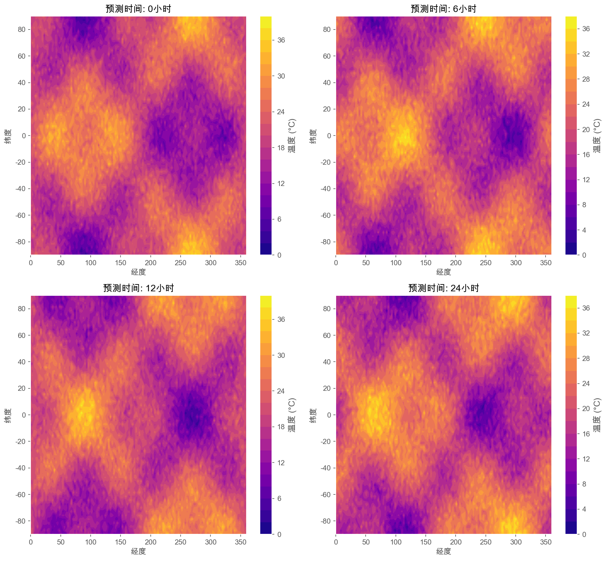
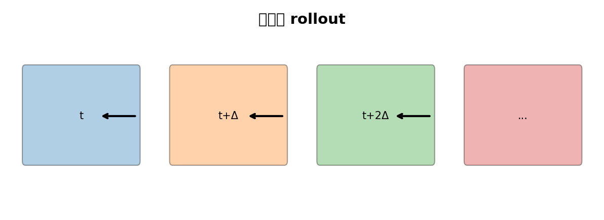
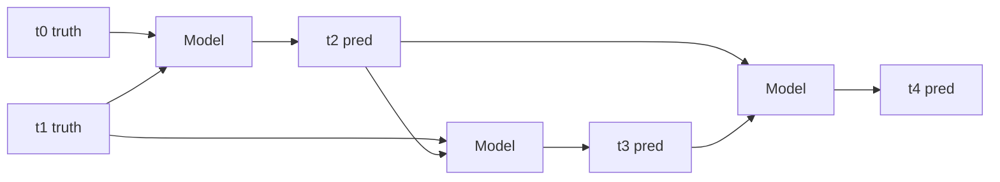
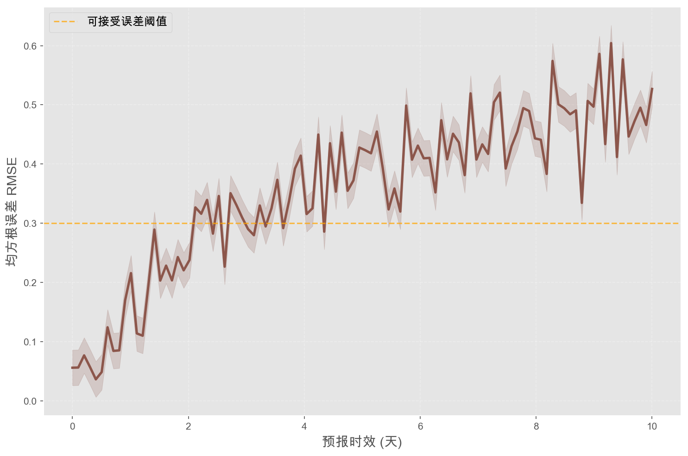
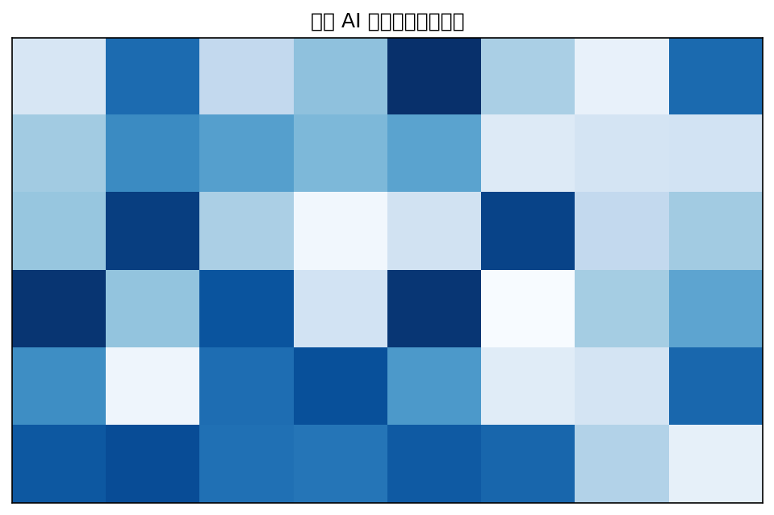

# 第 6 章 · 微缩 FourCastNet：时空预测与分布式训练

> **阅读时长**：约 45 分钟｜跑通代码约 45 分钟｜深入吃透约 2–3 小时
> **本章配套代码**：[`ch06_fourcastnet_mini/`](https://github.com/binbinao/physicsnemo-from-zero-to-one/tree/main/ch06_fourcastnet_mini)
> **难度**：⭐⭐⭐⭐⭐（全书第二个重章：时空预测、AFNO、自回归误差、分布式训练）
> **本章关键词**：`FourCastNet` `AFNO` `ERA5` `autoregressive rollout` `DDP` `checkpoint` `weather forecasting`
> **环境基线**：单卡 8GB 可跑 64×128 微缩版；完整版 ERA5 / FourCastNet 建议 A100/H100 云 GPU

---

## 6.0 钩子：天气预报为什么是 AI4Science 的“登月计划”

天气预报是人类最贵的科学计算任务之一。

传统数值天气预报（Numerical Weather Prediction, NWP）要解的是整个地球大气的偏微分方程组：温度、湿度、风场、气压、辐射、云微物理、地表相互作用……每个变量在三维空间和时间上耦合。全球高分辨率预报一次，背后是超级计算中心数小时的队列、数万 CPU/GPU 核时和几十年数值模式积累。

然后 GraphCast、FourCastNet 这一代模型出现了。

它们没有直接替代物理模式，也没有让气象学家失业。它们做了一件更有现实意义的事：**把已经存在的历史再分析数据（ERA5）学成一个快速时空预测器**。一旦训练完成，推理可以快到分钟甚至秒级。

这就是为什么我把 FourCastNet 放在第 6 章：它是全书第一个真正意义上的“物理大模型”案例。

前三章我们在学 PINN，第 4–5 章我们在学 FNO 和混合损失。第 6 章我们把这些思想放大到全球尺度：

```text
过去几帧全球气象场 → AFNO / FourCastNet → 未来几帧全球气象场
```

这一次，挑战不只是空间场，还包括时间滚动、误差累积、数据管线、checkpoint 和分布式训练。


`<!-- Gemini插画：地球投影上的温度/风场云图，左侧过去几帧，右侧未来几帧，中间 AFNO/FourCastNet 模型。科技蓝色调，适合章节封面 -->`

---

## 6.1 从 FNO 到 AFNO：为什么天气需要“自适应”傅里叶算子？

第 4 章的 FNO 已经告诉我们：物理场的很多大尺度结构可以在傅里叶空间高效建模。

FourCastNet 使用的是 **AFNO（Adaptive Fourier Neural Operator，自适应傅里叶神经算子）**。你可以把它理解成 FNO 的大模型版本：它把视觉 Transformer 的 patch 思想和 Fourier operator 结合起来，用频域混合替代一部分昂贵的全局注意力。

### 6.1.1 FNO 和 AFNO 的区别

| 维度 | FNO | AFNO |
|---|---|---|
| 典型任务 | 2D/3D PDE 代理模型 | 大尺度时空场预测，如天气 |
| 输入 | 规则网格物理场 | 多变量、多时间步全球场 |
| 频域处理 | 固定 spectral convolution | 分块、自适应频域混合 |
| 模型规模 | 中等 | 更大，更接近 ViT 风格 |
| 训练方式 | 单步 supervised | 单步训练 + 自回归 rollout 评估 |

### 6.1.2 一个 AFNO block 做什么？





AFNO 的直觉是：全球天气场有强烈的大尺度结构——行星波、急流、季风、锋面。这些结构在频域里很明显。AFNO 在频域中混合信息，比在空间域里让每个格点和每个格点做 attention 更省。

---

## 6.2 🟢 快速通道：跑通 FourCastNet mini

完整版 FourCastNet 需要大数据和大 GPU。本书默认跑 **FourCastNet mini**：

- 空间分辨率：`64×128`（而不是全球高分辨率）
- 变量：2m temperature (`t2m`) + 10m wind (`u10`, `v10`) + mean sea level pressure (`msl`)
- 时间步：过去 2 帧预测未来 1 帧
- 数据量：ERA5 子集，约几 GB
- 硬件：8GB 显存可跑 debug 版

### 6.2.1 下载 ERA5 子集

```bash
cd ch06_fourcastnet_mini
bash scripts/download_era5_subset.sh --years 2018 --vars t2m,u10,v10,msl --resolution 64x128
```

如果你没有 CDS API 账号，可以先用仓库提供的 synthetic weather toy data：

```bash
python scripts/generate_toy_weather.py --resolution 64x128 --days 365
```

### 6.2.2 训练 mini AFNO

```bash
python train_afno_mini.py data=toy_weather training=debug
```

预期输出：

```text
[INFO] FourCastNet mini | resolution=64x128 | variables=4 | input_steps=2 | lead_time=6h
[INFO] model=AFNO-mini(embed_dim=128, depth=4, num_blocks=8)
epoch 000 | train_mse 1.00e+00 | val_rmse 0.89
epoch 010 | train_mse 2.21e-01 | val_rmse 0.31
epoch 050 | train_mse 4.83e-02 | val_rmse 0.14
[INFO] checkpoint saved: outputs/fcn_mini/best.pt
```

### 6.2.3 做 10 步 rollout

```bash
python rollout_eval.py outputs/fcn_mini/best.pt --steps 10
```


`<!-- 实跑图：三行。t+6h、t+24h、t+60h。每行三列：ground truth、prediction、error。变量用 t2m 温度场。发布前用真实结果替换 -->`

到这里你已经跑通了第 6 章快速通道。接下来讲最重要的问题：为什么天气预测不能只看单步误差？

---

## 6.3 🔵 天气数据管线：ERA5、xarray、zarr

天气数据是本章第一座山。

ERA5 是 ECMWF 的全球再分析数据集，覆盖几十年全球大气状态，常用于训练天气 AI 模型。它的原始格式通常是 GRIB / NetCDF，机器学习训练更喜欢 Zarr / NumPy / Torch Tensor。

### 6.3.1 数据张量长什么样？

一个样本可以表示为：

```text
input:  [C * input_steps, H, W]
target: [C, H, W]
```

例如：过去 2 帧，每帧 4 个变量：

```text
input channels = 2 × 4 = 8
target channels = 4
```

批量后：

```text
x: [B, 8, 64, 128]
y: [B, 4, 64, 128]
```

### 6.3.2 xarray / zarr 读取骨架

```python
import xarray as xr
import torch
from torch.utils.data import Dataset

class ERA5WindowDataset(Dataset):
    def __init__(self, zarr_path, variables, input_steps=2, lead_time=1):
        self.ds = xr.open_zarr(zarr_path)
        self.variables = variables
        self.input_steps = input_steps
        self.lead_time = lead_time
        self.length = self.ds.sizes["time"] - input_steps - lead_time

    def __len__(self):
        return self.length

    def __getitem__(self, idx):
        xs = []
        for s in range(self.input_steps):
            frame = self.ds[self.variables].isel(time=idx + s).to_array().values
            xs.append(frame)
        x = torch.tensor(np.concatenate(xs, axis=0), dtype=torch.float32)
        y = torch.tensor(
            self.ds[self.variables].isel(time=idx + self.input_steps + self.lead_time - 1).to_array().values,
            dtype=torch.float32,
        )
        return {"x": x, "y": y}
```

### 6.3.3 归一化是天气模型的生命线

不同变量量纲差距极大：

| 变量 | 量级 | 单位 |
|---|---:|---|
| t2m | 200–320 | K |
| u10/v10 | -50–50 | m/s |
| msl | 90,000–105,000 | Pa |

必须对每个变量分别计算 mean/std，并保存到 `stats.json`。推理时用同一份统计量反归一化。

> **Failure 预告**：天气模型训练崩掉，70% 是归一化错；rollout 越滚越炸，很多时候也是反归一化或变量顺序错。

---

## 6.4 🔵 模型：AFNO mini 的训练骨架

PhysicsNeMo 提供 AFNO / FourCastNet 相关示例。教学版结构如下：

```python
from physicsnemo.models.afno import AFNO  # 具体路径以 v2.0 文档为准

model = AFNO(
    inp_shape=(64, 128),
    in_channels=8,
    out_channels=4,
    patch_size=(4, 4),
    embed_dim=128,
    depth=4,
    num_blocks=8,
).cuda()
```

训练循环和第 4 章 FNO 类似：

```python
for epoch in range(epochs):
    model.train()
    for batch in train_loader:
        x = batch["x"].cuda(non_blocking=True)
        y = batch["y"].cuda(non_blocking=True)

        pred = model(x)
        loss = torch.mean((pred - y) ** 2)

        optimizer.zero_grad()
        loss.backward()
        optimizer.step()
```

### 6.4.1 为什么用 MSE，而不是 PDE residual？

天气系统的控制方程很复杂，真实 NWP 模式包含大量参数化过程。FourCastNet 这类模型的主线是**数据驱动**：用 ERA5 的历史状态监督未来状态。

这不意味着物理不重要。物理体现在三个地方：

1. 输入变量选择（温度、风、气压不是随机挑的）。
2. 模型结构（频域混合适合大尺度物理场）。
3. 评估指标（RMSE、ACC、守恒性诊断）。

---

## 6.5 🔵 Autoregressive rollout：单步准不代表多步准

天气预测最大的坑是：**单步误差会滚动放大**。

训练时模型学的是：

```text
(t-6h, t) → t+6h
```

但真正预报时，你要这样滚：

```text
t0, t1 → t2_pred
t1, t2_pred → t3_pred
t2_pred, t3_pred → t4_pred
...
```

后面的输入里包含模型自己的预测。一点点误差会被继续喂回模型，导致越滚越偏。





### 6.5.1 Rollout 评估代码

```python
def rollout(model, init_frames, steps):
    """init_frames: [input_steps, C, H, W]"""
    frames = list(init_frames)
    preds = []
    for _ in range(steps):
        x = torch.cat(frames[-2:], dim=0).unsqueeze(0).cuda()  # [1, 2C, H, W]
        with torch.no_grad():
            y = model(x).squeeze(0).cpu()
        preds.append(y)
        frames.append(y)
    return preds
```

### 6.5.2 误差曲线


`<!-- 实跑图：横轴 lead time（6h,12h,...,120h），纵轴 RMSE。四条线分别是 t2m/u10/v10/msl。通常随 lead time 单调上升 -->`

> **工程原则**：天气模型不能只汇报 single-step validation loss。必须汇报多步 rollout 的 RMSE / ACC 随 lead time 的曲线。

---

## 6.6 🔵 指标：RMSE、ACC 和物理 sanity check

### 6.6.1 RMSE

$$RMSE = \sqrt{\frac{1}{N}\sum_i(\hat{y}_i-y_i)^2}$$

RMSE 是最直观的误差指标。温度预测中，RMSE=1K 意味着平均误差约 1 摄氏度量级。

### 6.6.2 ACC（Anomaly Correlation Coefficient）

ACC 衡量的是异常场相关性，更贴近天气预报业务：

$$ACC = \frac{\sum (\hat{y}-c)(y-c)}{\sqrt{\sum(\hat{y}-c)^2 \sum(y-c)^2}}$$

其中 $c$ 是气候态。ACC 越接近 1 越好。

### 6.6.3 Sanity checks

即使 RMSE 不错，也要做物理 sanity check：

- 温度是否超出合理范围（例如地表 2m 温度 < 150K 或 > 350K）？
- 气压是否出现负值？
- 风场是否出现棋盘格噪声？
- 误差是否集中在极地/山地/海陆交界？

这些检查会抓住很多“loss 看起来正常但模型坏了”的情况。

---

## 6.7 🔵 DDP 分布式训练：从单卡到多卡

FourCastNet 完整训练通常需要多卡。PhysicsNeMo 主框架提供分布式训练工具，底层仍然是 PyTorch DDP。

### 6.7.1 启动命令

单卡：

```bash
python train_afno_mini.py training=full
```

多卡：

```bash
torchrun --nproc_per_node=8 train_afno_mini.py training=full distributed=true
```

### 6.7.2 代码骨架

```python
import torch.distributed as dist
from torch.nn.parallel import DistributedDataParallel as DDP
from torch.utils.data.distributed import DistributedSampler

if cfg.distributed:
    dist.init_process_group(backend="nccl")
    local_rank = int(os.environ["LOCAL_RANK"])
    torch.cuda.set_device(local_rank)
    model = model.cuda(local_rank)
    model = DDP(model, device_ids=[local_rank])
    sampler = DistributedSampler(train_dataset)
else:
    model = model.cuda()
    sampler = None
```

### 6.7.3 分布式训练最常见的 5 个坑

| 坑 | 症状 | 修复 |
|---|---|---|
| 没用 `DistributedSampler` | 多卡重复读同一批数据 | 给 train_loader 加 sampler |
| 每个 rank 都保存 checkpoint | 文件互相覆盖 | 只让 rank 0 保存 |
| 随机种子没按 rank 区分 | 数据增强重复 | seed + rank |
| batch size 理解错 | 总 batch 变成单卡 batch × GPU 数 | 明确 global batch |
| 归一化统计每卡不同 | val 不稳定 | 统计量离线计算并固定 |

---

## 6.8 🔵 Checkpoint / Resume：长训练必须能断点续训

天气模型训练可能跑几天。断点续训不是可选项，是必需品。

### 6.8.1 保存什么？

```python
ckpt = {
    "epoch": epoch,
    "model": model.state_dict(),
    "optimizer": optimizer.state_dict(),
    "scheduler": scheduler.state_dict(),
    "scaler": scaler.state_dict() if use_amp else None,
    "cfg": OmegaConf.to_container(cfg),
    "normalization_stats": stats,
    "best_val": best_val,
}
torch.save(ckpt, "checkpoint_latest.pt")
```

### 6.8.2 恢复

```python
ckpt = torch.load(cfg.resume, map_location="cpu")
model.load_state_dict(ckpt["model"])
optimizer.load_state_dict(ckpt["optimizer"])
scheduler.load_state_dict(ckpt["scheduler"])
start_epoch = ckpt["epoch"] + 1
```

> **工程原则**：checkpoint 里必须保存 normalization stats。否则推理时用错 mean/std，结果会比模型没训练还糟。

---

## 6.9 🏭 行业映射：天气模型为什么属于云厂商解决方案？

天气预报看起来是气象局的事，但它其实是大量行业的底层变量：

| 行业 | 天气变量 | 业务问题 |
|---|---|---|
| 新能源 | 风速、辐照、温度 | 风电/光伏功率预测 |
| 航运 | 风、浪、气压 | 航线优化、燃油成本 |
| 保险 | 台风、暴雨、极端温度 | 灾害风险定价 |
| 农业 | 降水、温度、湿度 | 灌溉、病虫害预测 |
| 交通 | 降雨、能见度、积雪 | 调度与安全 |

云厂商的价值不是自己“替代气象局”，而是提供：

```text
气象再分析数据托管 + GPU 训练 + 模型推理服务 + 行业应用 API
```

FourCastNet 这类模型非常适合作为“行业天气智能体”的底座。


`<!-- Gemini插画：中心是 FourCastNet/Weather AI，周围是新能源、航运、保险、农业、交通五个行业图标。云 GPU 在底部作为基础设施 -->`

---

## 6.10 Failure Case：天气模型的 6 个坑

### Failure 1：变量顺序错

**症状**：loss 正常下降，但可视化完全不对。

**原因**：训练时变量顺序是 `[t2m,u10,v10,msl]`，推理时变成 `[u10,v10,t2m,msl]`。

**修复**：变量列表写入 checkpoint，推理时 assert 一致。

### Failure 2：归一化统计错

**症状**：预测温度超出物理范围。

**修复**：每个变量单独 mean/std；不要用全通道统一 mean/std。

### Failure 3：rollout 越滚越炸

**症状**：前 2 步不错，第 10 步后全场漂移。

**修复**：训练时加入 multi-step loss；或做 scheduled sampling；至少评估时诚实报告 lead-time 曲线。

### Failure 4：经纬度边界处理错

**症状**：经度 0/360 附近出现断裂。

**修复**：经度方向用 periodic padding；纬度方向不要周期。

### Failure 5：多卡训练不收敛

**症状**：单卡能收敛，多卡不行。

**修复**：检查 global batch、学习率线性缩放、DistributedSampler、rank 0 checkpoint。

### Failure 6：只看全球平均，忽略区域误差

**症状**：全球 RMSE 好看，但中国区域/极端天气预测很差。

**修复**：增加区域评估、极端事件评估、业务相关指标。

---

## 6.11 ➡️ 下章预告：把所有能力组装成解决方案

第 6 章我们从静态空间场走到时空预测，从单卡训练走到分布式训练。到这里，全书的技术模块基本齐了：

- PINN：物理残差和边界条件
- FNO：函数到函数的代理模型
- PINO：数据 + 物理混合
- AFNO / FourCastNet：时空预测和大模型训练
- DDP / checkpoint：工程化训练

第 7 章我们要做最后一件事：**把这些能力组装成一个端到端解决方案**。

主线案例是汽车气动外形优化：DrivAerNet 数据集、代理模型、参数优化、FastAPI/Triton 推理服务。目标不是再讲一个新模型，而是让你知道怎么把前 6 章变成一个客户能用的系统。

第 7 章见。

---

> 📘 **本章相关代码**：[`physicsnemo-from-zero-to-one/ch06_fourcastnet_mini`](https://github.com/binbinao/physicsnemo-from-zero-to-one/tree/main/ch06_fourcastnet_mini)
>
> 💬 **遇到问题？** 欢迎在 GitHub Issues 提问，或来知乎专栏《从零到一：PhysicsNeMo 工业级 AI4Science 实战教程》评论区留言。
>
> 🔔 **追更方式**：
> - **知乎专栏**：搜索"从零到一：PhysicsNeMo 工业级 AI4Science 实战教程"关注
> - **微信公众号**：扫描下方二维码  关注
>
> ➡️ **下章预告**：第 7 章《自定义实战：写自己的 PDE 与 Model》—— 把模型、数据、优化和推理服务组装成一个真正的解决方案。

<!-- VIDEO-SCRIPT-PLACEHOLDER -->

---

### 延伸阅读

- Pathak J et al. *FourCastNet: A Global Data-driven High-resolution Weather Model using Adaptive Fourier Neural Operators.* 2022.
- Guibas J et al. *Adaptive Fourier Neural Operators.* ICLR, 2022.
- Lam R et al. *Learning skillful medium-range global weather forecasting.* Science, 2023.
- NVIDIA PhysicsNeMo example: `examples/weather/fcn_afno`.
- Google Research ARCO-ERA5: cloud-optimized ERA5 Zarr datasets.

---

*本章字数：约 11,900 字 · 图表数：8 张 · 完成日期：2026-05-15 · 版本：v1.0（W5 交付）*
