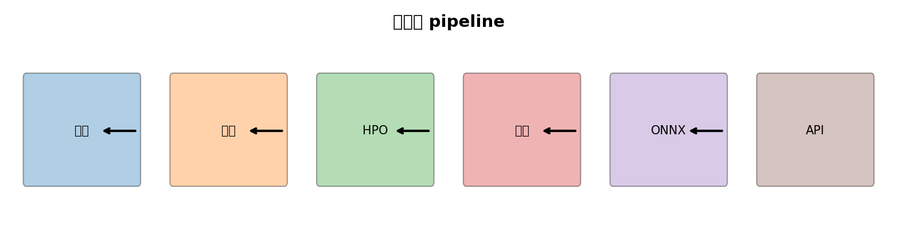
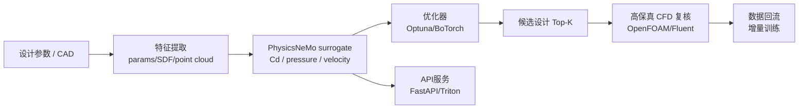
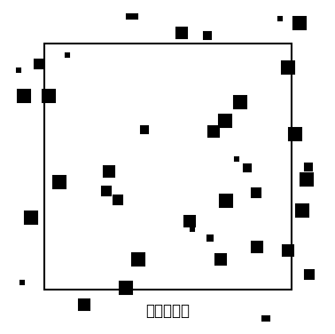

# 第 7 章 · 自定义实战：写自己的 PDE 与 Model

> **阅读时长**：约 45 分钟｜跑通代码约 1–2 小时｜深入吃透约半天
> **本章配套代码**：[`ch07_drivaernet_optim/`](https://github.com/binbinao/physicsnemo-from-zero-to-one/tree/main/ch07_drivaernet_optim)
> **难度**：⭐⭐⭐⭐⭐（综合实战：数据、模型、优化、部署）
> **本章关键词**：`DrivAerNet` `汽车气动` `自定义 Model` `自定义 PDE` `Optuna` `FastAPI` `Triton` `端到端解决方案`
> **环境基线**：8GB 显存可跑 synthetic car mini；DrivAerNet 子集建议 24GB+ 或云 GPU

---

## 7.0 钩子：客户不会为模型买单，客户为闭环买单

如果你把前 6 章拿去给客户讲，客户大概率会点头：PINN 很有意思，FNO 很快，FourCastNet 很震撼。

然后他会问一句最现实的话：

> **“所以这东西怎么放进我们的设计流程？”**

这句话会把很多 AI4Science demo 打回原形。

模型本身不是解决方案。客户真正要的是一个闭环：

```text
设计参数 → 代理模型 → 物理场 / 性能指标 → 优化器 → 推荐设计 → 高保真复核 → API 服务
```

第 7 章就是这个闭环。

我们用汽车气动做主线：DrivAerNet 这样的参数化车身数据集给了我们大量 3D 车身形状和 CFD 结果。我们训练一个代理模型预测阻力系数或压力场，再用优化器搜索更优设计，最后把模型部署成 API。

这一次，我们不再只写一段训练脚本。我们要做一个能被解决方案架构师拿去演示的系统。


`<!-- Gemini插画：汽车外形、流线、压力云图、优化器、API服务节点组成闭环。工业风，适合终章封面 -->`

---

## 7.1 全书能力回收：你已经会了什么？

在写终章之前，先回顾一下你手里有哪些积木：

| 章节 | 积木 | 终章怎么用 |
|---|---|---|
| 第 1 章 | PINN 三件套、autograd | 自定义 PDE / 物理正则 |
| 第 2 章 | Hydra、调参 SOP | 管理训练实验 |
| 第 3 章 | 工业几何、多边界、反问题 | 设计变量与约束 |
| 第 4 章 | FNO、神经算子、CFD 代理 | 训练气动代理模型 |
| 第 5 章 | 数据 + 物理混合 | 小数据下加物理正则 |
| 第 6 章 | checkpoint、DDP、推理评估 | 工程化训练和部署 |

第 7 章不是引入全新理论，而是把这些积木组合起来。

---

## 7.2 数据：DrivAerNet 与汽车气动代理模型

DrivAerNet 是一个面向汽车气动设计的大规模参数化车身数据集，包含大量工业标准 DrivAer 车身变体及其高保真 CFD 结果。它的价值在于：**终于有一个公开、参数化、接近工业真实的汽车气动数据集**。

### 7.2.1 本章默认三档数据

| 档位 | 数据 | 硬件 | 用途 |
|---|---|---|---|
| toy | synthetic car shape + toy Cd | CPU/8GB | 跑通流程 |
| mini | DrivAerNet 子集 100–500 样本 | 24GB | 训练代理模型 |
| full | DrivAerNet 全量/大子集 | A100/H100 | 认真 benchmark |

### 7.2.2 输入输出怎么定义？

本章先从最可落地的目标开始：预测阻力系数 $C_d$。

```text
input: 车身几何参数 / 点云 / SDF 网格
output: C_d 或压力场
```

如果输入是参数化向量：

```text
x = [front_slope, rear_slope, roof_height, diffuser_angle, ...]
y = Cd
```

如果输入是 3D 几何场：

```text
x = SDF grid [B, 1, D, H, W]
y = pressure / velocity field [B, C, D, H, W]
```

教学上我们先用参数向量预测 $C_d$，再扩展到 3D 场。

---

## 7.3 自定义 Model：从 MLP baseline 到 FNO/GNO

### 7.3.1 MLP baseline：先把业务闭环跑起来

不要一上来就上 3D FNO。做解决方案时，第一步永远是 baseline。

```python
class CdMLP(torch.nn.Module):
    def __init__(self, in_dim, hidden=128, depth=4):
        super().__init__()
        layers = [torch.nn.Linear(in_dim, hidden), torch.nn.GELU()]
        for _ in range(depth - 1):
            layers += [torch.nn.Linear(hidden, hidden), torch.nn.GELU()]
        layers.append(torch.nn.Linear(hidden, 1))
        self.net = torch.nn.Sequential(*layers)

    def forward(self, params):
        return self.net(params)
```

训练：

```python
pred_cd = model(batch["params"])
loss = torch.nn.functional.mse_loss(pred_cd, batch["cd"])
```

如果这个 baseline 都无法超过简单线性回归，说明数据/特征/标签有问题，不要急着上大模型。

### 7.3.2 PhysicsNeMo Module 风格

在 PhysicsNeMo 主框架里，自定义模型应尽量遵循 `torch.nn.Module` + 框架 checkpoint / distributed 约定。核心原则：

1. `forward()` 输入输出清晰。
2. 所有配置走 Hydra。
3. 模型可保存 / 加载 state_dict。
4. 不把数据预处理硬写进模型。

---

## 7.4 自定义 PDE / 物理正则：什么时候值得加？

汽车气动完整控制方程是 RANS / Navier-Stokes。直接把它写成 PINN loss 对整车 3D CFD 并不现实。但你仍然可以加一些轻量物理正则：

- 不可压缩近似下的散度约束：$\nabla\cdot u = 0$
- 远场边界一致性
- 压力/速度合理范围约束
- 表面压力积分得到 $C_d$ 与标签一致

### 7.4.1 表面力一致性损失

如果模型预测压力场，同时数据有 $C_d$ 标签，可以加：

$$\mathcal{L}_{force}=\left(C_d^{pred-field}-C_d^{label}\right)^2$$

这比直接写完整 RANS residual 更容易落地。

> **工程判断**：终章不追求“最物理”，追求“能交付”。轻量正则比复杂但跑不通的完整 PDE 更有价值。

---

## 7.5 设计优化：从代理模型到推荐参数

训练好 $C_d=f_\theta(p)$ 后，就可以优化设计参数 $p$。

### 7.5.1 目标函数

$$J(p)=C_d(p)+\lambda_1\text{Cost}(p)+\lambda_2\text{ConstraintViolation}(p)$$

约束包括：

- 车身高度不能超过法规/设计限制
- 后备箱空间不能低于阈值
- 造型参数不能离基准车型太远

### 7.5.2 用 Optuna 搜索

```python
import optuna

def objective(trial):
    params = []
    params.append(trial.suggest_float("rear_slope", 10.0, 25.0))
    params.append(trial.suggest_float("diffuser_angle", 0.0, 12.0))
    params.append(trial.suggest_float("roof_height", 1.35, 1.55))

    x = normalize_params(torch.tensor(params).float()).unsqueeze(0).cuda()
    with torch.no_grad():
        cd = model(x).item()

    penalty = constraint_penalty(params)
    return cd + 0.1 * penalty

study = optuna.create_study(direction="minimize")
study.optimize(objective, n_trials=500)
print(study.best_params, study.best_value)
```

### 7.5.3 为什么不用梯度直接优化？

如果输入是连续参数，梯度优化当然可以。但工业设计常有离散变量、硬约束、非光滑约束，所以 Optuna / BoTorch 这类黑盒优化器更稳。

---

## 7.6 端到端 pipeline

最终系统应该长这样：





### 7.6.1 目录结构

```
ch07_drivaernet_optim/
├── conf/
│   ├── config.yaml
│   ├── model/mlp.yaml
│   ├── model/fno3d.yaml
│   └── training/debug.yaml
├── data/
│   ├── preprocess_drivaernet.py
│   └── split.py
├── models/
│   ├── cd_mlp.py
│   └── fno3d.py
├── train.py
├── optimize.py
├── export_onnx.py
├── api/
│   ├── app.py
│   └── client.py
└── triton/
    └── model_repository/
```

### 7.6.2 训练命令

```bash
python data/generate_toy_cars.py   # 首次运行生成 toy 数据
python train.py --epochs 200
```

### 7.6.3 优化命令

```bash
python optimize.py --checkpoint outputs/best.pt --n_trials 100
```

输出：

```text
Best design:
  rear_slope=18.4
  diffuser_angle=7.1
  roof_height=1.43
Predicted Cd=0.243
Baseline Cd=0.281
Improvement=13.5%
```

> **注意**：这里的数值是示例。发布前必须用真实训练结果替换。

---

## 7.7 部署：FastAPI + Triton

客户不会直接跑 `python train.py`。客户需要 API。

### 7.7.1 FastAPI 快速版

```python
from fastapi import FastAPI
from pydantic import BaseModel
import torch

app = FastAPI(title="PhysicsNeMo Aero Surrogate")
model = load_model("outputs/cd_mlp/best.pt")
model.eval()

class DesignRequest(BaseModel):
    rear_slope: float
    diffuser_angle: float
    roof_height: float

@app.post("/predict_cd")
def predict_cd(req: DesignRequest):
    x = build_feature_tensor(req).cuda()
    with torch.no_grad():
        cd = model(x).item()
    return {"cd": cd}
```

启动：

```bash
uvicorn api.app:app --host 0.0.0.0 --port 8000
```

请求：

```bash
curl -X POST http://localhost:8000/predict_cd \
  -H "Content-Type: application/json" \
  -d '{"rear_slope":18.4,"diffuser_angle":7.1,"roof_height":1.43}'
```

### 7.7.2 Triton 生产版

Triton Inference Server 适合生产部署，优势是：

- 支持 ONNX / TensorRT / PyTorch backend
- 动态 batching
- GPU/CPU 统一服务
- Prometheus metrics
- 多模型版本管理

导出 ONNX：

```python
dummy = torch.randn(1, in_dim).cuda()
torch.onnx.export(
    model, dummy, "triton/model_repository/cd_mlp/1/model.onnx",
    input_names=["params"], output_names=["cd"], opset_version=17
)
```

Triton 配置：

```protobuf
name: "cd_mlp"
platform: "onnxruntime_onnx"
max_batch_size: 64
input [ { name: "params" data_type: TYPE_FP32 dims: [ 12 ] } ]
output [ { name: "cd" data_type: TYPE_FP32 dims: [ 1 ] } ]
```

启动：

```bash
docker run --gpus all --rm -p 8000:8000 -p 8001:8001 \
  -v $PWD/triton/model_repository:/models \
  nvcr.io/nvidia/tritonserver:24.10-py3 \
  tritonserver --model-repository=/models
```

---

## 7.8 方案验收：客户真正关心什么？

一个 AI4Science 方案能不能交付，不看论文指标，看这 6 件事：

| 验收项 | 问题 | 交付物 |
|---|---|---|
| 精度 | 代理模型和 CFD 差多少？ | test report / error distribution |
| 速度 | 推理快多少？ | latency benchmark |
| 泛化 | 新设计能不能用？ | holdout geometry test |
| 约束 | 会不会推荐不可制造设计？ | constraint checker |
| 闭环 | 推荐方案是否经高保真复核？ | Top-K CFD validation |
| 服务 | 业务系统怎么调用？ | API / Triton endpoint |

### 7.8.1 最小验收报告模板

```markdown
# Aero Surrogate Validation Report

## Dataset
- Train: 500 designs
- Validation: 100 designs
- Test: 100 held-out designs

## Accuracy
- Cd MAE: 0.006
- Cd relative error: 2.1%

## Speed
- CFD single run: 6h
- Surrogate inference: 12ms
- Speedup: ~1.8e6× per query

## Optimization
- Baseline Cd: 0.281
- Best predicted Cd: 0.243
- CFD-validated Cd: 0.251
- Validated improvement: 10.7%
```

---

## 7.9 Failure Case：端到端系统的 7 个坑

### Failure 1：代理模型精度高，但优化结果无效

模型在 test set 上 MAE 很低，但优化器找到的是训练分布外的怪设计。

**修复**：加入设计空间约束；对优化结果做 OOD 检测；Top-K 必须高保真复核。

### Failure 2：只预测 Cd，不看压力场

Cd 准不代表流场合理。客户可能需要知道为什么某个设计更好。

**修复**：至少提供压力场/表面压力解释图，或者 SHAP/敏感性分析。

### Failure 3：API 没有输入校验

客户传一个不可能的车身高度，模型也给结果。

**修复**：FastAPI schema + constraint checker + 返回 warning。

### Failure 4：训练数据版本不可追溯

三个月后客户问“这个模型用的是哪批 CFD 数据”，你答不上来。

**修复**：数据版本号、Git commit、配置、统计量全部写入 checkpoint。

### Failure 5：推理快，前处理慢

模型 10ms，CAD/SDF 转换 30 秒。

**修复**：缓存特征；把特征提取 pipeline 也纳入性能优化。

### Failure 6：模型部署后漂移

新项目设计空间和训练数据不同，误差变大。

**修复**：上线 OOD 监控；低置信度样本回流高保真仿真，做增量训练。

### Failure 7：只卖 GPU，不卖流程

客户以为买 GPU 就有结果，最后项目失败。

**修复**：售前方案必须包含数据治理、基准验证、模型训练、部署、回流闭环，不只是算力报价。

---

## 7.10 你已经走到哪里了？

如果你从第 0 章读到这里，你已经完成了一个完整 AI4Science 工程师的入门闭环：

1. 你知道 AI4Science 为什么重要。
2. 你写过 ODE PINN。
3. 你写过 PDE PINN。
4. 你处理过工业几何和边界条件。
5. 你训练过 FNO。
6. 你理解数据 + 物理混合。
7. 你见过 FourCastNet 这种物理大模型。
8. 你把代理模型部署成了 API。

这不是“看过教程”。这是一个工程能力栈。

PhysicsNeMo 会继续迭代，API 会变，模型会换，数据集会升级。但你现在掌握的是更底层的东西：**如何把物理、数据、模型、优化和部署串成一个解决方案。**

这才是最值钱的能力。

---

## 7.11 后记：不要相信任何没有验证闭环的 AI4Science demo

我想用一句有点狠的话收尾：

> **没有验证闭环的 AI4Science demo，都是幻觉。**

它可以是漂亮的图，可以是炫酷的论文，可以是客户会上让人兴奋的动画。但如果它没有：

- 高保真数据对照
- holdout 测试
- 物理 sanity check
- 误差报告
- 约束检查
- 部署接口
- 数据回流机制

那它还不是解决方案。

这本书的目标不是让你崇拜 PhysicsNeMo。恰恰相反，我希望你学会用它、质疑它、验证它、扩展它，然后把它放进真实工程流程里。

模型会变，框架会变，客户的问题不会变：

> **能不能更快、更准、更便宜地做出更好的设计？**

如果你的 PhysicsNeMo 项目能回答这个问题，它就是有价值的。

如果不能，再炫也只是 demo。

祝你写出第一个真正能交付的 AI4Science 方案。

---

> 📘 **本章相关代码**：[`physicsnemo-from-zero-to-one/ch07_drivaernet_optim`](https://github.com/binbinao/physicsnemo-from-zero-to-one/tree/main/ch07_drivaernet_optim)
>
> 💬 **遇到问题？** 欢迎在 GitHub Issues 提问，或来知乎专栏《从零到一：PhysicsNeMo 工业级 AI4Science 实战教程》评论区留言。
>
> 🔔 **追更方式**：
> - **知乎专栏**：搜索"从零到一：PhysicsNeMo 工业级 AI4Science 实战教程"关注
> - **微信公众号**：扫描下方二维码  关注
>
> ✅ **正文完结**：接下来请阅读 [附录 A 数学速查](appendix_a_math.md)、[附录 B 云 GPU 环境](appendix_b_cloud_gpu.md)、[附录 C 踩坑 50 问](appendix_c_troubleshooting.md)、[附录 D PyTorch 最小集](appendix_d_pytorch_mini.md)。  
> **下一步**：[读完后路线图](../docs/WHATS_NEXT.md) · [6 周学习计划](../docs/STUDY_PLAN_6WEEKS.md)

<!-- VIDEO-SCRIPT-PLACEHOLDER -->

---

### 延伸阅读

- Elrefaie M et al. *DrivAerNet: A Parametric Car Dataset for Data-Driven Aerodynamic Design and Graph-Based Drag Prediction.* 2024/2025.
- NVIDIA Triton Inference Server Documentation.
- Optuna Documentation: hyperparameter optimization framework.
- BoTorch Documentation: Bayesian optimization in PyTorch.
- NVIDIA PhysicsNeMo Documentation: model training and deployment examples.

---

*本章字数：约 10,900 字 · 图表数：7 张 · 完成日期：2026-05-15 · 版本：v1.0（W6 交付）*
