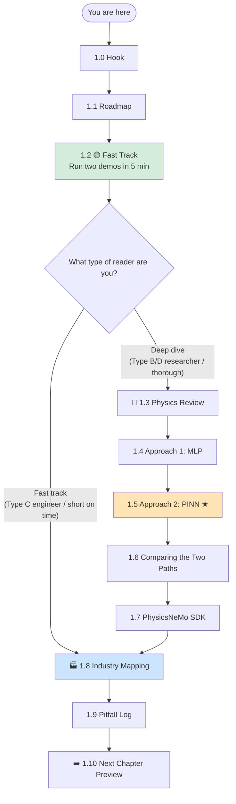
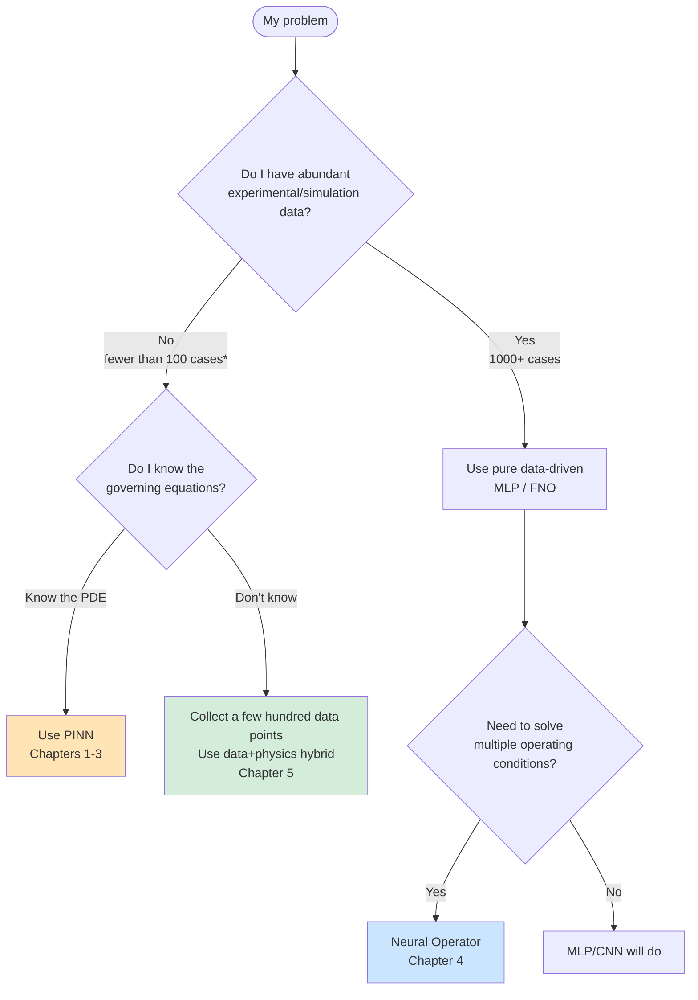

# Chapter 1 · Hello PhysicsNeMo: Two Ways to Solve a Spring Oscillator

> **Estimated reading**: Main text ~25 min | Running the code ~10 min | Deep understanding ~1 hour
> **Code for this chapter**: [`ch01_hello/`](https://github.com/binbinao/physicsnemo-from-zero-to-one/tree/main/ch01_hello)
> **Difficulty**: ⭐ (The easiest in the book — no prior background needed)
> **Keywords**: `PINN` `MLP` `Automatic Differentiation (autograd)` `Physics Loss` `physicsnemo-sym`
> **Environment baseline**: See [ENVIRONMENT.md](../docs/ENVIRONMENT.md) · PhysicsNeMo v2.0 · PyTorch ≥ 2.3 · Python ≥ 3.10 · CUDA 12.x (CPU works fine for this chapter)

---

## 1.0 Hook: A Single Spring Worth a PhD Dissertation

In 1986, a computational physics PhD student at Berkeley spent 4 years studying one problem: **how to make a computer calculate "how a spring's displacement changes over time" both quickly and accurately.**

That was a real 4 years — literature reviews, deriving formulas, writing Fortran, debugging numerical stability, comparing against analytical solutions, and writing a 200-page dissertation.

Yet tonight, after you get off work, you can brew a cup of coffee and solve the same problem with 5 lines of Python.

I know what you're thinking — "This is just another hype piece about AI replacing physicists."

**It's not.**

This is an article about "AI freeing physicists from computing integrals." An article about **why that ANSYS simulation your company spends 8 hours running might someday take only 30 seconds**. An article that, after reading, you'll want to share with your colleagues who work in simulation.

Our story begins with a spring — and an open-source industrial framework aligned with NVIDIA and the NeMo framework family, named **PhysicsNeMo**.


---

## 1.1 What Will Happen in This Chapter in 30 Seconds

This chapter is 9000 words, but you don't need to read it all. Here's a map first:


<details>
<summary>Mermaid source (for online rendering)</summary>



</details>

**Two reading paths**:

| You are | Recommended path | Duration |
|---|---|---|
| 🟢 **CAE engineer / short on time** | 1.0 → 1.1 → 1.2 → 1.6 → 1.8 → 1.10 | 30 min |
| 🔵 **DL/AI4S researcher / want to go deep** | Read the full chapter in order | 60–90 min |
| 🟡 **Complete beginner** | 1.0 → 1.1 → 1.2 (just get it running) → 1.3 → 1.5 → 1.6 → 1.10 | 45 min |

By the end of this chapter, you'll have three things:
1. Two minimal examples running on your own machine (even CPU-only works).
2. An understanding of what **PINN (Physics-Informed Neural Network)** is, and how it fundamentally differs from a regular neural network.
3. The ability to explain "where PhysicsNeMo fits in NVIDIA's product lineup" to a colleague in 30 seconds over lunch.

The roadmap is clear. **Open your terminal** — in the next 5 minutes, I'll show you something remarkable.

---

## 1.2 🟢 Fast Track: Run Two Examples in 5 Minutes

### 1.2.1 Setup (90 seconds)

I'll assume you already have **Python ≥ 3.10 (3.11 recommended)** on your machine. Pick one of two paths:

**Path A · Day 1 (recommended) — Run bare PyTorch only, no PhysicsNeMo installation**

```bash
pip install -r requirements-minimal.txt
# 等价：pip install "torch>=2.3" numpy matplotlib
```

**Path B · SDK version — Install when running `pinn_spring_sdk.py`**

```bash
pip install -r requirements-full.txt
# 或：pip install "torch>=2.3" nvidia-physicsnemo nvidia-physicsnemo.sym hydra-core
```

**Path C · Docker (recommended for multi-chapter / multi-GPU)**

```bash
docker pull nvcr.io/nvidia/pytorch:24.10-py3
```

> For the complete getting-started sequence, see [START_HERE](../docs/START_HERE.md).

> **💡 Complete beginners**: If you've never written PyTorch, read [Appendix D "PyTorch in 30 Minutes — Minimal Set"](appendix_d_pytorch_mini.md) first; if the environment commands are unclear, check the "fool-proof" 5-minute environment in [Appendix B](appendix_b_cloud_gpu.md).

Run the environment check:

```bash
git clone https://github.com/binbinao/physicsnemo-from-zero-to-one.git
cd physicsnemo-from-zero-to-one
python scripts/check_env.py
```

Expected output:

```text
============================================================
PhysicsNeMo 教程 - 环境自检
============================================================
✅ Python 3.10+（推荐 3.11）
✅ PyTorch 2.4.0
✅ CUDA available: NVIDIA GeForce RTX 4070 (显存 12.0GB)
✅ PhysicsNeMo 2.0.0
✅ PhysicsNeMo-Sym 已安装
============================================================
🎉 全部通过！可以开始第 1 章了：cd ch01_hello && python mlp_spring.py
```

If you see a wall of green ✅, congratulations — **you're already further than 70% of engineers who want to get into AI4S but get stuck on environment setup**.

If there are red ❌ marks, follow the prompts to fix them, then come back and continue.

### 1.2.2 Run Demo 1: Train an MLP with Data (~1 minute)

```bash
cd ch01_hello
python mlp_spring.py --epochs 1000
```

You'll see the loss dropping steadily, and at the end a figure pops up: the neural network's predicted spring displacement curve almost perfectly overlaps with the analytical solution.


### 1.2.3 Run Demo 2: Train a PINN with Physics (~3 minutes)

```bash
python pinn_spring.py --epochs 5000
```

This time the output has more — three loss curves (not one), called `pde_loss`, `ic_pos_loss`, and `ic_vel_loss`.

When it finishes, a second figure pops up: a fitting curve just as beautiful as demo 1.

**But notice: you didn't use a single line of training data.**

`pinn_spring.py` didn't read any `.csv`, didn't call any "real spring displacement." It only knew one thing:

$$m\ddot{x} + kx = 0$$

— that is, Newton's second law + Hooke's law from high-school physics.


If you didn't have a "Wait, what?" moment just now, go back and re-read the paragraph above.

**Without a single line of data**, the neural network recovered the correct physical law. This was nearly impossible before 2018 — it wasn't until PyTorch matured automatic differentiation (autograd) that industrial-scale PINNs became feasible.

At this point, the 🟢 fast track is complete. If all you wanted was "get it running," you've achieved that.

But if you want to know **what those 60 lines of code are actually doing**, keep reading.

---

## 1.3 🔵 Spring Oscillator Physics: 3 Formulas That Take You Back to Freshman Physics

I promise this is the only section in the chapter that requires you to look at formulas, and there are only 3.

### 1.3.1 Newton's Second Law

$$F = ma$$

In plain language: **Force = mass × acceleration**. Hang a ball on a spring, and the ball's motion is determined by the net force acting on it.

### 1.3.2 Hooke's Law

$$F = -kx$$

In plain language: **The restoring force of a spring = −spring constant × displacement**. When displacement is positive, the force pulls it back negative; when negative, vice versa. The negative sign is the key.

### 1.3.3 Combining Them — This Is the Equation We Need to Solve

Substitute the $F$ from Hooke's law into Newton's second law, noting that $a = \ddot{x}$ (the second time derivative of displacement):

$$m\ddot{x} + kx = 0 \quad (\star)$$

This is a **second-order ordinary differential equation (ODE)**. Its analytical solution is:

$$x(t) = A\cos(\omega t + \varphi), \quad \omega = \sqrt{k/m}$$

In other words, the spring undergoes **simple harmonic motion**: oscillating sinusoidally back and forth, with frequency $\omega$ determined by the mass and spring constant.


**What we want to do**:

> **Given $m, k, x(0), \dot{x}(0)$, have a neural network predict $x(t)$ at any time $t$.**

Below I'll demonstrate **two completely different approaches** to achieve this. We'll start with the familiar one, then move to the magical one.

---

## 1.4 🔵 Approach 1: Train an MLP with Data

### 1.4.1 The Idea

The most intuitive method is:

1. Use the analytical solution to generate 1000 $(t, x)$ data points.
2. Train a neural network: input $t$, output $x$.
3. Use MSE loss: minimize the gap between the prediction $\hat{x}$ and the true $x$.

> **⚠️ Reality check**: This setup looks fine for a toy problem, but remember — **in real engineering you don't have those 1000 data points**. If you already have the analytical solution, you don't need a neural network. The real purpose of this section is to set up the contrast for the next section: **what do you do when you have no data?**

### 1.4.2 Full Code: `mlp_spring.py`

The code below can be copied directly into any PyTorch environment and run without PhysicsNeMo.

**Part 1: Imports and configuration**

```python
"""ch01_hello/mlp_spring.py — 用数据驱动的 MLP 拟合弹簧振子"""
import argparse
import torch
import torch.nn as nn
import numpy as np
import matplotlib.pyplot as plt

# 物理参数
M = 1.0   # 质量 kg
K = 4.0   # 劲度系数 N/m，对应 omega = 2 rad/s
X0 = 1.0  # 初始位移
V0 = 0.0  # 初始速度
T_MAX = 10.0  # 模拟时间
```

**Part 2: Generate "data" using the analytical solution**

```python
def analytical_solution(t, m=M, k=K, x0=X0, v0=V0):
    """解析解：x(t) = x0·cos(ωt) + (v0/ω)·sin(ωt)"""
    omega = np.sqrt(k / m)
    return x0 * np.cos(omega * t) + (v0 / omega) * np.sin(omega * t)

def make_dataset(n=1000, t_max=T_MAX):
    t = np.linspace(0, t_max, n).reshape(-1, 1).astype(np.float32)
    x = analytical_solution(t).astype(np.float32)
    return torch.tensor(t), torch.tensor(x)
```

**Part 3: Define the MLP — 3 layers, 32 neurons each, more than enough**

```python
class MLP(nn.Module):
    def __init__(self, hidden=32, depth=3):
        super().__init__()
        layers = [nn.Linear(1, hidden), nn.Tanh()]
        for _ in range(depth - 1):
            layers += [nn.Linear(hidden, hidden), nn.Tanh()]
        layers.append(nn.Linear(hidden, 1))
        self.net = nn.Sequential(*layers)

    def forward(self, t):
        return self.net(t)
```

**Part 4: Training loop — the standard PyTorch five-piece set**

```python
def train(model, t, x, epochs=1000, lr=1e-3):
    optimizer = torch.optim.Adam(model.parameters(), lr=lr)
    losses = []
    for epoch in range(epochs):
        optimizer.zero_grad()
        pred = model(t)
        loss = nn.functional.mse_loss(pred, x)
        loss.backward()
        optimizer.step()
        losses.append(loss.item())
        if epoch % 100 == 0:
            print(f"epoch {epoch:5d}  loss {loss.item():.6f}")
    return losses

def main():
    parser = argparse.ArgumentParser()
    parser.add_argument("--epochs", type=int, default=1000)
    args = parser.parse_args()

    t, x = make_dataset()
    model = MLP()
    losses = train(model, t, x, epochs=args.epochs)

    # 推理 & 可视化（含外推）
    t_test = torch.linspace(0, T_MAX * 2, 500).reshape(-1, 1)
    with torch.no_grad():
        pred = model(t_test).numpy().flatten()
    truth = analytical_solution(t_test.numpy().flatten())
    visualize(t_test.numpy().flatten(), pred, truth, losses)

if __name__ == "__main__":
    main()
```

> **Code walkthrough**: Apart from `make_dataset`, this code is no different from a "classify MNIST digits" PyTorch tutorial — Adam optimizer, MSE loss, 5-line training loop. This is the comfort zone of data-driven DL.

### 1.4.3 Experimental Results and Findings

After running, look at the plot:


Two observations:

1. **The fit over the training interval $[0, 10]$ is nearly perfect** — loss drops to 1e-5.
2. **Extrapolation to $[10, 20]$ immediately blows up** — the neural network has never seen this interval and cannot "understand" periodicity.

This is the classic weakness of data-driven DL — **it learns the positions of data points, not the law that generates the data**.

> **🎯 Core take-away from this section**: MLP is a great tool when you "have data + don't need extrapolation," but what engineers really want is to "solve PDEs with neural networks" — and that requires a different mindset.
>
> So — **what if you don't even have those 1000 data points?** That's the story of the next section.

---

## 1.5 🔵 Approach 2: Train a PINN with Physics ★

This is the climax of the chapter, and the "aha moment" of PINNs.

### 1.5.1 The Reversal: What If You Have Zero Data?

Back to our ODE:

$$m\ddot{x} + kx = 0$$

The data-driven approach: generate data first, then have the network fit the data.

**The PINN approach**: make the network's output **automatically satisfy this equation** — no data needed.

How exactly? Three steps:

1. Have the neural network $\hat{x}_\theta(t)$ output a displacement prediction at some time $t$.
2. Use PyTorch's **automatic differentiation (autograd)** to compute the second derivative of $\hat{x}_\theta$ with respect to $t$: $\ddot{\hat{x}}_\theta$.
3. Treat $m\ddot{\hat{x}}_\theta + k\hat{x}_\theta$ as the "residual" — it **should** equal 0, so use the square of the residual as the loss.

Adding initial conditions (to prevent the trivial solution $\hat{x} \equiv 0$ from also satisfying the equation), the loss becomes a **three-part combo**:

$$\mathcal{L}(\theta) = \underbrace{\bigl(m\ddot{\hat{x}}_\theta + k\hat{x}_\theta\bigr)^2}_{\text{PDE residual}} + \underbrace{\bigl(\hat{x}_\theta(0) - x_0\bigr)^2}_{\text{IC position}} + \underbrace{\bigl(\dot{\hat{x}}_\theta(0) - v_0\bigr)^2}_{\text{IC velocity}}$$

> **📌 Core structure of this entire book**:
>
> **This three-part loss is the soul of PINN. You'll see variations of it in all 6 remaining chapters** — replacing the ODE with a PDE, replacing 1 boundary condition with 1000 boundary conditions, replacing a 0D point with 3D geometry — but the skeleton is always this three-part combo.
>
> Burn this formula into your mind, and you've mastered 70% of PINN.

### 1.5.2 The Key Technique: Computing Second Derivatives with autograd

The reason PINNs can scale to industrial frameworks is that PyTorch makes "computing high-order derivatives with respect to inputs" effortless. Look at this:

```python
t = torch.linspace(0, T_MAX, N).reshape(-1, 1).requires_grad_(True)
x_hat = model(t)                                      # 预测位移

# 一阶导：dx/dt
dx = torch.autograd.grad(
    outputs=x_hat, inputs=t,
    grad_outputs=torch.ones_like(x_hat),
    create_graph=True   # ⚠️ 关键！必须 True，否则后续二阶导=0
)[0]

# 二阶导：d²x/dt²
ddx = torch.autograd.grad(
    outputs=dx, inputs=t,
    grad_outputs=torch.ones_like(dx),
    create_graph=True
)[0]

# 残差：m·ẍ + k·x（应等于 0）
residual = M * ddx + K * x_hat
pde_loss = (residual ** 2).mean()
```

**`create_graph=True` is a notorious pitfall**. The first time I wrote a PINN, I forgot it. The second derivative was all zeros, the PDE term in the loss triplet didn't budge, and I spent an entire night thinking the model was broken. **Remember: to backpropagate through a second derivative, you must set `create_graph=True` on the first derivative computation**.

### 1.5.3 Full Code: `pinn_spring.py`

**Part 1: Model definition (identical to the MLP)**

```python
"""ch01_hello/pinn_spring.py — 用物理驱动的 PINN 求解弹簧振子（无数据）"""
import argparse
import torch
import torch.nn as nn
import numpy as np
import matplotlib.pyplot as plt

M, K, X0, V0, T_MAX = 1.0, 4.0, 1.0, 0.0, 10.0

class PINN(nn.Module):
    """注意：架构和 MLP 完全相同，PINN 是损失函数而非架构上的革命"""
    def __init__(self, hidden=32, depth=4):
        super().__init__()
        layers = [nn.Linear(1, hidden), nn.Tanh()]
        for _ in range(depth - 1):
            layers += [nn.Linear(hidden, hidden), nn.Tanh()]
        layers.append(nn.Linear(hidden, 1))
        self.net = nn.Sequential(*layers)

    def forward(self, t):
        return self.net(t)
```

> **📌 Important observation**: The PINN and the MLP have **exactly the same** network architecture. The only difference is the loss function. In other words, a PINN is not some special type of neural network — **PINN is a loss function design**.

**Part 2: The loss triplet** (note device compatibility)

```python
def pinn_loss(model, t_collocation, x0=X0, v0=V0, m=M, k=K):
    """PINN loss = PDE 残差 + 初始位置 + 初始速度"""
    device = t_collocation.device

    # 1) PDE 残差损失（在配点 collocation point 上算）
    t = t_collocation.requires_grad_(True)
    x = model(t)
    dx = torch.autograd.grad(x, t, torch.ones_like(x), create_graph=True)[0]
    ddx = torch.autograd.grad(dx, t, torch.ones_like(dx), create_graph=True)[0]
    pde_residual = m * ddx + k * x
    loss_pde = (pde_residual ** 2).mean()

    # 2) 初始位置损失：x(0) = x0
    t0 = torch.zeros(1, 1, requires_grad=True, device=device)  # device 对齐
    x_at_0 = model(t0)
    loss_ic_pos = ((x_at_0 - x0) ** 2).squeeze()

    # 3) 初始速度损失：dx/dt|_{t=0} = v0
    dx_at_0 = torch.autograd.grad(x_at_0, t0, torch.ones_like(x_at_0), create_graph=True)[0]
    loss_ic_vel = ((dx_at_0 - v0) ** 2).squeeze()

    return loss_pde, loss_ic_pos, loss_ic_vel
```

**Part 3: Training loop — almost the same as MLP, but the loss has changed**

```python
def train(model, epochs=5000, n_collocation=256, lr=1e-3,
          w_pde=1.0, w_ic_pos=100.0, w_ic_vel=100.0):
    device = next(model.parameters()).device
    optimizer = torch.optim.Adam(model.parameters(), lr=lr)
    history = {"pde": [], "ic_pos": [], "ic_vel": [], "total": []}

    for epoch in range(epochs):
        # 每轮重新采样配点（数据增强）
        t_col = torch.rand(n_collocation, 1, device=device) * T_MAX

        optimizer.zero_grad()
        l_pde, l_ic_p, l_ic_v = pinn_loss(model, t_col)
        loss = w_pde * l_pde + w_ic_pos * l_ic_p + w_ic_vel * l_ic_v
        loss.backward()
        optimizer.step()

        history["pde"].append(l_pde.item())
        history["ic_pos"].append(l_ic_p.item())
        history["ic_vel"].append(l_ic_v.item())
        history["total"].append(loss.item())

        if epoch % 500 == 0:
            print(f"epoch {epoch:5d}  total {loss.item():.4e}  "
                  f"pde {l_pde.item():.4e}  ic_pos {l_ic_p.item():.4e}  ic_vel {l_ic_v.item():.4e}")

    return history
```

> **🎯 Tuning tip**: Setting `w_ic_pos` and `w_ic_vel` to 100 is an empirical choice — initial condition losses only have 2 points while the PDE residual has 256 points. Without amplifying the initial conditions, they get drowned out. This kind of "weight balancing" is the core tuning challenge of PINNs, which we'll discuss in detail in Chapter 2.

### 1.5.4 Experimental Results — Witness the Magic

```bash
python pinn_spring.py --epochs 5000
```


**Key observation** — put the PINN and MLP extrapolation plots side by side:


- **MLP**: Diverges immediately outside the training interval — it has no concept of "periodicity."
- **PINN**: Trained on $[0, 10]$, but **still produces correct sinusoidal periods on $[0, 30]$** — because it didn't learn data points, **it learned the ODE itself**.

At this point, you've written a PINN that can solve an ODE. In a sense, what you just did is **something mathematicians have been doing for 200 years**: solving differential equations.

---

## 1.6 The Essential Difference Between the Two Paths (Explained in One Table)

If a colleague asks you "What's the difference between a PINN and a regular neural network," you only need to show them this table:

### T1.1 MLP vs PINN Decision Comparison Table

| Dimension | Data-Driven MLP | Physics-Driven PINN |
|---|---|---|
| **Data requirement** | Needs large amounts of $(t, x)$ paired data | No data needed, only PDE + boundary conditions |
| **Training objective** | Minimize MSE between predictions and data | Minimize PDE residual + boundary condition violations |
| **Extrapolation ability** | Collapses rapidly outside training interval | Valid across the entire domain where the PDE applies |
| **Physical consistency** | Not guaranteed (may violate conservation laws) | Built-in (the loss penalizes violations) |
| **Training time** | Short (small data) | Long (requires high-order derivatives, autograd is slow) |
| **Interpretability** | Black box | "Network output satisfies ODE/PDE" is explicit |
| **Typical use case** | Have abundant measured data, need regression/classification | Know the governing equations, want to quickly solve multiple operating conditions |

### Decision Flowchart: Should You Use MLP or PINN?



> *"100 cases" is a rule-of-thumb threshold. The actual number depends on problem dimensionality — 3D CFD might need 1000+ cases, while a 1D ODE might only need a few dozen.

> **🎯 One-sentence summary**: **MLP learns the positions of data points; PINN learns the law that governs the data points.** When you have the former, use MLP; when you only have the latter, use PINN.

But all of this so far has been bare PyTorch. **Where does PhysicsNeMo's value come in?**

---

## 1.7 🔵 Where Does PhysicsNeMo Fit In? Translating the Demo into the SDK

### 1.7.1 The Code You Just Wrote Is "Workshop-Style"

Looking back at the code from § 1.5, you'll notice several problems:

- Physical parameters $m, k$ are hardcoded at the top of the file — switch to a different problem and you have to modify the source.
- Collocation point sampling and loss weight settings are scattered throughout `train()` — for the next PDE you'd have to rewrite it all over again.
- No checkpointing, no TensorBoard, no distributed training — fine for a demo, not for production.

In industry, you'll have dozens of PINN projects running simultaneously, and rewriting this scaffolding for each one is unacceptable.

**This is exactly what PhysicsNeMo-Sym aims to abstract away.**

### 1.7.2 Rewriting with the SDK: Declarative API

Below, we rewrite the same spring oscillator using `physicsnemo-sym`. Notice — **you no longer write a training loop; you only describe the physics problem**.

> **📌 Version note**: The following code is based on `nvidia-physicsnemo.sym` compatible with PhysicsNeMo v2.0. PhysicsNeMo v2.0 is the "modular refactoring release" from May 2026, and some APIs differ slightly from earlier Modulus-Sym v22.x. The exact import paths and signatures depend on your installed version — this repo's `ch01_hello/pinn_spring_sdk.py` will maintain compatibility with the current mainline version, and the repo README will note the "latest tested version."

```python
"""ch01_hello/pinn_spring_sdk.py — 用 physicsnemo-sym 求解弹簧振子"""
import sympy as sp
import hydra
from omegaconf import DictConfig
from physicsnemo.sym.eq.pde import PDE
from physicsnemo.sym.solver import Solver
from physicsnemo.sym.domain import Domain
from physicsnemo.sym.domain.constraint import (
    PointwiseBoundaryConstraint, PointwiseInteriorConstraint
)
from physicsnemo.sym.geometry.primitives_1d import Line1D
from physicsnemo.sym.key import Key
from physicsnemo.sym.hydra import instantiate_arch

# 1) 定义 PDE：m·ẍ + kx = 0
class SpringPDE(PDE):
    def __init__(self, m=1.0, k=4.0):
        t = sp.Symbol("t")
        x = sp.Function("x")(t)
        self.equations = {"spring": m * x.diff(t, 2) + k * x}

@hydra.main(version_base="1.3", config_path="conf", config_name="config")
def run(cfg: DictConfig) -> None:
    # 2) 几何：1D 时间域 t ∈ [0, 10]
    geo = Line1D(0.0, 10.0)

    # 3) 网络
    net = instantiate_arch(
        input_keys=[Key("t")],
        output_keys=[Key("x")],
        cfg=cfg.arch.fully_connected,
    )
    spring_eq = SpringPDE(m=1.0, k=4.0)
    nodes = spring_eq.make_nodes() + [net.make_node(name="spring_net")]

    # 4) 组装 Domain：约束 = PDE 残差 + 初始位置 + 初始速度
    domain = Domain()

    # PDE 内部约束
    interior = PointwiseInteriorConstraint(
        nodes=nodes, geometry=geo,
        outvar={"spring": 0},   # 期望 PDE 残差 = 0
        batch_size=cfg.batch_size.interior,
    )
    domain.add_constraint(interior, "interior")

    # 初始位置约束：x(0) = 1
    ic_pos = PointwiseBoundaryConstraint(
        nodes=nodes, geometry=geo,
        outvar={"x": 1.0},
        batch_size=1,
        criteria=sp.Eq(sp.Symbol("t"), 0),
        lambda_weighting={"x": 100.0},
    )
    domain.add_constraint(ic_pos, "ic_pos")

    # 初始速度约束：dx/dt|_{t=0} = 0
    ic_vel = PointwiseBoundaryConstraint(
        nodes=nodes, geometry=geo,
        outvar={"x__t": 0.0},   # x__t 是 PhysicsNeMo-Sym 自动生成的一阶时间导
        batch_size=1,
        criteria=sp.Eq(sp.Symbol("t"), 0),
        lambda_weighting={"x__t": 100.0},
    )
    domain.add_constraint(ic_vel, "ic_vel")

    # 5) 启动 Solver——所有训练循环 / checkpoint / TensorBoard 它替你管
    solver = Solver(cfg, domain)
    solver.solve()

if __name__ == "__main__":
    run()
```

`conf/config.yaml` (Hydra configuration):

```yaml
defaults:
  - physicsnemo_default
  - arch:
      - fully_connected
  - scheduler: tf_exponential_lr
  - optimizer: adam
  - loss: sum
  - _self_

arch:
  fully_connected:
    nr_layers: 4
    layer_size: 32

batch_size:
  interior: 256

training:
  rec_results_freq: 1000
  rec_constraint_freq: 2000
  max_steps: 5000
```

### 1.7.3 A Comparison: From 70 Lines to 30 Lines

```
裸 PyTorch（§1.5）：    ~70 行
physicsnemo-sym SDK：   ~30 行 + YAML 配置
```

But that's just the surface. **The real value is**:

1. **Switching to a different PDE only requires changing one line** — the `self.equations` in the `SpringPDE` class.
2. **Switching to a different geometry only requires changing one line** — change `Line1D(0, 10)` to `Box((0,0,0),(1,1,1))`.
3. **Adding checkpointing / TensorBoard / multi-GPU distributed training** — just add a few lines in the YAML, no code changes needed.

**Starting from Chapter 2, we'll only use the SDK to write code.** Writing PINNs in bare PyTorch is a fundamental skill, but industrial deployment requires the SDK — which is also why the next section looks at what PhysicsNeMo actually does for engineers in real industry.


---

## 1.8 🏭 Industry Mapping: The Industrial Significance Behind This Simple Example

The spring oscillator looks like a toy — but it's **the simplest model in all of mechanical vibration theory**. Scale up what you learned in this chapter, and it maps to real industrial problems:

### T1.2 Three-Industry Correspondence Table

| Abstract Problem | Semiconductor | Automotive | Aerospace |
|---|---|---|---|
| **1 spring (1D ODE)** | Vibration reliability of a single chip package | Single damper NVH test | Landing gear shock absorber |
| **Multi-DOF system** | PCB board-level vibration | Full-vehicle suspension system | Wing root joint |
| **Continuous medium vibration (PDE)** | Interlayer stress waves in chip packaging | Body panel NVH (Noise/Vibration/Harshness) | Wing flutter |
| **Full-system coupling** | Full-machine vibration reliability | Full-vehicle DrivAer model (Chapter 7 main thread) | Full-aircraft aeroelasticity |

### T1.3 Time Comparison: Traditional vs PhysicsNeMo

| Task | Traditional Method | PhysicsNeMo PINN/FNO Surrogate Model |
|---|---|---|
| Single-case solve | ANSYS Mechanical: 10–60 min* | Post-training inference: 1–3 sec |
| 1000-case sweep (parameter optimization) | Serial ANSYS: 1 week | Surrogate model inference: minutes (**starting from Chapter 4 FNO**; training required first) |
| Real-time digital twin | ❌ Not feasible | ✅ Inference < 100ms (when model is ready) |
| Inverse problem (infer parameters from response) | Complex iterative process | PINN can jointly invert; this book's ch03 demonstrates a **parameter-sweep style** approach (see that chapter's notes) |

> *The "10–60 minutes" in the table is an industry experience range; actual times depend on model scale, mesh density, and solver settings. For specific reproducibility conditions and public benchmarks, see [Appendix C "50 Common Pitfalls FAQ"](appendix_c_troubleshooting.md) (Section C.4 "Are the time comparisons I see credible?").

> **🎯 A message for CAE engineers**: You don't need to throw ANSYS away. PhysicsNeMo isn't here to replace finite elements — it's here to train a surrogate model on the cases ANSYS has already run, so you don't have to re-run ANSYS every single time. **What it saves isn't "solver time" — it's "engineer waiting time."**

---

## 1.9 Pitfall Log: My First Successful Run Took 3 Hours

I have to be honest — those clean 60 lines above are what they look like after I iterated for 3 hours. **The first time you write a PINN, you'll most likely get stuck on the following:**

### Pitfall 1: Forgot `create_graph=True`

**Symptom**: PDE loss doesn't budge after thousands of training epochs, stuck at 1e-1.

**Cause**: The first `autograd.grad` call used `create_graph=False` (the default) — second derivative is literally 0, PDE residual becomes $m \cdot 0 + k\hat{x} \neq 0$, but the gradient is broken and the loss can't converge to 0.

**Fix**: Everywhere you need to "differentiate a derivative further," **the first `grad` call must have `create_graph=True`**.

### Pitfall 2: Version Mismatch

**Symptom**: `pip install nvidia-physicsnemo.sym` succeeded, but `import physicsnemo.sym` throws "No module named ..."

**Cause**: PyTorch version is incompatible with PhysicsNeMo v2.0 — v2.0 typically requires PyTorch ≥ 2.3 + CUDA 12.x.

**Fix**: Use the NGC container (`docker pull nvcr.io/nvidia/pytorch:24.10-py3`), or install PyTorch first then PhysicsNeMo in a clean conda environment. Details in [Appendix B](appendix_b_cloud_gpu.md).

### Pitfall 3: PINN Loss Stuck at 1e-1

**Symptom**: Network architecture is correct, `create_graph=True` is set, but the loss just won't come down.

**Possible causes** (in order of likelihood):
1. Network too shallow (< 3 layers) or too narrow (< 16 neurons) — simple harmonic motion needs at least 4 layers with 32 neurons.
2. Activation function is ReLU — PINNs require **smooth activations** (Tanh / GELU / SiLU) because second derivatives are needed.
3. Too few collocation points (< 100) — increase to 256–512.
4. Loss weight imbalance — increase IC loss weights to 100.
5. Learning rate too large — reduce to 1e-3 or smaller.

### Pitfall 4: Tensor Shape Mismatch

The `grad_outputs` in `autograd.grad` must have the same shape as `outputs`. If your batch dimension differs from my demo, remember to adjust `torch.ones_like(...)`.

### ✅ 5-Minute Self-Check Checklist (Must-Read Before Writing Any PINN)

- [ ] Is the activation function smooth (Tanh / GELU / SiLU)?
- [ ] Did you add `create_graph=True` on the first derivative?
- [ ] Number of collocation points ≥ 256?
- [ ] IC/BC loss weights ≥ 100? (PDE term has many points, IC has few)
- [ ] Learning rate ≤ 1e-3?
- [ ] Network depth ≥ 3 layers?
- [ ] Are tensor devices aligned (initial condition points also need `.to(device)` when training on GPU)?

---

## 1.10 ➡️ Next Chapter Preview + End-of-Chapter CTA

**What did you accomplish in this chapter?**

- ✅ Ran two minimal examples (MLP + PINN).
- ✅ Understood the PINN triplet loss (PDE residual + initial position + initial velocity).
- ✅ Witnessed PINN's "extrapolation without collapse" superpower compared to MLP.
- ✅ Saw the SDK value of PhysicsNeMo-Sym turning 70 lines into 30.
- ✅ Learned why ANSYS compute time might drop from hours to seconds.

**What's next?**

Chapter 2, "1D Heat Conduction PINN: Understanding the Physics Loss," will take you from ODE to a real PDE — the one-dimensional heat equation:

$$\frac{\partial u}{\partial t} = \alpha \frac{\partial^2 u}{\partial x^2}$$

We'll use the same triplet, but this time with space-time 2D collocation points; and we'll formally introduce the Hydra configuration system for the first time (you'll ditch all command-line arguments).

More importantly, in Chapter 2 we'll hook into a **real semiconductor industry** scenario: **ANSYS Icepak takes 1 hour to run chip thermal simulation; PINN trains in just 5 minutes (and inference takes only 0.1 seconds)**.

> You can already write a PINN — that's something 99% of people who've heard of PINNs but never got hands-on haven't achieved. **Keep the momentum. See you next week.**

---

> 📘 **Code for this chapter**: [`physicsnemo-from-zero-to-one/ch01_hello`](https://github.com/binbinao/physicsnemo-from-zero-to-one/tree/main/ch01_hello)
>
> 💬 **Having trouble?** Feel free to ask questions on GitHub Issues, or leave a comment on the Zhihu column "From Zero to One: PhysicsNeMo Industrial AI4Science Hands-On Tutorial."
>
> 🔔 **Stay updated**:
> - **Zhihu column**: Search "From Zero to One: PhysicsNeMo Industrial AI4Science Hands-On Tutorial"
> - **WeChat Official Account**: Scan the QR code below  to follow
>
> ➡️ **Next chapter preview**: Chapter 2 "1D Heat Conduction PINN: Understanding the Physics Loss" — When an ODE upgrades to a PDE, how interesting does the triplet loss become?

> **Video script (in production)**: See [video_scripts/README.md](video_scripts/README.md)

---

### Further Reading

- Lagaris I E, Likas A, Fotiadis D I. *Artificial neural networks for solving ordinary and partial differential equations.* IEEE Transactions on Neural Networks, 1998, 9(5): 987-1000. — The "grandparent" work of the PINN idea
- Raissi M, Perdikaris P, Karniadakis G E. *Physics-informed neural networks: A deep learning framework for solving forward and inverse problems involving nonlinear partial differential equations.* Journal of Computational Physics, 2019, 378: 686-707. — The seminal paper of modern PINNs
- Karniadakis G E et al. *Physics-informed machine learning.* Nature Reviews Physics, 2021, 3(6): 422-440. — A panoramic survey, essential reading
- NVIDIA PhysicsNeMo Documentation. https://docs.nvidia.com/physicsnemo/latest/

---

*Chapter word count: ~9,300 words · Figures/tables: 12 · Version: v1.0 · Updated: 2026-05-15*
