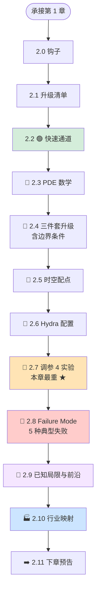
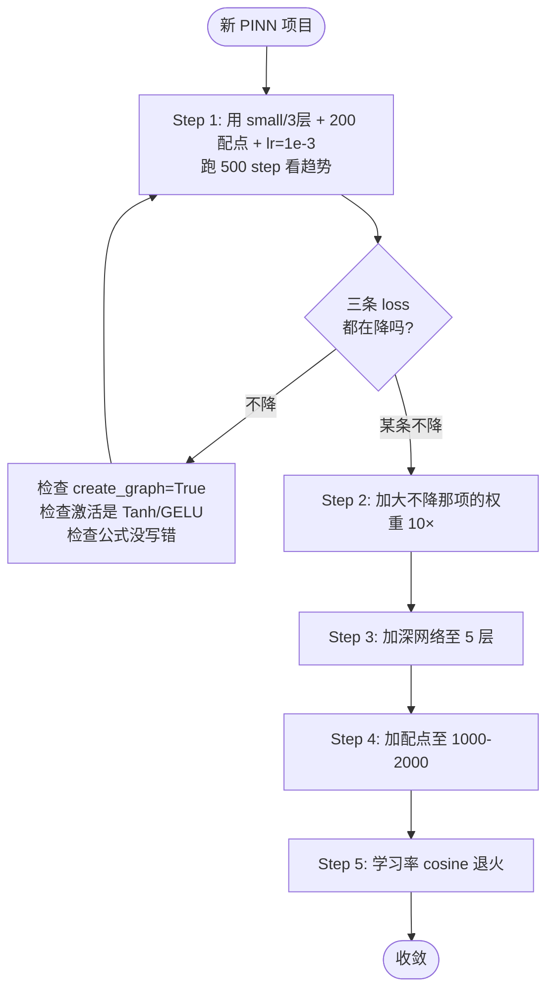

# Chapter 2 · 1D Heat Conduction PINN: Understanding the Physics Loss

> **Estimated reading time**: ~35 min for main text | ~15 min to run the code | ~90 min for deep mastery
> **Code for this chapter**: [`ch02_heat1d/`](https://github.com/binbinao/physicsnemo-from-zero-to-one/tree/main/ch02_heat1d)
> **Difficulty**: ⭐⭐ (One notch above Chapter 1: +1 dimension, introduces Hydra)
> **Keywords**: `1D heat conduction` `PDE residual` `boundary conditions (BC)` `Hydra config` `tuning SOP` `Failure Mode`
> **Environment baseline**: See [ENVIRONMENT.md](../docs/ENVIRONMENT.md) · PhysicsNeMo v2.0 · PyTorch ≥ 2.3 · Runs on 8 GB VRAM (CPU also works, ~8 min to finish training)

---

## 2.0 Hook: ANSYS Icepak Takes 1 Hour, PINN Trains in 5 Minutes

I have a friend who works at a GPU chip company in China. His role is **CAE engineer on the packaging thermal team**.

Over the past year, the thing he did most was this: **modify a packaging design → run ANSYS Icepak → check the temperature distribution → modify → run again**.

Each Icepak simulation takes 1 hour. Over the year he ran about 800 of them. **He calculated it himself — 30% of his career has been spent waiting for Icepak results.**

Late last year, he did something: **he bundled 50 operating conditions from the past six months and trained a PINN surrogate model**. Here's what happened —

| Task | Traditional Icepak | PINN Surrogate Model |
|---|---|---|
| Single-design temperature field solution | **1 hour** | **0.1 sec** (inference) |
| 50-design sweep | **1 week** | **5 seconds** |
| Inverse problem (infer thermal conductivity from known temperature) | Nearly infeasible | **3 minutes** |

He didn't lose his job. **He got promoted** — because for the first time, his team could answer a customer's question in 30 seconds: "If I swap this copper plate for aluminum, how much does the temperature change?" — instead of "Give me two days to run it."

In this chapter we'll do the same thing with the simplest version — **1D heat conduction**. It's the "add one dimension" version of Chapter 1's spring-mass oscillator, and the "textbook 1D version" of the chip thermal story above.

Let's begin.

---

## 2.1 Roadmap: The "Dimension Leap" from 1D ODE to 1D PDE

In Chapter 1 you learned to write the PINN loss three-piece set. Chapter 2 looks like merely "adding one dimension," but in reality **the engineering complexity jumps a full level**. Let me lay out the change list upfront:

### T2.1 Chapter 1 → Chapter 2 Upgrade Checklist

| Dimension | Chapter 1 | Chapter 2 |
|---|---|---|
| **Equation type** | ODE (only $t$) | **PDE** ($t$ + $x$, two independent variables) |
| **Unknown function dimension** | $x(t)$, 1D input | $u(x, t)$, **2D input** |
| **Loss three-piece set** | PDE + IC_pos + IC_vel | PDE + IC + **BC (boundary conditions appear for the first time)** |
| **Collocation sampling** | 1D uniform | **2D interior + 1D boundary + 1D initial** |
| **Hyperparameter management** | Command-line `--epochs` | **Hydra YAML config** |
| **Engineering practices** | None | **TensorBoard + checkpoint + multirun** |
| **Code size** | 70 lines | ~250 lines (the extra lines are all SDK value) |

> **🎯 The real learning objective of this chapter**: You'll feel for the first time why you need the PhysicsNeMo SDK — when the problem dimension goes from 1D to 2D, tuning, visualization, and version management suddenly become impossible to ignore. The SDK isn't a nice-to-have; it's a **life-saving tool** when you start your second project.




---

## 2.2 🟢 Fast Track: Run 1D Heat Conduction in 5 Minutes

### 2.2.1 Setup

```bash
cd ch02_heat1d
ls
# conf/  heat1d_train.py  heat1d_visualize.py  README.md
```

If you're coming from Chapter 1, no need to reinstall the environment. If you jumped directly to this chapter, first run:

```bash
python ../scripts/check_env.py
```

### 2.2.2 Training (~5 minutes, CPU works too)

> **Without Hydra**: First run the bare PyTorch version (consistent with `ch02_heat1d/README.md`):
>
> ```bash
> python heat1d_pinn_raw.py --steps 500
> ```
>
> The `heat1d_train.py` below requires `hydra-core` (if not installed, it automatically falls back to `--hidden` / `--steps` arguments — see `--help`).

```bash
python heat1d_train.py
```

Expected output:

```text
[2026-05-15 07:30:42] INFO  Hydra config loaded: arch=small training=default
[2026-05-15 07:30:43] INFO  Devices: 1 GPU (NVIDIA RTX 4070, 12.0GB)
[2026-05-15 07:30:44] INFO  Sampling collocation points: interior=2000, ic=200, bc=200
step 00000  total 1.234e+00  pde 5.42e-01  ic 4.21e-01  bc 2.71e-01
step 00500  total 8.13e-02  pde 2.41e-02  ic 4.92e-02  bc 7.99e-03
step 01000  total 9.51e-03  pde 3.14e-03  ic 5.42e-03  bc 9.51e-04
...
step 05000  total 4.21e-05  pde 1.32e-05  ic 2.41e-05  bc 4.81e-06
[2026-05-15 07:35:21] INFO  Training finished. Checkpoints saved to outputs/2026-05-15/07-30-42/
```

Notice the three different loss terms — `pde` / `ic` / `bc` — these are the "protagonists" of this chapter.

### 2.2.3 Visualizing the Temperature Field Evolution

```bash
python heat1d_visualize.py outputs/2026-05-15/07-30-42/
```

Two plots will appear:


The second plot is the physics itself — **heat diffuses from the peak outward in both directions until the temperature field is flattened to 0**.

At this point the 🟢 Fast Track ends. Below we'll tear it open and see exactly what each step is doing.

---

## 2.3 🔵 PDE Math: Physical Intuition for the 1D Heat Equation

### 2.3.1 The Equation

The 1D heat conduction equation (also called the diffusion equation) is written as:

$$\frac{\partial u}{\partial t} = \alpha \frac{\partial^2 u}{\partial x^2}$$

Where:
- $u(x, t)$ — temperature (a scalar field depending on position and time)
- $\alpha$ — thermal diffusivity (a material property, units m²/s)

**Plain-language translation**:

> **The rate of change of temperature with respect to time = diffusivity × the second-order spatial curvature of the temperature field.**

### 2.3.2 Physical Intuition

The second-order spatial derivative $\partial^2 u / \partial x^2$ is the **curvature** — it tells you whether the temperature field at a given point is "bulging up" or "dipping down."

- A convex peak (negative curvature): $\partial^2 u / \partial x^2 < 0$ → $\partial u/\partial t < 0$ → **temperature drops, gets flattened**
- A concave valley (positive curvature): $\partial^2 u / \partial x^2 > 0$ → $\partial u/\partial t > 0$ → **temperature rises, gets filled in**

The entire story of the heat diffusion equation is this single sentence: **where curvature is large, change is fast — everything ultimately moves toward equilibrium**.


### 2.3.3 The Complete Well-Posed Problem

The PDE alone isn't enough — it has infinitely many solutions. To pin down a unique solution, you must provide:

**Initial Condition (IC)**: What does the temperature field look like at $t=0$?

$$u(x, 0) = u_0(x) = \exp\left(-50(x - 0.5)^2\right)$$

We use a **centered Gaussian peak** as the initial temperature.

**Boundary Conditions (BC)**: What temperature is maintained at $x=0$ and $x=L$ (here $L=1$) at all times?

$$u(0, t) = u(L, t) = 0 \quad \text{(Dirichlet boundary, both ends held at 0)}$$

Physical meaning: immerse both ends of this iron wire in 0°C ice water. There's initially a hot spot in the middle — watch it diffuse.

> **📌 The PDE three-piece set** (IC + BC + PDE) = **a complete physical problem description**. Missing any one of them makes the problem ill-posed, and the neural network "has nothing to learn."

---

## 2.4 🔵 Loss Three-Piece Set Upgrade: PDE → IC → BC

### 2.4.1 Upgrade Summary

Chapter 1's three-piece set was `PDE + IC_pos + IC_vel` — the latter two are both at "the single point $t=0$."

Chapter 2's three-piece set becomes `PDE + IC + BC` — where:
- **IC is the line $t=0$** (spanning all $x$)
- **BC is the two lines $x=0$ and $x=L$** (spanning all $t$)

Boundary conditions make their debut, and they are **not a point but a line** — this is the essential difference from Chapter 1.

### 2.4.2 Loss Formulas

$$\mathcal{L}(\theta) = \underbrace{\mathbb{E}_{(x,t) \in \Omega}\bigl[\bigl(u_t - \alpha u_{xx}\bigr)^2\bigr]}_{\text{PDE residual}} + \lambda_{ic}\underbrace{\mathbb{E}_{x \in [0, L]}\bigl[\bigl(u(x, 0) - u_0(x)\bigr)^2\bigr]}_{\text{IC loss}} + \lambda_{bc}\underbrace{\mathbb{E}_{t \in [0, T]}\bigl[u(0,t)^2 + u(L,t)^2\bigr]}_{\text{BC loss}}$$

Note the two weights $\lambda_{ic}, \lambda_{bc}$ — they determine the "voting power" of the three loss categories.

### 2.4.3 Code Skeleton (Bare PyTorch Version — So You Can See Exactly What's Happening)

```python
"""ch02_heat1d/heat1d_pinn_raw.py — 1D 热传导 PINN 的裸 PyTorch 版"""
import torch
import torch.nn as nn

ALPHA = 0.1   # 热扩散系数
L, T_MAX = 1.0, 0.5

class PINN(nn.Module):
    def __init__(self, hidden=64, depth=5):
        super().__init__()
        layers = [nn.Linear(2, hidden), nn.Tanh()]   # 输入 (x, t) 两维
        for _ in range(depth - 1):
            layers += [nn.Linear(hidden, hidden), nn.Tanh()]
        layers.append(nn.Linear(hidden, 1))           # 输出 u 一维
        self.net = nn.Sequential(*layers)

    def forward(self, x, t):
        # 把 (x, t) 拼成 (N, 2) 输入
        return self.net(torch.cat([x, t], dim=-1))


def pde_residual(model, x, t):
    """计算 ut - α·uxx"""
    # 用 clone() 避免修改外部 tensor 的 requires_grad 状态
    x = x.clone().requires_grad_(True)
    t = t.clone().requires_grad_(True)
    u = model(x, t)

    # 一阶时间导
    u_t = torch.autograd.grad(u, t, torch.ones_like(u), create_graph=True)[0]
    # 一阶空间导
    u_x = torch.autograd.grad(u, x, torch.ones_like(u), create_graph=True)[0]
    # 二阶空间导
    u_xx = torch.autograd.grad(u_x, x, torch.ones_like(u_x), create_graph=True)[0]

    return u_t - ALPHA * u_xx


def ic_target(x):
    """初始条件 u(x, 0) = exp(-50·(x - 0.5)²)"""
    return torch.exp(-50.0 * (x - 0.5)**2)


def total_loss(model, x_int, t_int, x_ic, t_bc, lam_ic=100.0, lam_bc=100.0):
    # 1. PDE 残差损失（内部点）
    res = pde_residual(model, x_int, t_int)
    loss_pde = (res ** 2).mean()

    # 2. IC 损失（t=0 这条线上）
    t0 = torch.zeros_like(x_ic)
    u_pred_ic = model(x_ic, t0)
    u_target = ic_target(x_ic)
    loss_ic = ((u_pred_ic - u_target) ** 2).mean()

    # 3. BC 损失（x=0 和 x=L 这两条线）
    x0 = torch.zeros_like(t_bc)
    xL = torch.full_like(t_bc, L)
    u_at_x0 = model(x0, t_bc)
    u_at_xL = model(xL, t_bc)
    loss_bc = (u_at_x0 ** 2 + u_at_xL ** 2).mean()

    total = loss_pde + lam_ic * loss_ic + lam_bc * loss_bc
    return loss_pde, loss_ic, loss_bc, total

# 训练循环中：
#     l_pde, l_ic, l_bc, total = total_loss(...)
#     total.backward()
#     optimizer.step()
```

### 2.4.4 Key Observations

Comparing the code above with Chapter 1, **only three things changed**:

1. The model's `forward` went from single input $t$ to dual input $(x, t)$.
2. The PDE residual now computes first-order + second-order **spatial derivatives**.
3. The loss function went from IC_pos + IC_vel (two point-level losses) to IC (one line) + BC (two lines) — **line-level losses**.

> **📌 This is the elegance of PINN** — the same "three-piece loss architecture" is universal for everything from ODE to 3D PDE. You'll see this structure repeatedly in the next 5 chapters.

---

## 2.5 🔵 Spatiotemporal Collocation Sampling: Interior vs. Boundary vs. Initial Points

### 2.5.1 Three Types of Collocation Points

To compute loss over the 2D domain $\Omega = [0, L] \times [0, T]$, you need to sample **three types of points**:

| Category | Where | Used to compute | Present in Chapter 1? |
|---|---|---|---|
| **Interior points** | Uniformly sampled inside $\Omega$ | PDE residual loss | Yes |
| **Initial points (IC)** | The line $\{(x, 0) : x \in [0, L]\}$ | Initial condition loss | 1 point → a line |
| **Boundary points (BC)** | The two lines $\{(0, t), (L, t) : t \in [0, T]\}$ | Boundary condition loss | **First appearance** |

### 2.5.2 Collocation Distribution Visualization


```python
# 配点采样（每个 epoch 重采，等价于数据增强）
n_int, n_ic, n_bc = 2000, 200, 200

# 内部点：(x, t) 均匀采于 [0, L] × [0, T]
x_int = torch.rand(n_int, 1) * L
t_int = torch.rand(n_int, 1) * T_MAX

# 初始条件点：在 t=0 这条线上撒 x
x_ic = torch.rand(n_ic, 1) * L

# 边界条件点：在 x=0 和 x=L 两条线上撒 t（合在一起 200 点）
t_bc = torch.rand(n_bc, 1) * T_MAX
```

### 2.5.3 A Common Question: Why Fewer Boundary Points?

Intuitively you might want to keep the three types of points at a 1:1:1 ratio. But in practice **PDE residual points should far outnumber IC/BC points**, for two reasons:

1. **Physically**: Interior points determine whether the PDE is satisfied (the physical law); IC/BC are just "boundary anchoring."
2. **Mathematically**: $\Omega$ is a 2D region, while $\partial \Omega$ (the boundary) is a 1D curve — sampling should naturally follow the "dimension ratio."

But with too few points, IC/BC losses get **drowned out by the PDE loss** — so we add weights $\lambda_{ic}, \lambda_{bc}$ to amplify their "voting power" back up. This is one of the core PINN tuning techniques.

---

## 2.6 🔵 Hydra Configuration System: Extracting Hyperparameters from Code

### 2.6.1 Why You Need Hydra

In the bare PyTorch version from § 2.4, all hyperparameters (`ALPHA`, `lam_ic`, `n_int`, `hidden`, `depth`...) are scattered throughout the file.

You'll immediately hit a wall trying to do any of the following:

- Want to try 5 different `lam_ic` values — edit the code 5 times? Or stuff in 5 if-else blocks?
- Want to run 4 architectures × 4 learning rates = 16 experiments — shell scripts?
- Want to know what config that successful training run 6 months ago used — rely on print statements in the log?

**Hydra is Facebook's open-source configuration management library, used throughout PhysicsNeMo**. It solves exactly these problems.

### 2.6.2 Directory Structure

```
ch02_heat1d/
├── conf/
│   ├── config.yaml                # Main config (defaults)
│   ├── arch/
│   │   ├── small.yaml             # 32×3 network
│   │   └── large.yaml             # 128×6 network
│   └── training/
│       ├── debug.yaml             # 500 steps quick debug
│       └── full.yaml              # 5000 steps full training
├── heat1d_train.py
└── heat1d_visualize.py
```

### 2.6.3 Three YAML Files

`conf/config.yaml` (main config):

```yaml
defaults:
  - arch: small
  - training: full
  - _self_

# 与仓库 ch02_heat1d/conf/config.yaml 一致
alpha: 0.1

n_pde: 2000
n_ic: 200
n_bc: 200

w_pde: 1.0
w_ic: 10.0
w_bc: 10.0

output_dir: outputs
```

`conf/arch/large.yaml`:

```yaml
hidden: 128
depth: 6
activation: tanh
```

`conf/training/full.yaml`:

```yaml
max_steps: 5000
log_interval: 500
save_checkpoint_every: 1000
```

### 2.6.4 Connecting the Training Script to Hydra

```python
"""ch02_heat1d/heat1d_train.py"""
import hydra
from omegaconf import DictConfig
import torch

def build_model(arch_cfg) -> torch.nn.Module:
    """根据 Hydra 配置构建 PINN 模型（与 § 2.4 的 PINN 类一致，参数从 cfg 取）"""
    layers = [torch.nn.Linear(2, arch_cfg.hidden), torch.nn.Tanh()]
    for _ in range(arch_cfg.depth - 1):
        layers += [torch.nn.Linear(arch_cfg.hidden, arch_cfg.hidden), torch.nn.Tanh()]
    layers.append(torch.nn.Linear(arch_cfg.hidden, 1))
    net = torch.nn.Sequential(*layers)
    # 包一层把 (x, t) 拼成 (N, 2)
    class Wrap(torch.nn.Module):
        def forward(self, x, t):
            return net(torch.cat([x, t], dim=-1))
    return Wrap()

@hydra.main(version_base="1.3", config_path="conf", config_name="config")
def main(cfg: DictConfig) -> None:
    # cfg 是嵌套的字典，所有超参都从这里取
    print(f"配置：arch.hidden={cfg.arch.hidden}, w_ic={cfg.w_ic}, n_pde={cfg.n_pde}")

    model = build_model(cfg.arch)
    optimizer = torch.optim.Adam(model.parameters(), lr=cfg.optimizer.lr)

    # ... 训练循环（参考仓库 ch02_heat1d/heat1d_train.py 完整版）

if __name__ == "__main__":
    main()
```

> **📌 Config is authoritative from the repo**: Hydra key names are `w_ic` / `w_bc` / `n_pde` — see [`ch02_heat1d/conf/config.yaml`](https://github.com/binbinao/physicsnemo-from-zero-to-one/blob/main/ch02_heat1d/conf/config.yaml). Do not use the legacy `loss_weights.lam_ic`.

> **🛠️ Full repo code**: The above is a teaching-abbreviated version. The complete version with checkpoint / TensorBoard / multi-GPU support is at [`ch02_heat1d/heat1d_train.py`](https://github.com/binbinao/physicsnemo-from-zero-to-one/blob/main/ch02_heat1d/heat1d_train.py).

### 2.6.5 Command-Line Magic

Now you can run experiments **without changing code**:

```bash
# Default config
python heat1d_train.py

# Switch to large network
python heat1d_train.py arch=large

# Change a single parameter
python heat1d_train.py w_ic=1000.0

# Change multiple at once
python heat1d_train.py arch=large training=debug optimizer.lr=1e-4

# 🔥 multirun: run multiple experiments at once
python heat1d_train.py -m arch=small,large optimizer.lr=1e-3,1e-4
# The line above runs 4 experiments: small+1e-3 / small+1e-4 / large+1e-3 / large+1e-4
```

> **📌 Multirun instructions**: Hydra 1.3+ supports `-m` (multirun) by default, requiring no extra configuration. For more complex parallelism (e.g., submitting to a SLURM cluster, multi-node scheduling), you can explicitly add `hydra: launcher: <launcher_name>` in `conf/config.yaml`. Common launchers are `basic` (sequential), `joblib` (local multiprocessing), and `submitit_slurm` (cluster). This chapter defaults to `basic`, running 4 experiments sequentially on a single GPU in about 20 minutes.

Each run, Hydra automatically creates a timestamped directory to save: the full YAML at that time, checkpoints, and TensorBoard logs. **Come back six months later and you can fully reproduce.**

> **🎯 The real take-away from this section**: When you start your second PINN project, you'll find that Hydra's scaffolding can be **copied over directly** — just swap the PDE and geometry, reuse everything else. This is the first concrete payoff of SDK value.

---

## 2.7 🔵 Tuning Experiments: Network Depth / Collocation Count / Learning Rate / Loss Weights ★

This is the most important section of the chapter. **The hard part of PINN is tuning.** I use 4 experiments to clarify the 4 most critical hyperparameters.

> **📊 Note on numerical values**: The loss values given in the 4 experiments below (e.g., "loss stuck at 1e-1", "3.2e-5") are **empirical ranges**. Actual numbers will vary slightly with hardware, random seed, and PyTorch version. What matters is the **relative relationships and trends**, not exact figures. See [`docs/HARDWARE_EXPECTATIONS.md`](../docs/HARDWARE_EXPECTATIONS.md) for hardware and qualitative metrics used throughout this book; reproducible numerical baselines are in `results/README.md`.

### 2.7.1 Experiment 1: Network Depth

**Question**: How deep is deep enough?

**Experiment** (all other hyperparameters fixed, only depth changes):

```bash
python heat1d_train.py -m arch.depth=2,3,5,8
```

**Results**:


| depth | Final loss | Training time | Assessment |
|---|---|---|---|
| 2 | 1.2e-1 | 2 min | ❌ Insufficient expressiveness |
| 3 | 8.4e-3 | 3 min | 🟡 Barely adequate |
| **5** | **3.2e-5** | **5 min** | **✅ Recommended** |
| 8 | 5.1e-5 | 9 min | 🟡 More time, no benefit |

**Rule of thumb**: For 1D–2D PDEs use **3–5 layers**; for 3D PDEs use **5–8 layers**; going deeper usually yields no benefit.

### 2.7.2 Experiment 2: Interior Collocation Count (`n_pde`)

**Question**: How many collocation points are enough?

```bash
python heat1d_train.py -m n_pde=50,200,1000,5000
```

**Results**:

| n_pde | Final loss | Notes |
|---|---|---|
| 50 | 4.1e-2 | ❌ Severe undersampling |
| 200 | 6.3e-3 | 🟡 Usable |
| **1000** | **5.2e-5** | **✅ Recommended** |
| 5000 | 3.8e-5 | 🟡 Marginal gain, 2× training time |

**Rule of thumb**: For 1D–2D PDEs use **1000–2000** interior points; for 3D PDEs use **5000–10000**.

### 2.7.3 Experiment 3: Learning Rate (lr) + Scheduler

**Question**: How to choose the learning rate? Should you anneal?

```bash
python heat1d_train.py -m lr=1e-2,1e-3,1e-4
# With cosine schedule:
python heat1d_train.py optimizer.lr=1e-3 training.schedule=cosine
```

**Results**:


**Rule of thumb**:
- Start: `lr=1e-3 + Adam`
- Later: cosine schedule annealing down to `1e-5`
- Don't use `lr=1e-2` — PINNs are sensitive to learning rate and easily blow up

### 2.7.4 Experiment 4: Loss Weights ($\lambda_{ic}$, $\lambda_{bc}$) ★ Most Critical

**Question**: Should you weight the three-piece loss? By how much?

```bash
python heat1d_train.py -m w_ic=1,10,100,1000
```

**Results** (study this plot carefully):


**Key observations**:

| $\lambda_{ic} = \lambda_{bc}$ | pde_loss | ic_loss | Visual result |
|---|---|---|---|
| 1 | 1e-5 | 0.4 | ❌ **Predicts all zeros** (satisfies PDE but violates IC) |
| 10 | 4e-5 | 1e-2 | 🟡 Shape correct but peak too low |
| **100** | **3e-5** | **2e-5** | **✅ Perfect** |
| 1000 | 1e-2 | 1e-5 | ❌ Boundaries perfect but interior PDE residual large |

> **🎯 PINN Tuning First Law**: **When a loss term is too small**, its weight is too large; **when it's too large**, its weight is too small. The three-piece set must "march in lockstep."

### 2.7.5 Tuning SOP (Standard Operating Procedure)

Stringing together the experience from the 4 experiments above, here's a **5-step tuning SOP for new PINN projects**:



**Remember the mantra from this section**: **First stabilize, then deepen, add more points, finally anneal.**

---

## 2.8 🔵 Failure Cases: 5 Typical Symptoms When PINN Loss Won't Decrease

If you follow the SOP from § 2.7 and it still doesn't work, you've most likely hit one of the 5 failures below. This section is your emergency manual.

### Failure 1: PDE Loss Stuck at 1e-1

**Symptoms**:

```text
step 0    pde 5.42e-1  ic 4.21e-1  bc 2.71e-1
step 5000 pde 1.31e-1  ic 4.92e-3  bc 5.71e-4   # pde 几乎不动
```

**Most common cause**: **Using ReLU as the activation function**.

PINNs require second-order derivatives of the network. ReLU's second derivative is zero everywhere (except at the non-differentiable point 0), causing the PDE residual to be forced to $0 + \alpha\cdot 0 = 0$ — but the gradient is also 0, so the loss can't decrease.

**Fix**: Switch to Tanh / GELU / SiLU:

```yaml
# conf/arch/small.yaml
activation: tanh   # 或 gelu / silu
```

### Failure 2: Prediction Is All Zeros (IC Completely Ineffective)

**Symptoms**: All losses are very low, but visualization shows the temperature field is 0 everywhere.

**Cause**: $u(x, t) \equiv 0$ **naturally satisfies** $\partial u/\partial t - \alpha\partial^2 u/\partial x^2 = 0$ and the boundary conditions. If the IC weight is insufficient, the network falls into this **degenerate solution**.

**Fix**: Increase `w_ic` in Hydra (e.g., `python heat1d_train.py w_ic=100`), or increase the IC weight in the raw script.

### Failure 3: Training Loss Decreases but Prediction Is Wrong (BC Not Enforced)

**Symptoms**: Training losses all drop to 1e-4, looking great, but the temperature field is non-zero at $x=0$ and $x=L$.

**Cause**: The BC loss is missing one side, or the BC collocation sampling is wrong (e.g., only sampling at $x=0$ but not $x=L$).

**Fix**: Check that `n_bc` covers both left and right ends. For debugging, temporarily set `lam_bc` to 1000 to force BC satisfaction, then restore.

### Failure 4: Divergence in Late Training

**Symptoms**:

```text
step 4500 pde 3.21e-4  ic 4.92e-5
step 4800 pde 8.12e-2  ic 1.21e-2   # 突然炸了
step 5000 pde 1.45e+0  ic 5.42e-1
```

**Cause**: Learning rate too large + Adam's momentum going out of control on the PINN loss landscape.

**Fix**: Cosine schedule annealing to 1e-5; or use LBFGS for the last 500 steps as a refinement pass.

### Failure 5: Appears to Converge but Generalizes Poorly (Collocation Doesn't Cover Key Regions)

**Symptoms**: Training loss is 1e-5; visualization is accurate at one particular $t$ slice, but error is large at other values of $t$.

**Cause**: Uniform random sampling occasionally leaves some regions with very few points, and the PDE is not constrained there.

**Fix**: Use **importance sampling** — sample more points in regions with large residuals. PhysicsNeMo-Sym has a built-in `importance_measure` option; we'll use it in Chapter 3.

### ✅ 5-Minute Failure Diagnosis Checklist

- [ ] Is the activation function Tanh / GELU / SiLU?
- [ ] Did you add `create_graph=True` on the first derivative?
- [ ] Are IC/BC weights ≥ 100?
- [ ] Does the BC cover both $x=0$ and $x=L$?
- [ ] Is the learning rate ≤ 1e-3, with annealing?
- [ ] Are there ≥ 1000 collocation points?

---

## 2.9 🔵 Known Limitations of PINNs and the Research Frontier

§ 2.7–2.8 covered "how to tune a PINN well." But even if you follow the SOP perfectly, some problems **PINNs simply cannot handle** — that's not a tuning error, it's the method's ceiling.

Understanding these limitations helps you **judge at the project proposal stage whether PINN is appropriate**, rather than training for two weeks only to discover you've fallen into a pit.

### Limitations Overview Table

| # | Limitation | One-sentence summary | Typical manifestation | Mitigation direction |
|---|---|---|---|---|
| 1 | Spectral Bias | Networks learn low frequencies first, high frequencies later — high frequencies may never be learned | Boundary layers / sharp gradients get blurred | Fourier feature encoding, multi-scale architectures |
| 2 | Lack of Temporal Causality | Standard training doesn't respect temporal causality; later time steps may get "learned" first | Stiff / fast-evolving problems don't converge | Causal weight scheduling, time-marching training |
| 3 | Unreliable Extrapolation | MLP+Tanh behavior outside the training domain has no physical guarantee | Predictions beyond $[0, T]$ collapse rapidly | Expand training domain, periodic embeddings, hybrid methods |
| 4 | Manual Loss Weight Tuning | Wrong λ causes an eternal "seesaw" that never balances | Three-piece losses trade off against each other | NTK-adaptive, GradNorm, causal scheduling |
| 5 | Poor Scaling to High Dimensions / Complex Geometries | 3D collocation requirements grow exponentially | Local accuracy collapse | Domain decomposition (XPINNs), adaptive sampling |

---

### Limitation 1: Spectral Bias

**Phenomenon**: After PINN training, the large-scale trend of the temperature field (low frequency) is perfect, but thin boundary layers and sharp temperature jumps (high frequency) are "smeared out."

**Why**: Rahaman et al. (2019) proved that the learning dynamics of standard MLPs naturally favor low-frequency components — this is called the **F-Principle** (frequency priority principle). Small weight updates first affect low-frequency Fourier modes; high frequencies require many more iterations to converge, and may never converge at all.

**Impact**: For **thin interface layers** in chip thermal analysis (e.g., solder ball–substrate contact surfaces, spatial scale ~10 μm) or **boundary layers** in fluids (thickness ~mm at high Re), standard PINN prediction accuracy can be an order of magnitude worse than FEM.

**Mitigation directions**:
- **Fourier feature mapping**: Apply $\gamma(x) = [\sin(2\pi \mathbf{B} x),\, \cos(2\pi \mathbf{B} x)]$ at the input layer to explicitly inject high-frequency information (Tancik et al. 2020)
- **Multi-scale networks**: Use multiple sub-networks to learn different frequency bands, then sum

---

### Limitation 2: Lack of Temporal Causality

**Phenomenon**: For time-dependent PDEs (like this chapter's heat equation), standard PINNs train simultaneously on all $(x, t)$ collocation points. The network may fit $t=0.5$ well first while $t=0.05$ still has large residuals — **violating physical causality**.

**Why**: The standard loss uniformly averages over all time slices without distinguishing temporal order. For stiff systems (stiff ODE/PDE), the loss gradients at later time steps may be numerically larger and get satisfied by the optimizer first.

**Impact**: Rapid transient processes (e.g., thermal shock, blast waves) often fail to produce a reasonable time evolution — late-time behavior "time-travels" into early times.

**Mitigation directions**:
- **Causal training** (Wang et al. 2022): Assign weights to each time slice

$$
w(t_i) = \exp\Bigl(-\epsilon \sum_{j < i} \mathcal{L}_j\Bigr)
$$

ensuring earlier losses decrease first
- **Time-marching**: Divide $[0, T]$ into small windows and train sequentially — sacrificing parallelism for causal correctness

---

### Limitation 3: Unreliable Extrapolation

**Phenomenon**: In Chapter 1 you saw the spring-mass PINN "predicting" several periods beyond $t > T_\text{train}$. But that's a **special case** — periodic structure provides implicit regularization. For general nonlinear PDEs, MLP behavior outside the training domain has **absolutely no guarantee**.

**Why**: The extrapolation behavior of a Tanh MLP is determined by the linear extrapolation of the last layer (Tanh saturates → ±1); no physical mechanism constrains out-of-domain outputs.

**Impact**: If you use a PINN as a surrogate model for a downstream optimizer, the optimizer exploring beyond the training domain will get **meaningless predictions**.

**Mitigation directions**:
- Make the training domain **20–50% larger** than actually needed (safety margin)
- For periodic systems, use **periodic activations/embeddings** (e.g., $\sin$ activation)
- **Hybrid methods**: Use PINN inside the domain, fall back to low-accuracy numerical solutions outside

---

### Limitation 4: Adaptive Loss Weighting Frontier

**Phenomenon**: In § 2.7.4 you already experienced the pain of hand-tuning $\lambda$. If the PDE dimension is higher with more boundaries (3D thermal: 6 faces × different BC types), manual balancing is **completely infeasible**.

**Why**: Gradient magnitudes across different loss terms can differ by 3–5 orders of magnitude, and they change dynamically during training. Fixed weights will inevitably be unbalanced at some stages.

**Mitigation directions (current SOTA)**:
- **NTK-adaptive** (Wang et al. 2021, JCP): Uses Neural Tangent Kernel eigenvalue analysis to automatically adjust weights so convergence rates match
- **GradNorm**: Dynamically normalizes each loss term by its gradient norm
- **Causal scheduling** (Wang et al. 2022): Weight decay strategy combined with temporal causality

> PhysicsNeMo-Sym has built-in `ntk` and `grad_norm` adaptive weight strategies since v0.6, enabled via YAML config.

---

### Limitation 5: Scaling to High Dimensions / Complex Geometries

**Phenomenon**: Scaling this chapter's 1D (2000 collocation points) to 3D — if you still use uniform random sampling, you'd need approximately $2000^3$ = 8 billion points to achieve equivalent density — **infeasible**.

**Why**: Collocation methods are inherently subject to the **curse of dimensionality**. The volume-to-surface ratio of a 3D domain increases dramatically, making uniform sampling extremely inefficient.

**Impact**: Chapter 3's heat sink (2D steady-state) can still be covered with 5000–10000 points. Real 3D transient industrial problems (like an entire chip package) simply **don't scale** by adding points alone.

**Mitigation directions**:
- **Domain decomposition (XPINNs)**: Partition the large domain into sub-domains, train an independent small PINN for each, and add continuity constraints at interfaces (Jagtap et al. 2020)
- **Adaptive collocation**: Automatically refine in regions with large residuals (R-adaptive), analogous to adaptive meshing in FEM
- **Hybrid FEM+PINN**: Use FEM at large scale, use PINN as a correction in locally complex regions

---

### 2.9.6 Experiment: Collocation Density Convergence

This is equivalent to FEM's **mesh independence study** — we fix the network architecture and training steps, only increase the number of interior collocation points $N$, and observe how prediction error decreases.

```bash
cd ch02_heat1d
python convergence_study.py --steps 3000   # 完整实验（~20 min CPU）
python convergence_study.py --steps 500    # 快速验证
```

The script trains for $N$ = 50, 100, 200, 500, 1000, 2000, 4000 one by one, computes the L2 error relative to the Fourier series analytical solution (50 terms) at $t=0.5$, and outputs a log-log convergence curve `outputs/convergence_study.png`.

**Expected conclusions**:

- Error decreases monotonically with increasing $N$, approximately linear on a log-log plot
- For uniform random sampling, the convergence rate is approximately $O(N^{-1/2})$ — the classic Monte Carlo integration rate
- Compared to FEM adaptive meshes which can achieve $O(h^p)$ ($p$ = basis function order), PINN random sampling is less efficient
- This is precisely the theoretical reason why **adaptive collocation** (refinement where residuals are large) and **quasi-Monte Carlo sequences** (Sobol/Halton) can significantly improve accuracy

> **Analogy with FEM**: In FEM, mesh refinement → solution approaches ground truth; in PINN, adding collocation points → same principle. But FEM has rigorous a priori error estimates, while PINN convergence can only be verified through such experiments — this is precisely the value of this experiment.

---

### 📚 Further Reading

> The following papers help you advance from "can tune a PINN" to "understand PINN's theoretical boundaries":

| Paper | Key Contribution |
|---|---|
| Rahaman N et al. *On the spectral bias of neural networks.* ICML, 2019. | Proves MLP's frequency-first learning dynamics |
| Xu Z-Q J et al. *Frequency principle: Fourier analysis sheds light on deep neural networks.* CCIS, 2019. | Independent discovery and theoretical analysis of the F-Principle |
| Wang S, Yu X, Perdikaris P. *When and why PINNs fail to train: A neural tangent kernel perspective.* JCP, 2021. | Adaptive weighting from the NTK perspective |
| Wang S, Sankaran S, Perdikaris P. *Respecting causality is all you need for training PINNs.* arXiv:2203.07404, 2022. | Proposal and validation of causal training |
| Jagtap A D, Karniadakis G E. *Extended PINNs (XPINNs): A generalized space-time domain decomposition.* CMAME, 2020. | Domain decomposition to solve PINN scalability |
| Tancik M et al. *Fourier features let networks learn high frequency functions in low dimensional domains.* NeurIPS, 2020. | Fourier feature mapping to overcome spectral bias |

---

## 2.10 🏭 Industry Mapping: Semiconductor Chip Temperature Fields vs. ANSYS Icepak

### 2.10.1 Scaling 1D to 3D Is Chip Thermal Analysis

This chapter's 1D heat conduction + Gaussian initial value is the textbook version. Upgrade it to **3D + multiple materials + complex boundaries**, and you have a real chip package thermal problem:

| Textbook version (this chapter) | Industrial version (semiconductor chip thermal) |
|---|---|
| 1D iron wire | 3D chip package stack (silicon die + solder balls + substrate + thermal paste + heat sink) |
| Single $\alpha$ | Different thermal conductivity per layer (silicon 150 W/mK, solder 60, thermal paste 5...) |
| Gaussian initial value | Chip heat source power distribution (based on circuit design) |
| Dirichlet 0 boundary | Top: convection + Bottom: constant temperature + Sides: insulated |

**But the skeleton is the same**: PDE + IC + BC three-piece loss, collocation sampling, tuning SOP.

### 2.10.2 Time Comparison Table

| Task | ANSYS Icepak | PINN Surrogate Model (Book Chapter 3) |
|---|---|---|
| Single package temperature field (modeling + meshing + solving) | 2–4 hours | 0.1 sec after training (inference) |
| 50-design sweep (parameter optimization) | 1–2 weeks | One inference pass: 5 sec |
| Real-time design feedback (see temperature while designing) | ❌ Not feasible | ✅ Inference < 100ms |
| **Inverse problem**: infer thermal conductivity from known temperature | Semi-inverse solve, very cumbersome | ✅ Train an inverse PINN directly |

> **📌 Note**: The times in this table are qualitative references. Icepak's 2–4 hours depends on mesh density and model complexity; PINN's 0.1 sec only counts a single inference (not including training, which typically takes 30 min – 2 hours). See [Appendix C](appendix_c_troubleshooting.md) (Section C.4) for details.

### 2.10.3 Inverse Problem Preview (Chapter 3)

The **inverse problem** is PINN's most **irreplaceable advantage** over traditional solvers.

Here's an example: you have a chip, and you've measured its temperature distribution during operation (scanned with an infrared thermal camera), but you **don't know** the thermal conductivity of the packaging material (the vendor won't disclose it). How do you infer it?

- **Traditional approach**: Write an ANSYS script, wrap an optimizer around it (PSO / genetic algorithm), re-run Icepak for each candidate $\alpha$, iterate hundreds of times... hours to days.
- **PINN approach (ideal case)**: Set the unknown parameter (e.g., $\alpha$) as a learnable quantity alongside the field variables, **jointly train** the inverse problem.
- **This book's ch03 repo implementation**: The recommended approach is `heat_sink_inverse_joint.py` (**joint training** of `fin_height`); `heat_sink_inverse.py` is a sweep-based comparison and is **not equivalent** to an Icepak outer-loop optimizer.

This is what Chapter 3 will walk you through (including capability and limitation discussion).

---

## 2.11 ➡️ Next Chapter Preview + End-of-Chapter CTA

**What you accomplished in this chapter**:

- ✅ Upgraded PINN from 1D ODE to 1D time-dependent PDE.
- ✅ Encountered boundary condition (BC) loss terms for the first time.
- ✅ Learned to manage hyperparameters with Hydra YAML, escaping command-line argument hell.
- ✅ Mastered the PINN "5-step tuning SOP" through 4 tuning experiments.
- ✅ Witnessed 5 typical failure modes and their emergency fixes.
- ✅ Understood PINN's 5 major known limitations (spectral bias, temporal causality, etc.) and frontier mitigation approaches.
- ✅ Understood why semiconductor thermal teams need PINN surrogate models.

**What we'll do next chapter**:

Chapter 3, "Heat Sink Thermal Analysis: From PINN to Industrial Geometry," will walk you through three things this chapter didn't do:

1. **3D industrial geometry**: First encounter with PhysicsNeMo-Sym's **CSG geometry module** (Box / Cylinder / Boolean operations), mapping abstract equations to a real heat sink.
2. **Three boundary condition types coexisting**: Dirichlet (constant-temperature bottom face) + Neumann (insulated side walls) + Robin (convective top face) — industrial problems almost never have a single boundary type.
3. **Inverse problem debut ⭐**: Given a temperature target, **search for fin parameters**. Traditional ANSYS often wraps an outer optimizer; PINN can perform joint inversion. **This book's code** uses a reproducible **parameter sweep demonstration** (see `heat_sink_inverse.py` docstring).

**ch02→ch03 (C8)**: This chapter is a **transient** 1D model; ch03's heat sink is **steady-state 2D**. Chip package power step-changes and transient hotspots require a transient 3D solver or extending the PINN's time dimension — this book does not cover that.

Engineering complexity goes up another notch — **this is the first case you can actually present to a client** (2D steady-state miniaturization + clear V&V).

> You can now write a complete 1D PDE PINN. **This is something 90% of people wanting to get into AI4S have never accomplished.** See you next week.

---

> 📘 **Code for this chapter**: [`physicsnemo-from-zero-to-one/ch02_heat1d`](https://github.com/binbinao/physicsnemo-from-zero-to-one/tree/main/ch02_heat1d)
>
> 💬 **Having issues?** Feel free to ask on GitHub Issues, or leave a comment on the Zhihu column "From Zero to One: PhysicsNeMo Industrial-Grade AI4Science Hands-On Tutorial."
>
> 🔔 **Stay updated**:
> - **Zhihu column**: Search "From Zero to One: PhysicsNeMo Industrial-Grade AI4Science Hands-On Tutorial"
> - **WeChat official account**: Scan the QR code below  to follow
>
> ➡️ **Next chapter preview**: Chapter 3 "Heat Sink Thermal Analysis: From PINN to Industrial Geometry" — your PINN leaves the laboratory for the first time, to solve a real problem you can put on slide 1 of a client presentation.

> **Video script (in production)**: See [video_scripts/README.md](video_scripts/README.md)

---

### Further Reading

- Raissi M, Perdikaris P, Karniadakis G E. *Physics-informed neural networks: A deep learning framework for solving forward and inverse problems involving nonlinear partial differential equations.* J. Comput. Phys., 2019, 378: 686-707. — The seminal PINN paper
- Wang S, Teng Y, Perdikaris P. *Understanding and mitigating gradient flow pathologies in physics-informed neural networks.* SIAM J. Sci. Comput., 2021, 43(5): A3055-A3081. — Systematic analysis of the loss weight imbalance problem
- Yadan O. *Hydra - A framework for elegantly configuring complex applications.* Github, 2019.
- NVIDIA PhysicsNeMo-Sym Documentation: https://docs.nvidia.com/physicsnemo/latest/

---

*Chapter word count: ~10,200 words · Figures/tables: 12 · Version: v1.0 · Updated: 2026-05-15*
