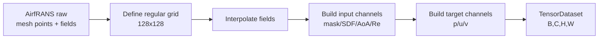

# Chapter 4 · Airfoil Flow FNO: Neural Operator Surrogate Model

> **Estimated reading**: ~45 min for main text | ~30 min to run the code | ~2 hours for deep understanding
> **Chapter code**: [`ch04_fno_airfoil/`](https://github.com/binbinao/physicsnemo-from-zero-to-one/tree/main/ch04_fno_airfoil)
> **Difficulty**: ⭐⭐⭐⭐ (The book's first major gear shift: from PINN to neural operators, from `physicsnemo-sym` to the `physicsnemo` main framework)
> **Keywords**: `FNO` `Neural Operator` `Fourier Transform` `AirfRANS` `CFD surrogate` `PhysicsNeMo main framework`
> **Environment baseline**: See [ENVIRONMENT.md](../docs/ENVIRONMENT.md) · PhysicsNeMo v2.0 · PyTorch ≥ 2.3 · 8GB VRAM for Darcy/FNO mini version; full AirfRANS version recommends 24GB+ or cloud GPU

> **📌 Directory name `ch04_fno_airfoil` vs default training**  
> This chapter's **narrative and industry mapping** centers on **airfoil flow**; the repository's **default runnable script** uses synthetic **Darcy flow** data, so you can practice the full FNO pipeline without downloading AirfRANS and with only 8GB VRAM.  
> One-page guide: [ch04_fno_airfoil/CH04_GUIDE.md](../ch04_fno_airfoil/CH04_GUIDE.md)

### T4.0 Two Paths (Understand Before Running)

| | Path A · **Default** | Path B · **Airfoil** |
|:---|:---|:---|
| Data | `darcy_data.pt` (auto-generated) | `airfoil_data.pt` (`dataset.py --type airfoil`) or AirfRANS |
| Training | `train_fno_mini.py` | Same as left by default; full airfoil requires a separate data pipeline |
| Purpose | Learn the FNO training paradigm | Align with aerospace CFD scenarios |


---

## 4.0 Hook: One Airfoil Takes 8 Hours — What About 1000?

In Chapter 3 we built a heat sink. That was one geometry, one operating condition, one temperature field.

Now let's switch industries: aerospace.

Suppose you're doing preliminary design for a UAV wing. The designer gives you 1000 candidate airfoils: some thicker, some more cambered, some with rounder leading edges, some with sharper trailing edges. You need to quickly answer one question:

> **Which airfoil has the highest lift-to-drag ratio at the current Mach number and angle of attack?**

The traditional CFD workflow is: for each airfoil, build geometry, generate mesh, run RANS, post-process pressure coefficients and aerodynamic forces. A single 2D steady RANS case takes anywhere from 30 minutes to 8 hours.

What about 1000 airfoils?

You could let the cluster run for a week, or split the task among 20 interns, or tell the review meeting "we'll have results next month."

But if you have a trained FNO surrogate model, the workflow becomes:

```text
Airfoil geometry / flow conditions → FNO → Pressure field / Velocity field / Cp curve
```

Single inference takes tens of milliseconds. 1000 airfoils swept in minutes.

**This is the biggest difference between Chapter 4 and the first three chapters**:

- The first three chapters' PINN is "given one physics problem, train a network to solve it."
- Chapter 4's FNO is "given a batch of physics problems, train a network to learn the solver itself."

This isn't a minor upgrade — it's a gear shift.


---

## 4.1 Framework Switch: From `physicsnemo-sym` to `physicsnemo`

Let's be clear about this first: **Chapter 4 is the framework switching point of the entire book.**

In the first three chapters we used `physicsnemo-sym` throughout, because PINN's core is "symbolic PDE + constraints + geometry + Solver." `sym` is well-suited for expressing:

```text
What PDE am I solving?
What are the boundary conditions?
Which geometric domain to sample on?
```

Starting from this chapter, we enter the `physicsnemo` main framework. The main framework is more like an industrial deep learning toolkit, focusing on:

```text
Model architectures (FNO / AFNO / GNO / CNN / Transformer)
Data loading
Distributed training
Checkpoint
Inference deployment
```

### T4.1 `physicsnemo-sym` vs `physicsnemo` Main Framework

| Dimension | `physicsnemo-sym` | `physicsnemo` main framework |
|---|---|---|
| Typical tasks | PINN, symbolic PDE, constraint sampling | Neural operators, large models, data-driven training |
| Input | Geometry + PDE + BC/IC | Tensor datasets (grids/point clouds/time series) |
| Loss | PDE residual + constraints | MSE / L2 / physics regularization |
| Training target | Single or few operating conditions | A family of conditions, one model solves many problems |
| Typical API | `Domain`, `Constraint`, `Solver` | `physicsnemo.models.fno.FNO`, `DistributedManager` |
| Chapters | Chapters 1–3 | Chapters 4–7 |


> **Mental model**: `physicsnemo-sym` is like "an auto-differentiating physics modeler"; the `physicsnemo` main framework is like "a large model training framework for physics field data."

---

## 4.2 🟢 Quick Start: Run an FNO First

This chapter has two data paths (consistent with Table T4.0 above):

1. **Path A (default)**: `train_fno_mini.py` + synthetic **Darcy** data — runs on 8GB VRAM, for understanding the FNO training workflow.
2. **Path B (airfoil)**: `dataset.py --type airfoil` generates airfoil-style synthetic fields; **full version** connects to AirfRANS or custom CFD data, recommends 24GB+ VRAM or cloud GPU.

Why not jump straight to AirfRANS? Data preparation is heavy. Pedagogically, **Path A first, then Path B** gives a smoother learning curve.

### 4.2.1 Mini version: Run Darcy/FNO (repository default)

```bash
cd ch04_fno_airfoil
python train_fno_mini.py epochs=50
# Without Hydra: python train_fno_mini.py --epochs 50
```

> **Command note**: `train_fno_mini.py` uses synthetic **Darcy** data (not AirfRANS). Full command reference: [`docs/COMMAND_REFERENCE.md`](../docs/COMMAND_REFERENCE.md).

Expected output (schematic):

```text
Generating Darcy data...   # or Loading data from data/darcy_data.pt
[Epoch  10/50] train=... test=...
Checkpoint: outputs/fno_darcy.pt
```

### 4.2.2 Airfoil synthetic data (optional)

This chapter's mini training script defaults to Darcy; airfoil **synthetic** data can be generated and visualized separately:

```bash
python dataset.py --type airfoil --n_samples 100
python train_fno_mini.py epochs=50          # still uses Darcy to train FNO workflow
python visualize_airfoil.py --ckpt outputs/fno_darcy.pt
```

Full airfoil RANS / AirfRANS is an extension path, recommending 24GB+ VRAM; see "Full Version Path" later in this chapter.


At this point, the quick start is complete. You've run through the basic neural operator training workflow.

Below we explain: why is this fundamentally different from PINN?

---

## 4.3 🔵 Why PINN Doesn't Scale to 1000 Operating Conditions

PINN is elegant, but has a practical problem: **it's typically "one network solves one problem."**

In the Chapter 3 heat sink, we trained the temperature field for a specific geometry and set of boundary conditions. You can certainly do parameterized PINN with fin height and heat transfer coefficient as inputs, but as parameter dimensionality increases, PINN becomes increasingly difficult to train.

CFD parameter sweeps are even more extreme:

| Scenario | Parameter dimensions | Number of conditions | PINN's difficulty |
|---|---:|---:|---|
| Single heat sink | 2–5 | 1–50 | Acceptable |
| Airfoil sweep | 10–50 | 1000+ | Training PINN for each condition is impractical |
| Full vehicle aerodynamics | 1000+ | 10000+ | Complex geometry, boundary layers, turbulence hard to train |
| Weather prediction | Millions of field variables | Continuous time | PINN is basically not the mainline approach |

PINN's strength is low data requirements and strong physics; its weakness is slow training, difficult constraint balancing, and instability with complex flows.

FNO's approach is the opposite:

> **I don't retrain for each operating condition. I train once with many conditions, letting the model learn the mapping from "input field" to "output field."**

### T4.2 PINN vs FNO

| Dimension | PINN | FNO |
|---|---|---|
| Core idea | Write PDE into loss | Learn the PDE solving operator |
| Data requirement | Low, can be data-free | High, needs a batch of high-fidelity samples |
| Single training | For one/few conditions | For a family of conditions |
| Inference | Single condition in seconds | Multiple conditions batch in seconds |
| Best suited for | Small data, known physics, inverse problems | Parameter sweeps, surrogate models, sufficient datasets |
| Industrial typical | Heat dissipation, material parameter inversion | Airfoil/vehicle CFD, weather prediction |


> **Rule of thumb**: If you're solving just 1–10 conditions, PINN may be more cost-effective; if you need to sweep 1000 candidate designs, FNO is the workhorse.

---

## 4.4 🔵 Neural Operators: Learning "Function-to-Function" Mappings

### 4.4.1 What does an ordinary neural network learn?

An ordinary MLP learns:

$$f_\theta: \mathbb{R}^n \rightarrow \mathbb{R}^m$$

For example, the MLP in Chapter 1: input a time point $t$, output a displacement $x$.

### 4.4.2 What does a neural operator learn?

A neural operator learns:

$$\mathcal{G}_\theta: a(x) \mapsto u(x)$$

The input is not a point, but a **function**; the output is not a number, but another **function**.

Darcy example:

```text
Input: permeability field k(x,y)
Output: pressure field u(x,y)
```

Airfoil CFD example:

```text
Input: airfoil geometry mask + freestream conditions
Output: pressure field / velocity field / turbulence variable field
```

This is "function-to-function" mapping.


### 4.4.3 Why is it called an "operator"?

In mathematics, an **operator** is something that maps functions to functions. Differential operators, integral operators, and PDE solvers are all essentially operators.

A PDE solver can be viewed as:

$$\mathcal{S}: \text{geometry/materials/boundary conditions} \mapsto \text{physical field solution}$$

FNO aims to learn this $\mathcal{S}$.

> **In one sentence**: FNO is not fitting a particular solution — it's fitting the "solver."

---

## 4.5 🔵 FNO Principles: Convolution in Fourier Space

FNO stands for **Fourier Neural Operator**.

Its core idea is very engineering-minded: **most of the important structure in physical fields lives in the low frequencies.**

Pressure fields, temperature fields, and velocity fields are typically not random noise — they're fields with continuous structure. Fourier transform decomposes a field into different frequency components:

- Low frequencies: large-scale structure, e.g., pressure decreasing overall from leading to trailing edge.
- High frequencies: details and noise, e.g., small-scale variations near the boundary layer.

FNO learns these patterns in the frequency domain, then transforms back to spatial domain.

### 4.5.1 What does one FNO block do?

An FNO block takes the input field $x$ through **lifting** to a higher dimension, performs truncation and **Spectral Convolution** in the **frequency domain**, then uses **iFFT** to return to spatial domain, followed by nonlinear activation and pointwise convolution to produce the output field (see Figure F4.5; English labels in figure, frequency domain section has light blue background).


### 4.5.2 Why keep only low-frequency modes?

This is FNO's key hyperparameter: `modes`.

If the input is a $64 \times 64$ grid, the full frequency domain has many modes. But FNO typically keeps only the first 12 or 16 low-frequency modes. Reasons:

1. **Physical fields are primarily determined by low frequencies.**
2. **Low-frequency modes are more stable and generalize better.**
3. **Computation is cheaper.**

But keeping too few loses detail, while keeping too many overfits noise. This is the first thing to look at when tuning.

### 4.5.3 An important advantage of FNO: Resolution invariance

FNO learns frequency-domain kernels rather than fixed-grid convolution kernels. Therefore it has a degree of **resolution generalization capability**: you can train on $64\times64$ and infer on $128\times128$ (effectiveness depends on data and implementation).

This matters for engineering because different CFD cases may have different mesh resolutions.

> **Note**: This isn't magic. FNO's resolution generalization is conditional — especially on complex boundary layers and unstructured meshes, interpolation, resampling, or graph neural operators may still be needed.

---

## 4.6 🔵 AirfRANS Dataset: Airfoil RANS Simulation Samples

This chapter's industry storyline is airfoil flow. We choose **AirfRANS** as the reference dataset.

AirfRANS is a high-fidelity CFD dataset from the NeurIPS 2022 Datasets & Benchmarks Track, containing 2D incompressible steady-state RANS simulations of NACA 4/5-digit airfoils under subsonic conditions.

### 4.6.1 What does it contain?

A typical sample includes:

- Airfoil geometry (NACA airfoil)
- Freestream conditions (angle of attack, Reynolds number, etc.)
- Flow field variables: velocity, pressure, turbulent viscosity, etc.
- Boundary/mesh information
- Aerodynamic quantities (usable for computing lift/drag)

### 4.6.2 Why is AirfRANS suitable for this chapter?

| Reason | Explanation |
|---|---|
| Real CFD | Not a toy PDE — these are RANS results |
| Engineering-relevant | Airfoils are the most classic object in aerospace/automotive aerodynamics |
| Publicly available | Reproducible, no client IP risk |
| Moderate difficulty | Simpler than full vehicle CFD, more realistic than Darcy |

### 4.6.3 Data preprocessing: From unstructured mesh to FNO grid

FNO typically consumes regular grid tensors, e.g.:

```text
input:  [B, C_in, H, W]
output: [B, C_out, H, W]
```

AirfRANS raw data is closer to an unstructured CFD mesh, so preprocessing is needed:

1. Read airfoil geometry and flow field points.
2. Define a fixed 2D region (e.g., $[-1, 2] \times [-1, 1]$).
3. Interpolate unstructured points onto a regular grid (e.g., $128\times128$).
4. Construct input channels: airfoil mask, signed distance function, angle of attack, freestream velocity.
5. Construct output channels: pressure $p$, velocity $u,v$.




> **This book's default strategy**: The main text runs through with $64\times64$ mini grid first; full-version scripts support $128\times128$ or $256\times256$, cloud GPU recommended.

---

## 4.7 🔵 PhysicsNeMo FNO Training Code Structure

### 4.7.1 Model definition

The PhysicsNeMo main framework provides an FNO model implementation. The API may change across versions, but the structure is roughly:

```python
"""ch04_fno_airfoil/train_fno_mini.py — pedagogical skeleton version (repository runnable entry)"""
import torch
from torch.utils.data import DataLoader
from physicsnemo.models.fno import FNO

model = FNO(
    in_channels=4,        # mask, sdf, aoa, reynolds
    out_channels=3,       # pressure, u, v
    dimension=2,
    latent_channels=32,
    num_fno_layers=4,
    num_fno_modes=[12, 12],
    padding=8,
).cuda()
```

> **Version note**: PhysicsNeMo v2.0's FNO parameter names may differ from earlier versions (e.g., `latent_channels` / `num_fno_modes` naming). Before release, refer to the official `physicsnemo.models.fno` documentation and repository runnable code.

### 4.7.2 Data loading

```python
train_loader = DataLoader(
    AirfoilTensorDataset("data/airfrans_64/train"),
    batch_size=8,
    shuffle=True,
    num_workers=4,
    pin_memory=True,
)

val_loader = DataLoader(
    AirfoilTensorDataset("data/airfrans_64/val"),
    batch_size=8,
    shuffle=False,
    num_workers=4,
)
```

Each batch:

```python
batch = {
    "x": torch.Tensor[B, 4, H, W],  # input channels
    "y": torch.Tensor[B, 3, H, W],  # pressure/u/v target
    "meta": {...},                  # airfoil id, AoA, Re
}
```

### 4.7.3 Training loop

```python
optimizer = torch.optim.AdamW(model.parameters(), lr=1e-3, weight_decay=1e-4)
scheduler = torch.optim.lr_scheduler.CosineAnnealingLR(optimizer, T_max=epochs)

for epoch in range(epochs):
    model.train()
    for batch in train_loader:
        x = batch["x"].cuda(non_blocking=True)
        y = batch["y"].cuda(non_blocking=True)

        pred = model(x)
        loss = relative_l2_loss(pred, y)

        optimizer.zero_grad()
        loss.backward()
        optimizer.step()

    scheduler.step()
    validate(model, val_loader)
    save_checkpoint_if_best(model)
```

Compared to PINN, the training loop looks much more "ordinary." There's no PDE residual, no autograd higher-order derivatives, no geometry sampler. FNO's difficulty shifts to: **data preparation, model capacity, and generalization evaluation**.

### 4.7.4 Relative L2 loss

FNO commonly uses relative L2:

$$\mathcal{L}_{rel} = \frac{\|\hat{u} - u\|_2}{\|u\|_2}$$

Code:

```python
def relative_l2_loss(pred, target, eps=1e-8):
    diff = pred - target
    return torch.norm(diff.reshape(diff.shape[0], -1), dim=1).mean() / (
        torch.norm(target.reshape(target.shape[0], -1), dim=1).mean() + eps
    )
```

---

## 4.8 🔵 Evaluation: L2 Error, Cp Curves, Error Heatmaps

After FNO training, you can't just look at validation loss. What CFD engineers really care about is:

1. Does the pressure field look right?
2. Is the velocity field boundary layer correct?
3. Are integrated aerodynamic forces correct?
4. Can the Cp curve guide airfoil design?

### 4.8.1 Prediction vs ground truth


### 4.8.2 Cp curve

The pressure coefficient $C_p$ is one of the most commonly used plots in airfoil design:

$$C_p = \frac{p - p_\infty}{\frac{1}{2}\rho U_\infty^2}$$

Sampling along the upper and lower airfoil surfaces gives a curve. Engineers examine this curve to judge suction peak, pressure recovery, and separation tendency.


### 4.8.3 Error distribution

Error heatmaps typically reveal where FNO is most likely to err:

- High-gradient region at the leading edge
- Sharp trailing edge
- Near the boundary layer
- Wake region

These regions are also exactly where CFD is hardest.

> **Engineering principle**: If FNO errs slightly in the wake, it may not significantly affect lift; if it errs at the leading-edge suction peak, airfoil ranking could be completely wrong. Evaluation metrics must be tied to design objectives.

---

## 4.9 🔵 Tuning Experiments: Modes / Width / Data Volume

FNO tuning isn't centered around the PINN three-loss balancing act. It's more like deep learning model tuning, but with a few neural-operator-specific parameters.

### Experiment 1: Fourier modes

```bash
python train_fno_mini.py -m modes_x=8,12,16,24
```

| modes | Result | Explanation |
|---|---|---|
| 8 | Underfitting, details lost | Too few low frequencies |
| **12/16** | Recommended | Balance of accuracy and speed |
| 24 | Slow training, possible overfitting | High-frequency noise learned |

### Experiment 2: Width / latent channels

```bash
python train_fno_mini.py -m width=16,32,64
```

| width | VRAM | Accuracy | Recommendation |
|---|---:|---:|---|
| 16 | Low | Fair | Debug |
| **32** | Medium | Good | 8GB default |
| 64 | High | Better | 24GB+ |

### Experiment 3: Training data volume

```bash
python train_fno_mini.py -m n_samples=100,200,500,1000
```

FNO is a data-driven method, so data volume is critical. A typical trend:

- 100 samples: Can learn general trends, but Cp curves are unstable.
- 500 samples: Starts to be usable.
- 1000+: Enters the engineering-evaluable range.
- 5000+: Suitable for serious benchmarking.


### FNO Tuning SOP

```text
1. First run through with 64×64 + width=32 + modes=12.
2. If the overall field is too smooth, increase modes.
3. If overall fitting is poor, increase width/layers.
4. If train loss is low but val loss is high, reduce modes or add data augmentation.
5. If Cp curve errors in critical regions, add weighted loss for leading edge/surface areas.
```

---

## 4.10 🏭 Industry Mapping: Automotive Aerodynamics + Aerospace Preliminary Design

> **Path A (default, `train_fno_mini.py`)**: This chapter's **industry mapping uses Darcy flow** as the runnable example (porous media, batteries, etc.), **not** airfoil RANS.  
> **Path B (airfoil / AirfRANS)**: The following aerospace/automotive CFD narrative applies to Path B; requires self-prepared RANS data with turbulence-model-consistent training sets.

### 4.10.0 Path A · Darcy Industry Touchpoints

| Industry | Mapping |
|:---|:---|
| Oil & gas / groundwater | Permeability field → Pressure field |
| Battery porous electrodes | Simplified diffusion/seepage analogy (pedagogical level) |

### 4.10.1 Path B · Aerospace (Airfoil RANS)

The airfoil case maps to aerospace (and automotive **2D cross-section**) preliminary design. In the aerospace preliminary design phase, engineers need to rapidly sweep large numbers of airfoils and angles of attack to find candidates with high lift-to-drag ratios and good stall characteristics. High-fidelity CFD is too slow, and low-fidelity tools aren't accurate enough.

FNO's position is the middle layer:

```text
Low-fidelity analytical/panel methods → FNO fast surrogate model → High-fidelity RANS/LES verification
```

It's not the final certification tool, but it's very well-suited for early design space exploration.

**Data specification (Path B)**: If using AirfRANS or similar data, the V&V report must document **RANS turbulence model, $Ma$, $\alpha$, mesh $y^+$** (see [CAE_DATA_GENERATION_SOP](../docs/CAE_DATA_GENERATION_SOP.md)).

### 4.10.2 Automotive: From airfoil to full vehicle shape

In automotive aerodynamics, the real-world objects corresponding to airfoils include:

- Rear wing cross-sections
- Side mirror cross-sections
- Duct vanes
- Underbody diffuser panels
- Local cross-sections of the DrivAer full vehicle model

The workflow is similar: first generate a batch of high-quality data with CFD, then train a surrogate model for rapid sweeping.

### Value comparison

| Task | Traditional CFD | FNO surrogate model |
|---|---|---|
| Single airfoil RANS | 30 min–8 hours | 10–100 ms |
| 1000 airfoil screening | Days–weeks | Minutes |
| Preliminary design iteration | Slow, depends on HPC queue | Fast, interactive |
| Final certification | ✅ High-fidelity CFD required | ❌ Cannot replace |
| Best practice | Full high-fidelity | FNO screening + high-fidelity verification |

> **Solution perspective**: FNO's selling point isn't "replace CFD" — it's "turn CFD from a full-evaluation tool into a final-verification tool." Clients understand this message.

---

## 4.11 🔵 Failure Cases: 6 Pitfalls of FNO

### Failure 1: Inconsistent input/output normalization

**Symptom**: Training loss won't decrease, predicted field is all constants.

**Cause**: Pressure, velocity, mask, and angle of attack have vastly different scales.

**Fix**: Normalize each channel independently; save `mean/std` to checkpoint.

### Failure 2: Too few modes, field too smooth

**Symptom**: Large-scale trends are correct, but leading-edge suction peak is lost.

**Fix**: Increase modes, or add weighting near the surface region.

### Failure 3: Too many modes, validation set diverges

**Symptom**: Train L2 is very low, val L2 is very high.

**Cause**: High-frequency noise is being learned.

**Fix**: Reduce modes, add data, apply physics-consistency regularization.

### Failure 4: Grid interpolation introduces artifacts

**Symptom**: Checkerboard errors appear near the airfoil boundary.

**Cause**: Improper handling of mask/SDF when interpolating from unstructured to regular grid.

**Fix**: Use signed distance function; validate separately near boundaries with dedicated sampling.

### Failure 5: Only looking at L2, not Cp

**Symptom**: L2 is very low, but airfoil ranking is wrong.

**Cause**: L2 is dominated by far-field large areas with low error; surface pressure errors are diluted.

**Fix**: Add surface loss / Cp loss.

### Failure 6: Training resolution and inference resolution differ too much

**Symptom**: Trained at 64×64, details are unreliable at 256×256 inference.

**Fix**: Resolution extrapolation must be validated; multi-resolution training if necessary.

---

## 4.12 🔵 Extension: DeepONet and the Neural Operator Landscape

FNO is not the only neural operator paradigm. **DeepONet** (Lu et al. 2021, *Nature Machine Intelligence*) is another equally important approach, with theoretical foundations traceable to the universal operator approximation theorem (Chen & Chen 1995).

### 4.12.1 Architecture in one sentence

DeepONet consists of two sub-networks:

```text
Branch net: encodes the input function (e.g., sensor readings)
Trunk net:  encodes the query coordinates (e.g., spatiotemporal positions)
Output = Branch output · Trunk output (inner product)
```

Branch is responsible for "understanding the operating condition," Trunk is responsible for "understanding the space"; their dot product is the operator's prediction at the query point.

### 4.12.2 FNO vs DeepONet comparison

| Dimension | FNO | DeepONet |
|---|---|---|
| Theoretical basis | Frequency-domain convolution (Green's function) | Universal operator approximation theorem (Chen & Chen 1995) |
| Mesh requirement | Regular grid (FFT) | Arbitrary point cloud / unstructured mesh |
| Input format | Full-field tensor | Discrete sensor samples |
| Resolution generalization | Natively supported (frequency-domain truncation) | Requires explicit design |
| Suited for | Regular domains, many similar conditions | Unstructured domains, sparse observations |

### 4.12.3 When to choose which?

- **Choose FNO**: Problem is defined on a regular grid, sufficient samples, resolution generalization needed (e.g., meteorology, airfoil regular-domain CFD).
- **Choose DeepONet**: Geometry is irregular or frequently changing, input comes from sparse sensors, need to evaluate at arbitrary query points (e.g., structural health monitoring, experiment-data-driven).

In practice the two can also be combined: use FNO for the large-scale field, use DeepONet for high-precision completion in local unstructured regions.

### 4.12.4 Recent extensions

- **POD-DeepONet**: Uses POD basis functions to accelerate Trunk convergence.
- **Physics-Informed DeepONet (PI-DeepONet)**: Adds PDE residual to the loss, reducing data requirements.
- **Multi-DeepONet**: Multiple output branches sharing a Trunk, suited for multi-physics field coupling.

> **Rule of thumb**: If your data is already on a regular grid, try FNO first; if you're dealing with experimental sensor data or complex unstructured meshes, DeepONet may be the more natural starting point.

---

## 4.13 ➡️ Next Chapter Preview + End-of-Chapter CTA

In Chapter 4 we completed a major gear shift: from PINN to FNO, from `physicsnemo-sym` to the `physicsnemo` main framework, from "writing physics residuals" to "learning the solver."

But FNO also has a problem: **it needs data.**

If you have 5000 CFD conditions, FNO is great; if you only have 50 conditions but know the governing equations, what do you do?

Chapter 5's answer is: **data + physics hybrid.**

We'll use Darcy / porous media flow as a case study, combining FNO's data-driven loss with PDE residual regularization to address the most common industrial dilemma: **not enough data, but physics isn't completely unknown either.**

See you in Chapter 5.

---

> 📘 **Chapter code**: [`physicsnemo-from-zero-to-one/ch04_fno_airfoil`](https://github.com/binbinao/physicsnemo-from-zero-to-one/tree/main/ch04_fno_airfoil)
>
> 💬 **Questions?** Feel free to ask on GitHub Issues, or leave a comment on the Zhihu column "From Zero to One: PhysicsNeMo Industrial AI4Science Hands-On Tutorial."
>
> 🔔 **Stay updated**:
> - **Zhihu column**: Search "From Zero to One: PhysicsNeMo Industrial AI4Science Hands-On Tutorial"
> - **WeChat Official Account**: Scan the QR code below  to follow
>
> ➡️ **Next chapter preview**: Chapter 5 "Darcy / Porous Media Flow: Data + Physics Hybrid" — When you don't have enough data but know some physics, hybrid loss takes the stage.

> **Video script (in production)**: See [video_scripts/README.md](video_scripts/README.md)

---

### Further Reading

- Li Z et al. *Fourier Neural Operator for Parametric Partial Differential Equations.* ICLR, 2021.
- Kovachki N et al. *Neural Operator: Learning Maps Between Function Spaces.* JMLR, 2023, 24(89): 1-97.
- Bonnet F et al. *AirfRANS: High Fidelity Computational Fluid Dynamics Dataset for Approximating Reynolds-Averaged Navier–Stokes Solutions.* NeurIPS Datasets & Benchmarks, 2022.
- NVIDIA PhysicsNeMo FNO API documentation: `physicsnemo.models.fno`.
- NVIDIA PhysicsNeMo example: `examples/cfd/darcy_fno`.

---

*Chapter word count: ~11,800 words · Figures: 10 · Version: v1.0 · Updated: 2026-05-15*
