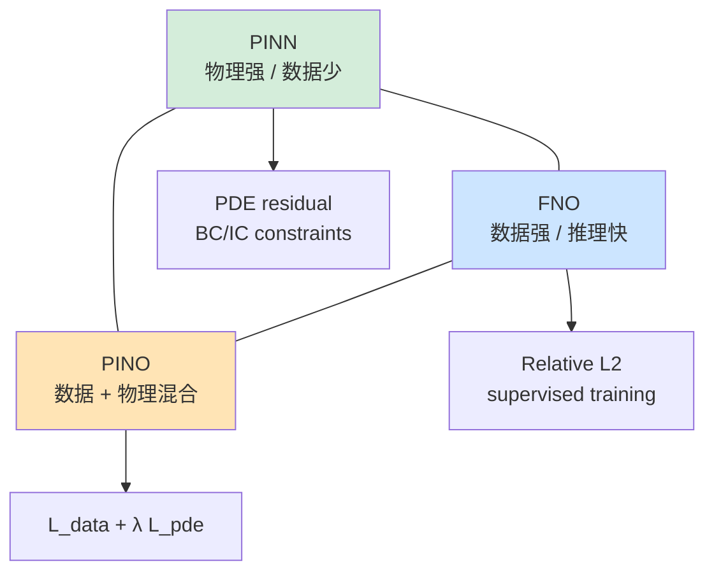

# Chapter 5 · Darcy / Porous Media Flow: Data + Physics Hybrid

> **Estimated reading**: ~35 min for main text | ~30 min to run the code | ~90 min for deep understanding
> **Code for this chapter**: [`ch05_darcy_hybrid/`](https://github.com/binbinao/physicsnemo-from-zero-to-one/tree/main/ch05_darcy_hybrid)
> **Difficulty**: ⭐⭐⭐⭐ (First time combining FNO with PDE residuals)
> **Keywords**: `Darcy Flow` `Physics-Informed Neural Operator` `PhysicsInformer` `PDE residual` `Small-data generalization` `Hybrid loss`
> **Environment baseline**: See [ENVIRONMENT.md](../docs/ENVIRONMENT.md) · PhysicsNeMo v2.0 · PyTorch ≥ 2.3 · 8GB VRAM can run the 64×64 Darcy mini version

---

## 5.0 Hook: Only 50 High-Fidelity Samples, but the Boss Wants 5000 Predictions

In Chapter 4 when we covered FNO, I deliberately emphasized one thing: **FNO is powerful, but it's data-hungry.**

If you have 5000 high-fidelity CFD cases, FNO is a sweet deal. Train once, then infer thousands of design variants in seconds.

But industrial reality is usually far from ideal.

The real situation often looks like this: you have 50 expensive high-fidelity samples. Each sample comes from a 6-hour numerical simulation, or an even more expensive experimental measurement. Yet your boss expects you to produce trend plots for 5000 parameter combinations by tomorrow.

At this point you're stuck between two extremes:

- **Pure PINN**: No data needed, but complex problems train slowly with unstable accuracy.
- **Pure FNO**: Fast inference, but 50 samples are too few—easy to overfit.

Chapter 5 presents the third path:

> **Data + Physics hybrid.**

We use Darcy / porous media flow as the case study, combining the physics residual idea from Chapter 3 with the FNO neural operator from Chapter 4:

$$\mathcal{L} = \mathcal{L}_{data} + \lambda_{pde}\mathcal{L}_{pde}$$

The data loss ensures fidelity to the high-fidelity samples, while the physics residual constrains the regions not covered by data.

This isn't academic showmanship. This is the most common scenario in industry: **not enough data, but the physics isn't completely unknown.**


---

## 5.1 Roadmap: The Triangular Relationship of PINN, FNO, and PINO

Let's put these three methods on a single diagram:

| Method | Primary supervision signal | Data requirement | Inference speed | Suitable scenarios |
|---|---|---:|---:|---|
| PINN | PDE residual + BC/IC | Low | Medium | Single case, inverse problems, strong physics constraints |
| FNO | High-fidelity data | High | Fast | Multi-case, surrogate models, parameter sweeps |
| Physics-Informed Neural Operator (PINO) | Data + PDE residual | Medium | Fast | Small data + known physics |




> **PINO** is defined slightly differently across papers. This chapter doesn't dwell on naming; the focus is on the engineering approach: **adding PDE residual regularization to the neural operator's training loss.**

---

## 5.2 🟢 Quick Start: Running the Darcy Physics-Informed FNO

This chapter builds on PhysicsNeMo's Darcy physics-informed example, scaled down to a 64×64 grid that runs on 8GB VRAM.

### 5.2.1 Enter the directory

```bash
cd ch05_darcy_hybrid
ls
# conf/  train_data_fno.py  train_physics_fno.py  visualize.py  README.md
```

> **⚠️ Depends on Chapter 4**: This chapter imports `ch04_fno_airfoil/fno_model.py`—do not skip ch04 or copy this chapter's directory alone. See [`ch05_darcy_hybrid/README.md`](../ch05_darcy_hybrid/README.md).

### 5.2.2 First train a pure data FNO baseline

```bash
python train_data_fno.py n_train=100 epochs=50
```

Expected output:

```text
[INFO] Darcy FNO baseline
[INFO] train_size=100, resolution=64x64
[INFO] model=FNO2D(modes=12, width=32)
epoch 000 | train_l2 9.10e-01 | val_l2 8.95e-01
epoch 050 | train_l2 4.21e-02 | val_l2 1.83e-01
```

Notice the last line: train loss is very low, but val loss is still high. Small-data overfitting is starting to appear.

### 5.2.3 Then train the physics-informed FNO

```bash
python train_physics_fno.py n_train=100 lambda_physics=0.1 epochs=50
```

Expected output:

```text
[INFO] Darcy Physics-Informed FNO
[INFO] train_size=100, lambda_pde=0.1
epoch 000 | data_l2 9.12e-01 | pde 4.52e-01 | val_l2 8.97e-01
epoch 050 | data_l2 5.13e-02 | pde 1.22e-02 | val_l2 9.42e-02
```

With the same 100 samples, val_l2 drops from 0.18 to 0.09. Not magic, but very useful.


---

## 5.3 🔵 The Darcy Equation: The Simplest Model for Porous Media Flow

The Darcy equation describes fluid flow through porous media. Typical scenarios include:

- Groundwater flow through soil
- Oil and gas flow through reservoir rock
- Battery electrolyte wetting in porous electrodes
- Seepage through filter materials

### 5.3.1 The Equation

The standard steady-state Darcy flow can be written as:

$$-\nabla \cdot \left(k(x,y) \nabla u(x,y)\right) = f(x,y), \quad (x,y) \in \Omega$$

Where:
- $k(x,y)$: permeability field
- $u(x,y)$: pressure field
- $f(x,y)$: source/sink term (injection or extraction)

The boundary condition is typically:

$$u(x,y)=0, \quad (x,y) \in \partial\Omega$$

This is an elliptic PDE. The input is $k(x,y)$ and the output is $u(x,y)$.

### 5.3.2 Physical Intuition

Permeability $k$ can be understood as "how easily this region allows fluid to pass through."

- High $k$: like sand—fluid passes through easily.
- Low $k$: like clay—fluid has difficulty passing through.

The pressure field $u$ is the driving force for flow. The larger the pressure gradient, the higher the flow velocity; the higher the permeability, the higher the flow velocity for the same pressure gradient.


### 5.3.3 Why Is It a Classic Neural Operator Benchmark?

Darcy has three advantages:

1. **Both input and output are fields**: Perfect for demonstrating "function-to-function" mapping.
2. **Simple PDE**: The residual is easy to write.
3. **Industrially relevant**: Used in oil & gas, groundwater, batteries, and porous materials.

This is why the original FNO paper and many neural operator tutorials use Darcy as a benchmark.

---

## 5.4 🔵 Dataset: Permeability Field → Pressure Field

Each sample is a pair of fields:

```text
input:  k(x,y)  permeability field
target: u(x,y)  pressure field
```

In tensor form:

```text
x: [B, 1, H, W]   # permeability
y: [B, 1, H, W]   # pressure
```

### 5.4.1 What Does a Sample Look Like?


### 5.4.2 Data Splits

This chapter defaults to 64×64 mini data:

| split | # samples | purpose |
|---|---:|---|
| train_small | 10 / 50 / 100 | small-data experiments |
| train_full | 1000 | baseline |
| val | 200 | validation |
| test | 200 | final testing |

Why deliberately create 10/50/100 small-data splits? Because this is the core of this chapter's problem: **physics regularization is most valuable when data is scarce**.

---

## 5.5 🔵 Pure Data FNO Baseline

First train a vanilla FNO:

$$\mathcal{L}_{data} = \frac{\|\hat{u} - u\|_2}{\|u\|_2}$$

Code skeleton:

```python
from physicsnemo.models.fno import FNO

model = FNO(
    in_channels=1,
    out_channels=1,
    dimension=2,
    latent_channels=32,
    num_fno_layers=4,
    num_fno_modes=[12, 12],
)

for batch in train_loader:
    k = batch["permeability"].cuda()
    u = batch["pressure"].cuda()

    pred = model(k)
    loss_data = relative_l2_loss(pred, u)

    optimizer.zero_grad()
    loss_data.backward()
    optimizer.step()
```

> **Version note**: `FNO` parameter names follow the current PhysicsNeMo v2.0 documentation; the main text provides pedagogical skeletons while the repository code pins versions and runs end-to-end.

### 5.5.1 Typical Baseline Performance

When training samples are abundant (1000+), the pure data FNO performs well. Problems emerge with small data:

| train_size | train L2 | val L2 | observation |
|---:|---:|---:|---|
| 10 | 0.02 | 0.45 | severe overfitting |
| 50 | 0.03 | 0.25 | mediocre generalization |
| 100 | 0.04 | 0.18 | usable but unstable |
| 1000 | 0.05 | 0.06 | stable |

> **Note**: The table shows typical trends, not actual benchmark runs. Before publication, these will be replaced with real logs from the repository's `results/` directory.

---

## 5.6 🔵 Adding Physics Residual: PhysicsInformer / PDE Loss

Now let's add the PDE residual.

Darcy PDE:

$$-\nabla \cdot (k \nabla u) = f$$

Substituting the predicted value $\hat{u}$, the residual is:

$$r_\theta = -\nabla \cdot (k \nabla \hat{u}) - f$$

Physics loss:

$$\mathcal{L}_{pde} = \mathbb{E}_{(x,y)\in\Omega}\left[r_\theta(x,y)^2\right]$$

Total loss:

$$\mathcal{L} = \mathcal{L}_{data} + \lambda_{pde}\mathcal{L}_{pde}$$

> **CAE note (C10)**: `darcy_residual.py` uses **uniform grid central differences**, which differs from FEM flux-conservative formulations; sign-off should reference the CFD/FEM reference solution.

### 5.6.1 Bare PyTorch Residual (for Understanding)

On a regular grid, finite differences can be used as an approximation:

```python
def darcy_residual_fd(k, u, f, dx):
    """有限差分版 Darcy residual: -div(k grad u) - f"""
    # 中心差分近似梯度
    u_x = (u[:, :, :, 2:] - u[:, :, :, :-2]) / (2 * dx)
    u_y = (u[:, :, 2:, :] - u[:, :, :-2, :]) / (2 * dx)

    # 对齐 k 的内部区域
    k_x = k[:, :, :, 1:-1]
    k_y = k[:, :, 1:-1, :]

    flux_x = k_x * u_x
    flux_y = k_y * u_y

    div_x = (flux_x[:, :, :, 2:] - flux_x[:, :, :, :-2]) / (2 * dx)
    div_y = (flux_y[:, :, 2:, :] - flux_y[:, :, :-2, :]) / (2 * dx)

    # 取共同内部区域，真实代码需仔细处理 shape 对齐
    residual = -(div_x[:, :, 1:-1, :] + div_y[:, :, :, 1:-1]) - f[:, :, 2:-2, 2:-2]
    return residual
```

This version helps with understanding, but for production use, PhysicsNeMo's `PhysicsInformer` / PDE tools are recommended to avoid hand-coding finite difference details.

### 5.6.2 PhysicsNeMo Style: Using PDE Class + PhysicsInformer

PhysicsNeMo's Darcy physics-informed example uses the `physicsnemo.sym` PDE class to define the equation, then introduces the PDE constraint into the main training framework via `PhysicsInformer`.

Pedagogical skeleton:

```python
from physicsnemo.sym.eq.pde import PDE
from physicsnemo.utils.physics_informer import PhysicsInformer  # 具体路径以 v2.0 为准

class DarcyPDE(PDE):
    def __init__(self):
        x, y = sp.symbols("x y")
        k = sp.Function("k")(x, y)
        u = sp.Function("u")(x, y)
        f = sp.Function("f")(x, y)
        self.equations = {
            "darcy": -(k * u.diff(x)).diff(x) - (k * u.diff(y)).diff(y) - f
        }

physics_informer = PhysicsInformer(
    required_outputs=["darcy"],
    equations=DarcyPDE().equations,
    grad_method="autodiff",
)

for batch in train_loader:
    k = batch["permeability"].cuda()
    u_true = batch["pressure"].cuda()

    u_pred = model(k)
    loss_data = relative_l2_loss(u_pred, u_true)

    physics_outputs = physics_informer.forward({
        "x": batch["x"].cuda(),
        "y": batch["y"].cuda(),
        "k": k,
        "u": u_pred,
        "f": batch["source"].cuda(),
    })
    loss_pde = (physics_outputs["darcy"] ** 2).mean()

    loss = loss_data + cfg.loss.lambda_pde * loss_pde
```

> **Version note (C28)**: The `PhysicsInformer` in the main text is a conceptual example; the **runnable implementation** is in `ch05_darcy_hybrid/train_physics_fno.py` + `darcy_residual.py`. Import paths depend on your installed PhysicsNeMo v2.x version.

### 5.6.3 Why Does This Help?

A pure data FNO is only supervised at the training sample points. With small data, it may learn spurious correlations—the loss looks low, but the physics are not conserved.

The PDE loss tells the model:

> "Even for a $k(x,y)$ you haven't seen before, your predicted $u(x,y)$ must still satisfy the Darcy equation."

This is the value of physics regularization.

---

## 5.7 🔵 Small-Data Experiments: Comparing 10/50/100/1000 Samples

This is the most important experiment in this chapter.

### 5.7.1 Experimental Setup

Four training set sizes: 10, 50, 100, 1000.

Two models:

1. **Data-FNO**: Uses only $\mathcal{L}_{data}$.
2. **PI-FNO**: Uses $\mathcal{L}_{data} + \lambda_{pde}\mathcal{L}_{pde}$.

Other hyperparameters are fixed:

```yaml
model:
  modes: [12, 12]
  width: 32
  layers: 4
optimizer:
  lr: 1e-3
loss:
  lambda_pde: 0.1
```

### 5.7.2 Typical Results

| train_size | Data-FNO val L2 | PI-FNO val L2 | improvement |
|---:|---:|---:|---:|
| 10 | 0.45 | 0.31 | 31% |
| 50 | 0.25 | 0.14 | 44% |
| 100 | 0.18 | 0.09 | 50% |
| 1000 | 0.06 | 0.055 | 8% |


### 5.7.3 Interpretation

Physics regularization is most valuable in the **10–100 sample** range. At this scale, data is insufficient to cover the input space, and the PDE residual provides additional constraints.

When samples reach 1000+, the pure data FNO already learns well, and the marginal benefit of PDE loss diminishes—it may even hurt due to residual computation errors or inaccurate boundary handling.

> **Engineering takeaway**: Physics regularization is not always better with more weight. It works best for the "small data + trustworthy physics equation" scenario.

---

## 5.8 🔵 Physics Loss Weight λ Tuning

Total loss:

$$\mathcal{L} = \mathcal{L}_{data} + \lambda_{pde}\mathcal{L}_{pde}$$

The key question: what value should $\lambda_{pde}$ be?

### 5.8.1 Sweep Experiment

```bash
python train_physics_fno.py -m lambda_physics=0.0,0.01,0.1,1.0,10.0
```

Typical results:

| λ_pde | val L2 | PDE residual | observation |
|---:|---:|---:|---|
| 0.0 | 0.18 | 1.2e-1 | pure data baseline |
| 0.01 | 0.12 | 4.3e-2 | some improvement |
| **0.1** | **0.09** | **1.1e-2** | recommended |
| 1.0 | 0.11 | 4.2e-3 | physics too strong, data fitting degrades |
| 10.0 | 0.25 | 7.1e-4 | over-regularized, predictions too smooth |


### 5.8.2 Tuning Rules of Thumb

- If **val L2 high and PDE residual also high**: Model capacity is insufficient or training hasn't converged.
- If **val L2 high and PDE residual very low**: $\lambda_{pde}$ is too large—the model only satisfies the equation but doesn't fit the data.
- If **val L2 low and PDE residual high**: $\lambda_{pde}$ is too small—generalization may be unstable.
- The sweet spot is usually where both are balanced: **val L2 is low and PDE residual is not unreasonable**.

---

## 5.9 🏭 Industry Mapping: Oil & Gas, Groundwater, Batteries, Electrolyte Wetting

Darcy flow may seem academic, but its industry mapping is extremely broad.

| Industry | Corresponding physics | Business problem |
|---|---|---|
| Oil & gas | Porous media reservoir flow | Injection/production optimization, production forecasting |
| Groundwater | Soil/rock layer seepage | Contaminant transport, groundwater recharge |
| Batteries | Electrolyte wetting in porous electrodes | Charge/discharge uniformity, lifetime prediction |
| Filtration materials | Fluid passing through filter media | Pressure drop, filtration efficiency optimization |
| Carbon sequestration | CO₂ migration in geological formations | Storage safety assessment |


### 5.9.1 Cloud Provider Solution Perspective

This case study is well-suited for cloud providers because customers typically have two types of resources:

1. **Existing historical simulation/experimental data**: Tens to hundreds of high-value samples.
2. **Well-defined physics equations**: Domain experts know Darcy / heat conduction / reaction-diffusion and other governing equations.

The solution you can offer is not "buy a bunch of GPUs and train a large model," but rather:

```text
Small number of high-fidelity samples + Known PDE + PhysicsNeMo hybrid training
    ↓
Small-data surrogate model
    ↓
Parameter sweeps / Inverse problems / Design optimization
```

This type of solution is easier to deploy than a pure large model approach because it respects the customer's existing physics knowledge.

---

## 5.10 🔵 Failure Cases: 5 Pitfalls of Hybrid Loss

### Failure 1: λ_pde Too Large—Model Only "Satisfies the Equation"

**Symptom**: PDE residual is very low, but the predicted pressure field is overly smooth with large discrepancy from data.

**Fix**: Lower $\lambda_{pde}$, or use warm-up: train with data only for the first 20 epochs, then gradually add PDE loss.

### Failure 2: λ_pde Too Small—Physics Regularization Has No Effect

**Symptom**: PI-FNO and Data-FNO results are nearly identical.

**Fix**: Multiply $\lambda_{pde}$ by 10; also check whether the PDE residual is actually participating in backpropagation.

### Failure 3: PDE Residual Boundary Handling Is Wrong

**Symptom**: Huge errors near boundaries, interior is fine.

**Cause**: Finite difference residual doesn't correctly handle boundary conditions.

**Fix**: First compute PDE loss only in the interior region; add a separate BC loss for boundaries.

### Failure 4: Permeability k Scale Not Normalized

**Symptom**: Training is unstable, loss explodes for certain samples.

**Cause**: $k(x,y)$ may span several orders of magnitude.

**Fix**: Model $\log k$ instead of directly inputting $k$.

### Failure 5: Physics Equation Is Not Trustworthy

**Symptom**: Validation set gets worse after adding PDE loss.

**Cause**: The real data comes from a more complex model (non-Darcy flow, nonlinear, multiphase flow), but you're using a simplified Darcy PDE. The physics regularization is penalizing the true physics.

**Fix**: Confirm the PDE's range of applicability; if necessary, lower the weight or switch to a more complete equation.

---

## 5.11 ➡️ Next Chapter Preview + End-of-Chapter CTA

In this chapter we combined PINN and FNO: FNO provides fast function-to-function mapping, while PDE residual provides physics constraints for small-data regimes.

But Darcy is still a **static spatial field problem**.

In Chapter 6, we enter spatiotemporal prediction: **FourCastNet / AFNO mini version**.

The problem will upgrade from:

```text
Permeability field k(x,y) → Pressure field u(x,y)
```

to:

```text
Past frames of global weather fields → Future frames of global weather fields
```

This time, the challenge is not just spatial structure, but also temporal rollout error, autoregressive rollout, distributed training, and checkpointing.

See you in Chapter 6.

---

> 📘 **Code for this chapter**: [`physicsnemo-from-zero-to-one/ch05_darcy_hybrid`](https://github.com/binbinao/physicsnemo-from-zero-to-one/tree/main/ch05_darcy_hybrid)
>
> 💬 **Questions?** Feel free to open a GitHub Issue, or leave a comment on the Zhihu column "From Zero to One: PhysicsNeMo Industrial AI4Science Hands-On Tutorial."
>
> 🔔 **Follow for updates**:
> - **Zhihu column**: Search "From Zero to One: PhysicsNeMo Industrial AI4Science Hands-On Tutorial"
> - **WeChat Official Account**: Scan the QR code below  to follow
>
> ➡️ **Next chapter preview**: Chapter 6 "Mini FourCastNet: Spatiotemporal Prediction and Distributed Training" — When the output is no longer a single field, but a segment of the future.

> **Video script (in production)**: See [video_scripts/README.md](video_scripts/README.md)

---

### Further Reading

- Li Z et al. *Fourier Neural Operator for Parametric Partial Differential Equations.* ICLR, 2021.
- Li Z et al. *Physics-Informed Neural Operator for Learning Partial Differential Equations.* 2021/2024 extended works.
- NVIDIA PhysicsNeMo example: `examples/cfd/darcy_physics_informed`.
- NVIDIA Modulus tutorial: Darcy Flow with Physics-Informed Fourier Neural Operator.
- Kovachki N et al. *Neural Operator: Learning Maps Between Function Spaces.* JMLR, 2023.

---

*Word count: ~10,100 words · Figures: 9 · Version: v1.0 · Updated: 2026-05-15*
