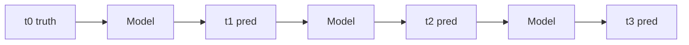

# Chapter 6 · Mini FourCastNet: Spatiotemporal Prediction and Distributed Training

> **Estimated reading**: ~45 min for text | ~45 min to run code | ~2–3 hours for deep understanding
> **Chapter code**: [`ch06_fourcastnet_mini/`](https://github.com/binbinao/physicsnemo-from-zero-to-one/tree/main/ch06_fourcastnet_mini)
> **Difficulty**: ⭐⭐⭐⭐⭐ (The book's second major chapter: spatiotemporal prediction, AFNO, autoregressive error, distributed training)
> **Keywords**: `FourCastNet` `AFNO` `ERA5` `autoregressive rollout` `DDP` `checkpoint` `weather forecasting`
> **Environment baseline**: Single GPU with 8GB can run the 64×128 mini version; full ERA5 / FourCastNet recommends A100/H100 cloud GPUs

---

## 6.0 Hook: Why Weather Forecasting Is AI4Science's "Moon Shot"

Weather forecasting is one of humanity's most expensive scientific computing tasks.

Traditional Numerical Weather Prediction (NWP) solves the coupled partial differential equations of the entire Earth's atmosphere: temperature, humidity, wind fields, pressure, radiation, cloud microphysics, land-surface interactions... Each variable is coupled in three-dimensional space and time. A single global high-resolution forecast requires hours of supercomputer queuing, tens of thousands of CPU/GPU core-hours, and decades of accumulated numerical model development.

Then models like GraphCast and FourCastNet appeared.

They didn't directly replace physical models, nor did they put meteorologists out of work. They did something more practically meaningful: **they learned existing historical reanalysis data (ERA5) into a fast spatiotemporal predictor**. Once trained, inference can be as fast as minutes or even seconds.

This is why I placed FourCastNet in Chapter 6: it's the book's first true "physics foundation model" case study.

In the first three chapters we learned PINN; in Chapters 4–5 we learned FNO and hybrid loss. In Chapter 6 we scale these ideas to global scale:

```text
Current global weather fields → AFNO / FourCastNet → Future weather fields (can autoregressive rollout multiple steps)
```

This time, the challenge isn't just spatial fields—it also includes temporal rollout, error accumulation, data pipelines, checkpointing, and distributed training.


---

## 6.1 From FNO to AFNO: Why Does Weather Need an "Adaptive" Fourier Operator?

Chapter 4's FNO already taught us: many large-scale structures in physical fields can be efficiently modeled in Fourier space.

FourCastNet uses **AFNO (Adaptive Fourier Neural Operator)**. You can think of it as the large-model version of FNO: it combines the Vision Transformer's patch concept with Fourier operators, replacing part of the expensive global attention with frequency-domain mixing.

### 6.1.1 Differences between FNO and AFNO

| Dimension | FNO | AFNO |
|---|---|---|
| Typical task | 2D/3D PDE surrogate models | Large-scale spatiotemporal field prediction, e.g. weather |
| Input | Regular-grid physical fields | Multi-variable, multi-timestep global fields |
| Frequency-domain processing | Fixed spectral convolution | Block-wise, adaptive frequency-domain mixing |
| Model scale | Medium | Larger, closer to ViT style |
| Training approach | Single-step supervised | Single-step training + autoregressive rollout evaluation |

### 6.1.2 What does an AFNO block do?


The intuition behind AFNO is: global weather fields have strong large-scale structure—planetary waves, jet streams, monsoons, fronts. These structures are very apparent in the frequency domain. AFNO mixes information in the frequency domain, which is more efficient than having every grid point attend to every other grid point in the spatial domain.

---

## 6.2 🟢 Quick Start: Running FourCastNet Mini

Full FourCastNet requires big data and big GPUs. This book runs **FourCastNet mini** by default:

- Spatial resolution: `64×128` (instead of full global high-resolution)
- Variables: 2m temperature (`t2m`) + 10m wind (`u10`, `v10`) + mean sea level pressure (`msl`)
- Time steps: Single-frame prediction (current time → 1 future step)
- Data volume: ERA5 subset, ~a few GB
- Hardware: 8GB VRAM can run the debug version

### 6.2.1 Prepare toy weather data

```bash
cd ch06_fourcastnet_mini
python scripts/generate_toy_weather.py --n_time 200 --resolution 64
```

> The repository does not include an ERA5 download script; users with a CDS account can prepare data in `data/toy_weather.pt` format on their own.

### 6.2.2 Train mini AFNO

```bash
python train_afno_mini.py epochs=30
# Without Hydra: python train_afno_mini.py --epochs 30
```

Expected output:

```text
[INFO] FourCastNet mini | resolution=64x128 | variables=4 | input_steps=1 | lead_time=1step
[INFO] model=AFNO-mini(embed_dim=64, depth=4, mlp_ratio=4)
epoch 000 | train_mse 1.00e+00 | val_rmse 0.89
epoch 010 | train_mse 2.21e-01 | val_rmse 0.31
epoch 050 | train_mse 4.83e-02 | val_rmse 0.14
[INFO] Checkpoint: outputs/afno_weather.pt
```

### 6.2.3 Run a 10-step rollout

```bash
python rollout_eval.py --ckpt outputs/afno_weather.pt --rollout_steps 10
```


At this point you've completed Chapter 6's quick start. Next we'll discuss the most important question: why can't weather prediction be judged by single-step error alone?

---

## 6.3 🔵 Weather Data Pipeline: ERA5, xarray, zarr

Weather data is the first mountain in this chapter.

ERA5 is ECMWF's global reanalysis dataset, covering decades of global atmospheric states and commonly used to train weather AI models. Its native format is typically GRIB / NetCDF; machine learning training prefers Zarr / NumPy / Torch Tensor.

### 6.3.1 What does the data tensor look like?

This book's mini version uses **single-frame input**, i.e., predicting the next step from the current time:

```text
input:  [C, H, W]      — C variables at current time
target: [C, H, W]      — C variables lead_time steps ahead
```

For example: 4 variables (t2m, u10, v10, msl), lead_time=1:

```text
input channels = 4
target channels = 4
```

After batching:

```text
x: [B, 4, 64, 128]
y: [B, 4, 64, 128]
```

> **Note**: Full FourCastNet uses multi-frame concatenated input (e.g., 2 frames concatenated into 2C channels) to capture temporal change trends. This book simplifies to single-frame → single-frame prediction to lower the entry barrier. After understanding the basic flow, readers can refer to the original paper to expand `in_channels` to `input_steps * C`.

### 6.3.2 xarray / zarr reading skeleton (multi-frame reference)

The skeleton below shows how to read **multi-frame** windows from ERA5 Zarr data. Full FourCastNet uses a similar structure, but this book's companion code simplifies to single-frame input (see `WeatherWindowDataset` in `dataset.py`).

```python
import xarray as xr
import torch
from torch.utils.data import Dataset

class ERA5WindowDataset(Dataset):
    """多帧窗口 Dataset（完整版 FourCastNet 参考）。
    本书 mini 版使用 input_steps=1，即单帧输入。"""
    def __init__(self, zarr_path, variables, input_steps=1, lead_time=1):
        self.ds = xr.open_zarr(zarr_path)
        self.variables = variables
        self.input_steps = input_steps
        self.lead_time = lead_time
        self.length = self.ds.sizes["time"] - input_steps - lead_time

    def __len__(self):
        return self.length

    def __getitem__(self, idx):
        xs = []
        for s in range(self.input_steps):
            frame = self.ds[self.variables].isel(time=idx + s).to_array().values
            xs.append(frame)
        x = torch.tensor(np.concatenate(xs, axis=0), dtype=torch.float32)
        y = torch.tensor(
            self.ds[self.variables].isel(time=idx + self.input_steps + self.lead_time - 1).to_array().values,
            dtype=torch.float32,
        )
        return {"x": x, "y": y}
```

### 6.3.3 Normalization is the lifeline of weather models

Different variables have vastly different scales:

| Variable | Magnitude | Unit |
|---|---:|---|
| t2m | 200–320 | K |
| u10/v10 | -50–50 | m/s |
| msl | 90,000–105,000 | Pa |

You must compute mean/std separately for each variable and save them to `stats.json`. At inference time, use the same statistics for de-normalization.

> **Failure preview**: 70% of the time when weather model training crashes, it's due to normalization errors; when rollout diverges, it's often also due to incorrect de-normalization or variable order mismatch.

---

## 6.4 🔵 Model: Training Skeleton for AFNO Mini

PhysicsNeMo provides AFNO / FourCastNet related examples. The pedagogical version has the following structure:

```python
from physicsnemo.models.afno import AFNO  # 具体路径以 v2.0 文档为准

model = AFNO(
    inp_shape=(64, 128),
    in_channels=4,       # 单帧：C 个变量
    out_channels=4,
    patch_size=(4, 4),
    embed_dim=64,
    depth=4,
    num_blocks=8,
).cuda()
```

The training loop is similar to FNO in Chapter 4:

```python
for epoch in range(epochs):
    model.train()
    for batch in train_loader:
        x = batch["x"].cuda(non_blocking=True)
        y = batch["y"].cuda(non_blocking=True)

        pred = model(x)
        loss = torch.mean((pred - y) ** 2)

        optimizer.zero_grad()
        loss.backward()
        optimizer.step()
```

### 6.4.1 Why use MSE instead of PDE residual?

The governing equations for weather systems are very complex—real NWP models include numerous parameterization processes. Models like FourCastNet are primarily **data-driven**: they use ERA5's historical states to supervise future states.

This doesn't mean physics is unimportant. Physics is reflected in three places:

1. Input variable selection (temperature, wind, pressure aren't chosen randomly).
2. Model architecture (frequency-domain mixing suits large-scale physical fields).
3. Evaluation metrics (RMSE, ACC, conservation diagnostics).

---

## 6.5 🔵 Autoregressive Rollout: Single-Step Accuracy Doesn't Guarantee Multi-Step Accuracy

The biggest pitfall in weather prediction is: **single-step errors compound during rollout**.

During training, the model learns a single-frame to single-frame mapping:

```text
data[t] → data[t + lead_time]
```

But during actual forecasting, you roll forward like this:

```text
t0 → t1_pred
t1_pred → t2_pred
t2_pred → t3_pred
...
```

Later inputs contain the model's own predictions. Small errors get fed back into the model, causing predictions to drift further and further.

> **Note**: Full FourCastNet uses 2-frame concatenated input `(t-6h, t) → t+6h`, allowing the model to perceive temporal difference trends; during rollout it maintains a 2-frame sliding window. This book's mini version simplifies to single-frame input—the rollout logic is more straightforward but error accumulation may be faster.




### 6.5.1 Rollout evaluation code

```python
def rollout(model, initial_state, steps):
    """initial_state: [1, C, H, W]"""
    predictions = [initial_state.squeeze(0)]
    current = initial_state
    with torch.no_grad():
        for _ in range(steps):
            current = model(current)          # [1, C, H, W] → [1, C, H, W]
            predictions.append(current.squeeze(0).cpu())
    return torch.stack(predictions)
```

### 6.5.2 Error curves


> **Engineering principle**: Weather models cannot only report single-step validation loss. You must report the RMSE / ACC curves as a function of lead time during multi-step rollout.

---

## 6.6 🔵 Metrics: RMSE, ACC, and Physical Sanity Checks

### 6.6.1 RMSE

$$RMSE = \sqrt{\frac{1}{N}\sum_i(\hat{y}_i-y_i)^2}$$

RMSE is the most intuitive error metric. In temperature prediction, RMSE = 1K means the average error is on the order of 1 degree Celsius.

### 6.6.2 ACC (Anomaly Correlation Coefficient)

ACC measures anomaly field correlation and is more aligned with weather forecasting operations:

$$ACC = \frac{\sum (\hat{y}-c)(y-c)}{\sqrt{\sum(\hat{y}-c)^2 \sum(y-c)^2}}$$

Where $c$ is the climatology. ACC closer to 1 is better.

### 6.6.3 Sanity checks

Even if RMSE looks good, you should perform physical sanity checks:

- Is temperature outside reasonable bounds (e.g., 2m surface temperature < 150K or > 350K)?
- Does pressure have negative values?
- Does the wind field show checkerboard noise?
- Are errors concentrated at poles/mountains/land-sea boundaries?

These checks catch many situations where "loss looks normal but the model is broken."

---

## 6.7 🔵 DDP Distributed Training: From Single GPU to Multi-GPU

Full FourCastNet training typically requires multiple GPUs. PhysicsNeMo's main framework provides distributed training tools, with PyTorch DDP as the underlying mechanism.

### 6.7.1 Launch commands

Single GPU:

```bash
python train_afno_mini.py training=full
```

Multi-GPU:

```bash
torchrun --nproc_per_node=8 train_afno_mini.py training=full distributed=true
```

### 6.7.2 Code skeleton

```python
import torch.distributed as dist
from torch.nn.parallel import DistributedDataParallel as DDP
from torch.utils.data.distributed import DistributedSampler

if cfg.distributed:
    dist.init_process_group(backend="nccl")
    local_rank = int(os.environ["LOCAL_RANK"])
    torch.cuda.set_device(local_rank)
    model = model.cuda(local_rank)
    model = DDP(model, device_ids=[local_rank])
    sampler = DistributedSampler(train_dataset)
else:
    model = model.cuda()
    sampler = None
```

### 6.7.3 Top 5 pitfalls of distributed training

| Pitfall | Symptom | Fix |
|---|---|---|
| Not using `DistributedSampler` | Multiple GPUs read the same batch of data | Add sampler to train_loader |
| Every rank saves checkpoint | Files overwrite each other | Only let rank 0 save |
| Random seed not differentiated by rank | Data augmentation repeats | seed + rank |
| Batch size misunderstanding | Total batch becomes per-GPU batch × GPU count | Clarify global batch |
| Normalization statistics differ per GPU | Unstable val | Compute stats offline and fix them |

---

## 6.8 🔵 Checkpoint / Resume: Long Training Runs Must Support Resumption

Weather model training can run for days. Checkpoint resumption isn't optional—it's essential.

### 6.8.1 What to save?

```python
ckpt = {
    "epoch": epoch,
    "model": model.state_dict(),
    "optimizer": optimizer.state_dict(),
    "scheduler": scheduler.state_dict(),
    "scaler": scaler.state_dict() if use_amp else None,
    "cfg": OmegaConf.to_container(cfg),
    "normalization_stats": stats,
    "best_val": best_val,
}
torch.save(ckpt, "checkpoint_latest.pt")
```

### 6.8.2 Resuming

```python
ckpt = torch.load(cfg.resume, map_location="cpu")
model.load_state_dict(ckpt["model"])
optimizer.load_state_dict(ckpt["optimizer"])
scheduler.load_state_dict(ckpt["scheduler"])
start_epoch = ckpt["epoch"] + 1
```

> **Engineering principle**: Checkpoints must include normalization stats. Otherwise, using incorrect mean/std at inference will produce results worse than an untrained model.

---

## 6.9 🏭 Industry Mapping: Why Weather Models Belong in Cloud Provider Solutions

Weather forecasting may seem like the meteorological bureau's business, but it's actually a foundational variable for numerous industries:

| Industry | Weather variable | Business problem |
|---|---|---|
| Renewable energy | Wind speed, solar irradiance, temperature | Wind/solar power forecasting |
| Shipping | Wind, waves, pressure | Route optimization, fuel costs |
| Insurance | Typhoons, heavy rain, extreme temperatures | Disaster risk pricing |
| Agriculture | Precipitation, temperature, humidity | Irrigation, pest prediction |
| Transportation | Rainfall, visibility, snow accumulation | Scheduling and safety |

The cloud provider's value isn't "replacing the meteorological bureau" themselves, but providing:

```text
Meteorological reanalysis data hosting + GPU training + model inference service + industry application APIs
```

Models like FourCastNet are ideal as the foundation for "industry weather AI agents."


---

## 6.10 🔵 Failure Cases: 6 Pitfalls of Weather Models

### Failure 1: Variable order is wrong

**Symptom**: Loss decreases normally, but visualizations are completely wrong.

**Cause**: Variable order during training is `[t2m,u10,v10,msl]`, but at inference it becomes `[u10,v10,t2m,msl]`.

**Fix**: Write the variable list into the checkpoint; assert consistency at inference.

### Failure 2: Normalization statistics are wrong

**Symptom**: Predicted temperatures exceed physical bounds.

**Fix**: Use separate mean/std for each variable; do not use a single mean/std across all channels.

### Failure 3: Rollout diverges over time

**Symptom**: First 2 steps are fine, but after step 10 the entire field drifts.

**Fix**: Add multi-step loss during training; or use scheduled sampling; at minimum, honestly report lead-time curves during evaluation.

### Failure 4: Longitude/latitude boundary handling is wrong

**Symptom**: Discontinuity appears near longitude 0/360.

**Fix**: Use periodic padding in the longitude direction; do not use periodic padding for latitude.

### Failure 5: Multi-GPU training doesn't converge

**Symptom**: Single GPU converges, multi-GPU doesn't.

**Fix**: Check global batch, linear learning rate scaling, DistributedSampler, rank 0 checkpoint.

### Failure 6: Only looking at global average, ignoring regional errors

**Symptom**: Global RMSE looks good, but China-region/extreme weather predictions are poor.

**Fix**: Add regional evaluation, extreme event evaluation, and business-relevant metrics.

---

## 6.11 🔵 Extension: 2023–2025 Weather Foundation Model Landscape

FourCastNet (2022) opened the door to AI weather forecasting, but the real explosion happened in 2023–2025. In just three years, multiple institutions published weather foundation models with performance progressively approaching or even surpassing traditional NWP systems. Here we provide a panoramic overview to help readers place the AFNO learned in this chapter within a larger context.

### 6.11.1 Major weather foundation model comparison

| Model | Institution | Year | Core architecture | Key innovation | Publication |
|---|---|---|---|---|---|
| **FourCastNet** | NVIDIA | 2022 | AFNO | Frequency-domain token mixing + sparsification | arXiv |
| **Pangu-Weather** | Huawei | 2023 | 3D Swin Transformer | Explicit pressure-level modeling, separate training for different lead times | Nature |
| **GraphCast** | DeepMind | 2023 | GNN (encode-process-decode) | Multi-scale mesh graph, 16-layer message passing | Science |
| **FengWu** | Shanghai AI Lab | 2023 | Multi-modal Transformer | Multi-modal fusion, replay buffer training | arXiv |
| **SFNO** | NVIDIA | 2023 | Spherical Fourier Operator | Native spherical geometry support, no lat-lon grid distortion | JAMES |
| **GenCast** | DeepMind | 2024 | Diffusion model | Probabilistic forecasting (ensemble-free), single sampling produces ensemble | Nature |
| **NeuralGCM** | Google | 2024 | Hybrid ML + physics dynamical core | Differentiable physics coupling, retains atmospheric dynamics equations | Nature |
| **Aurora** | Microsoft | 2024 | Foundation model | Cross-variable / cross-resolution pretraining, few-shot transfer | arXiv |

### 6.11.2 Key trends

- **From deterministic prediction to probabilistic forecasting**: GenCast uses diffusion models to directly generate ensemble forecasts without running dozens of perturbed members, drastically reducing ensemble forecasting costs.
- **From purely data-driven to physics-ML coupling**: NeuralGCM retains the atmospheric dynamical core (made differentiable), using ML only to replace hard-to-parameterize sub-grid processes (radiation, convection, etc.), balancing physical consistency with data efficiency.
- **From single-task models to Foundation Models**: Aurora pretrains a general model across multiple meteorological variables and resolutions; downstream tasks only need minimal fine-tuning. This follows the same foundation model philosophy as NLP/CV.
- **From research demos to operational system integration**: ECMWF has integrated GraphCast and their in-house AIFS (Artificial Intelligence Forecasting System) into the operational forecast chain, marking AI weather models as officially "on duty."

### 6.11.3 Relationship to this chapter

This chapter's mini AFNO captures the core idea of frequency-domain mixing: FFT the global field to frequency domain, perform token mixing in frequency domain, then transform back to spatial domain. This is the foundation of FourCastNet and SFNO.

But real weather foundation models additionally require:

- **3D pressure-level modeling**: Pangu-Weather explicitly encodes 13 pressure levels rather than flattening to 2D.
- **Spherical geometry**: SFNO uses spherical harmonics to avoid singularities at the poles inherent in lat-lon grids.
- **Multi-step fine-tuning**: GraphCast first does single-step pretraining, then fine-tunes with multi-step rollout loss to suppress error accumulation.
- **Ensemble / probabilistic output**: GenCast outputs an entire probability distribution in a single inference pass, rather than a single deterministic prediction.

After understanding this chapter's AFNO foundation, readers can approach the above papers with a clearer framework.

### 6.11.4 Further reading

1. Bi K et al. *Accurate medium-range global weather forecasting with 3D neural networks.* **Nature**, 2023. (Pangu-Weather)
2. Lam R et al. *Learning skillful medium-range global weather forecasting.* **Science**, 2023. (GraphCast)
3. Price I et al. *GenCast: Diffusion-based ensemble forecasting for medium-range weather.* **Nature**, 2024. (GenCast)
4. Kochkov D et al. *Neural general circulation models for weather and climate.* **Nature**, 2024. (NeuralGCM)
5. Bonev B et al. *Spherical Fourier Neural Operators: Learning Stable Dynamics on the Sphere.* **JAMES**, 2023. (SFNO)

---

## 6.12 ➡️ Next Chapter Preview + End-of-Chapter CTA

In Chapter 6 we moved from static spatial fields to spatiotemporal prediction, from single-GPU training to distributed training. At this point, the book's technical building blocks are essentially complete:

- PINN: Physics residuals and boundary conditions
- FNO: Function-to-function surrogate models
- PINO: Data + physics hybrid
- AFNO / FourCastNet: Spatiotemporal prediction and large-model training
- DDP / checkpoint: Engineering-grade training

In Chapter 7, we'll do the final thing: **assemble these capabilities into an end-to-end solution**.

The main case study is automotive aerodynamic shape optimization: DrivAerNet dataset, surrogate model, parameter optimization, FastAPI/Triton inference service. The goal isn't to introduce yet another new model, but to show you how to turn Chapters 1–6 into a system that a customer can actually use.

See you in Chapter 7.

---

> 📘 **Chapter code**: [`physicsnemo-from-zero-to-one/ch06_fourcastnet_mini`](https://github.com/binbinao/physicsnemo-from-zero-to-one/tree/main/ch06_fourcastnet_mini)
>
> 💬 **Questions?** Feel free to ask in GitHub Issues, or leave a comment on the Zhihu column "From Zero to One: PhysicsNeMo Industrial AI4Science Hands-On Tutorial."
>
> 🔔 **Follow updates**:
> - **Zhihu column**: Search "From Zero to One: PhysicsNeMo Industrial AI4Science Hands-On Tutorial"
> - **WeChat Official Account**: Scan the QR code below 
>
> ➡️ **Next chapter preview**: Chapter 7 "Custom Practice: Writing Your Own PDE and Model" — Assembling model, data, optimization, and inference service into a real solution.

> **Video script (in production)**: See [video_scripts/README.md](video_scripts/README.md)

---

### Further Reading

- Pathak J et al. *FourCastNet: A Global Data-driven High-resolution Weather Model using Adaptive Fourier Neural Operators.* 2022.
- Guibas J et al. *Adaptive Fourier Neural Operators.* ICLR, 2022.
- Lam R et al. *Learning skillful medium-range global weather forecasting.* Science, 2023.
- NVIDIA PhysicsNeMo example: `examples/weather/fcn_afno`.
- Google Research ARCO-ERA5: cloud-optimized ERA5 Zarr datasets.

---

*Chapter word count: ~11,900 words · Figures: 8 · Version: v1.0 · Updated: 2026-05-15*
