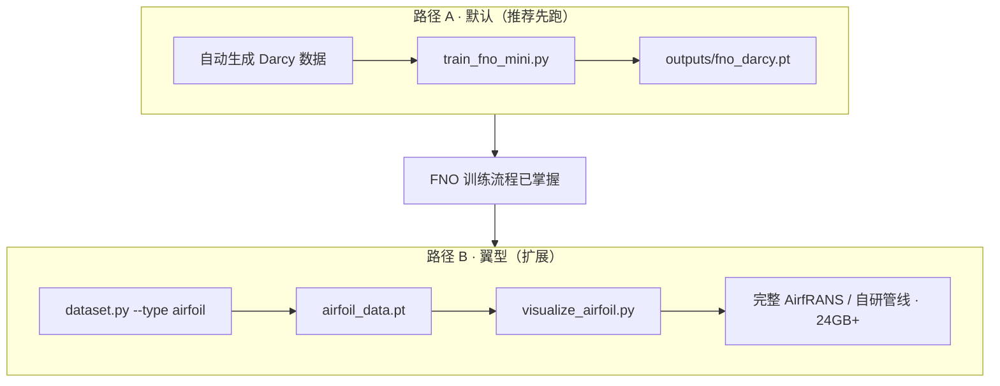

# 第 4 章一页纸：翼型叙事 vs Darcy 默认训练

> 读完即可回答：「为什么文件夹叫 `airfoil`，跑的却是 Darcy？」

## 1. 一句话

| | |
|:---|:---|
| **章名 / 目录** `ch04_fno_airfoil` | 工业场景是 **翼型绕流**（航空 CFD 代理模型） |
| **默认脚本** `train_fno_mini.py` | 训练数据是 **Darcy 渗流**（合成、轻量、无需下载 AirfRANS） |
| **原因** | 先学会 **FNO 训练范式**（数据→模型→推理），再换翼型真数据 |

FNO 的数学与代码路径在两条路上 **相同**；变的是「输入场 → 输出场」的物理含义与数据集。

---

## 2. 两条数据路径

| | 路径 A：Darcy 微缩 | 路径 B：翼型 |
|:---|:---|:---|
| **物理** | 渗透率场 → 压力场 | 翼型几何/来流 → 压力/速度场 |
| **数据文件** | `data/darcy_data.pt` | `data/airfoil_data.pt`（可选生成） |
| **训练入口** | `python train_fno_mini.py --epochs 30` | 默认同左；完整翼型 RANS 需另建数据管线 |
| **显存** | ~8GB | 合成翼型数据生成轻；AirfRANS 建议 24GB+ |
| **章节角色** | **仓库默认、快速通道** | **叙事目标、行业映射** |

---

## 3. 框架切换（ch3 → ch4）

| | ch1–ch3 | ch4–ch7 |
|:---|:---|:---|
| **包** | `physicsnemo-sym` | `physicsnemo` 主框架 |
| **范式** | PINN：PDE + 配点 + 约束 | 神经算子：数据集 + MSE（+ 可选物理项） |
| **典型 API** | `Domain`, `Constraint`, `Solver` | `physicsnemo.models.fno.FNO` 等 |
| **本书脚本** | `*_sym` / 裸 PyTorch PINN | `train_fno_*.py`, `train_afno_*.py` |

详见教材 [book/ch04.md §4.1](../book/ch04.md)。

---

## 4. 推荐顺序

1. `python train_fno_mini.py --epochs 30`（路径 A）  
2. `python dataset.py --type airfoil` + `visualize_airfoil.py`（了解路径 B 数据长什么样）  
3. 阅读正文 AirfRANS / 完整翼型节（有 GPU 与数据时再跑）

命令表：[docs/COMMAND_REFERENCE.md](../docs/COMMAND_REFERENCE.md)
