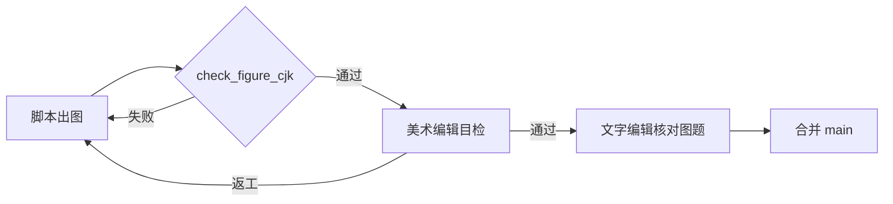

# 教材配图美术质检与整改意见（待主编 Review）

> **文档性质**：图书文字编辑 × 插图美术编辑联合出品。  
> **抽检日期**：2026-05-19 · **执行**：2026-05-19（路线 A：Matplotlib + 内置 Noto Sans SC，见 #100–#103）  
> **范围**：`book/assets/*.png`（共 54 张）+ 生成脚本 `book/scripts/generate_*.py`  
> **关联体例**：[book/STYLE.md](../book/STYLE.md)、[book/assets/FIGURE_MANIFEST.md](../book/assets/FIGURE_MANIFEST.md)

---

## 一、结论（请先读）

### 1.1 上一轮「格式审读」的盲区

上一轮修订聚焦 **Markdown 体例**（图号、章首章末、附录顺序），**未做像素级配图验收**，因此未能发现大量 **方块字（tofu，□）**——这是科技图书质检中的典型分工缺口：

| 角色 | 应负责 | 上一轮是否覆盖 |
|:---|:---|:---|
| **文字编辑** | 图题、图号、正文引用、图注一致性 | ✅ 部分覆盖 |
| **插图美术编辑** | 字形、字号、留白、色彩、分辨率、中文可读性、与品牌风格 | ❌ 未覆盖 |
| **制作技术** | 出图环境、字体嵌入、可复现构建 | ❌ 未覆盖 |

**建议**：本书后续所有配图变更，实行 **「美术编辑签字 + 脚本可复现」双门禁**，再合并进 `main`。

### 1.2 是否应请插图美术编辑？

**应请，且有必要与文字编辑搭档。**

理由：

1. 当前约 **半数以上为 Matplotlib 程序化示意图**，故障模式单一（CJK 字体缺失），但 **整改不等于只改代码**——横幅、路线图、行业映射图还涉及版式、信息层级、与正文风格统一，需要美术判断。
2. 另有 **数据类曲线/场图** 需核对色标、单位、科学表达是否与正文一致，属于 **技术插画编辑** 范畴。
3. 书中多处 `FIGURE_MANIFEST` 仍标注「Gemini 插画」意向，与现网 PNG **混用两套视觉语言**，需美术统一。

---

## 二、问题定义：什么是「方块字」

- **表现**：图中中文变为空心方框 `□`（俗称 tofu、豆腐块、方块字）。
- **读者影响**：标题、图例、流程节点不可读，**比无图更严重**（损害专业信任）。
- **技术根因（已核实）**：`book/scripts/generate_diagram_figures.py` 与 `generate_all_figures.py` 虽配置 `PingFang SC` / `Noto Sans CJK SC` 等，但 **出图环境若无对应字体**（常见于 Linux CI、Docker、无中文系统的云主机），Matplotlib 会 **静默回退** 至 `DejaVu Sans`，中文缺字即显示为方框。
- **为何部分图正常、部分失败**：同一仓库内 PNG **可能来自不同机器/不同次生成**；含少量汉字且被替代的图（如仅「综述」二字）呈 **局部方块**；纯英文节点图则 **表面正常**。

---

## 三、抽检方法（本次已执行）

| 步骤 | 做法 |
|:---|:---|
| 1 | 列出 54 个 PNG 与脚本 `save()` 映射 |
| 2 | **像素级抽检 22 张**（覆盖 ch0–ch7 横幅、路线图、行业图、数据图各类型） |
| 3 | 对照脚本内中文字符串，推断未抽检文件的 **风险等级** |
| 4 | 插图美术编辑视角补充：版式、箭头压字、信息完整性 |

> **说明**：完整 54 张全量人工过目应在整改执行阶段由美术编辑完成；本表「推断高风险」项需在改图时 **逐张打开确认**。

---

## 四、分级标准

| 等级 | 含义 | 处理时限 |
|:---|:---|:---|
| **🔴 P0** | 中文标题/图例/节点 **全部或大部分为方块**，或核心信息不可读 | 出版/合并前必须更换 |
| **🟠 P1** | **局部方块**（如「PIML □□」）或标题方块但英文可读 | 同批次更换 |
| **🟡 P2** | 中文可读，但有 **压字、字号过小、缺图例/色标** 等美术问题 | 可排期第二轮 |
| **🟢 P3** | 纯英文/数值图，抽检无方块 | 仅做风格统一时可动 |

---

## 五、配图整改清单（54 张）

### 5.1 🔴 P0 — 已抽检确认存在方块字（必须重出）

| 文件 | 图号（正文） | 类型 | 抽检问题摘要 | 脚本来源 |
|:---|:---|:---|:---|:---|
| `f0_1_ai4s_timeline.png` | F0.1 | 时间线 | 「PIML **□□**」等中文标签方块 | `generate_diagram_figures.py` |
| `f0_4_book_roadmap.png` | F0.3 | 路线图 | 标题与 ch0/ch7 节点中文全方块 | 同上 |
| `f1_0_banner.png` | F1.0 | 章横幅 | 「第 1 章」等标题方块 | 同上 |
| `f1_1_roadmap.png` | F1.1 | 路线图 | 标题与多节点中文方块 | 同上 |
| `f1_3_spring_diagram.png` | F1.4 | 示意图 | 底部「胡克定律…」共 10 字方块 | 同上 |
| `f2_1_roadmap.png` | F2.1 | 路线图 | 标题、钩子、三件套等方块 | 同上 |
| `f3_0_banner.png` | F3.0 | 章横幅 | 章题中文方块 | 同上 |
| `f3_4_csg.png` | F3.4 | 示意图 | 「矩形 A/B」中文方块 | 同上 |
| `f3_9_design_loop.png` | F3.9 | 流程图 | 标题与「优化」「复核」等方块 | 同上 |
| `f4_0_banner.png` | F4.0 | 章横幅 | 章题中文方块 | 同上 |
| `f4_1_framework_switch.png` | F4.1 | 结构图 | 顶部标题 4 字方块 | 同上 |
| `f4_5_fno_block.png` | F4.5 | 流程图 | 多节点中文标签方块 | 同上 |
| `f5_0_banner.png` | F5.0 | 章横幅 | 章题中文方块 | 同上 |
| `f5_8_industry_map.png` | F5.7 | 柱状图 | **标题、轴标签、类目全方块** | 同上 |
| `f6_5_weather_industry.png` | F6.5 | 示意图 | 标题中文全方块 | 同上 |

### 5.2 🟠 P1 — 推断高风险（脚本含大量中文，本次未逐张打开）

> **美术编辑执行时**：以下默认按 P0 处理，打开后若无方块可降为 P2。

**来源 `generate_diagram_figures.py`（概念图/横幅/路线图，共 28 张逻辑产出）：**

| 文件 | 图号 | 含中文要点 |
|:---|:---|:---|
| `f1_7_physicsnemo_arch.png` | F1.8 | 标题「双框架架构」 |
| `f2_4_physics_intuition.png` | F2.4 | 标题「热扩散：…」 |
| `f3_1_progression.png` | F3.1 | 维度递进、1D/2D/3D 节点 |
| `f3_3_geometry.png` | F3.3 | 芯片、鳍片标签 |
| `f3_5_boundary_conditions.png` | F3.5 | BC 流程中文 |
| `f3_6_domain_constraint.png` | F3.6 | 部分中文节点 |
| `f3_8_inverse_flow.png` | F3.8 | 反问题流程 |
| `f4_4_neural_operator.png` | F4.4 | 输入函数/神经算子/一族工况 |
| `f4_6_data_pipeline.png` | F4.6 | 预处理、张量数据集等 |
| `f5_1_triangle.png` | F5.1 | 顶点「数据」等 |
| `f5_3_darcy_physics.png` | F5.3 | 渗透率、渗流标题 |
| `f6_0_banner.png` | F6.0 | 章横幅 |
| `f6_1_afno_block.png` | F6.1 | 输入场、自回归等 |
| `f6_3_autoregressive.png` | F6.3 | 标题「自回归 rollout」 |
| `f7_0_banner.png` | F7.0 | 章横幅 |
| `f7_1_pipeline.png` | F7.1 | 训练、优化等节点 |

**来源 `generate_all_figures.py`（数据图，26 张）— 含中文轴/图例，环境无字体时可能方块：**

| 文件 | 图号 | 备注 |
|:---|:---|:---|
| `f1_4_mlp_results.png` | F1.5 等 | 训练损失、外推区域等 |
| `f1_5_pinn_results.png` | F1.6 | 同上 |
| `f1_5_2_extrapolation.png` | F1.7 | MLP/PINN 外推标题 |
| `f2_2_loss_curves.png` | F2.2 | **本次抽检中文正常** ✅ |
| `f2_3_temperature_evolution.png` | F2.3 | 轴标签中文 |
| `f2_5_collocation_points.png` | F2.5 | 配点图例 |
| `f2_7_depth_sweep.png` 等 | F2.6–F2.8 | 调参图 |
| `f3_2_temperature_field.png` | F3.2 | 多为英文 colorbar |
| `f3_7_loss_curves.png` | F3.7 | 四条 loss 中文图例 |
| `f4_2`–`f4_9` | F4.2–F4.9 | 部分 title/label 中文 |
| `f5_2`–`f5_7` | F5.2–F5.6 | 对比实验轴标签 |
| `f6_2`、`f6_4` | F6.2、F6.4 | rollout 相关 |

### 5.3 🟢 P3 — 本次抽检通过或主要为英文

| 文件 | 图号 | 说明 |
|:---|:---|:---|
| `f0_2_cfd_vs_ai_comparison.png` | F0.2 | 中文轴、图例 **可读** ✅ |
| `f2_2_loss_curves.png` | F2.2 | 中文 **可读** ✅ |
| `f4_3_pinn_vs_fno.png` | F4.3 | 节点为 PINN/FNO 英文 |

其余场图、误差热力图等 **需美术编辑补查色标与单位**，本次未报方块但可能有 P2 美术问题。

---

## 六、插图美术编辑 — 整改方案（技术 + 美术）

### 6.1 路线选择（请主编勾选）

| 方案 | 做法 | 优点 | 缺点 | 美术编辑建议 |
|:---|:---|:---|:---|:---|
| **A. 字体工程化（推荐基线）** | 仓库内置 `book/assets/fonts/NotoSansSC-Regular.otf`，脚本 `FontProperties` 强制加载；CI 跑 `check_figures_cjk.py` 扫描方块 | 可复现、与代码同步 | 审美偏「工程图」 | 统一色板、字号、横幅模板 |
| **B. 设计稿重绘** | 按 `FIGURE_MANIFEST` 用 Figma/Illustrator 或指定 Gemini 提示词重出横幅/路线图 | 视觉统一、品牌感强 | 成本高、难随代码自动更新 | **P0 横幅、全书路线图优先** |
| **C. 中英双轨** | 概念图节点改为英文+正文中文图题；数据图保留中文但锁字体 | 改动小 | 与「中文教材」定位略冲突 | 仅作临时止血，不建议长期使用 |

**联合建议**：**A + B 组合** — 数据类走 A；ch0 全书路线图、各章 **f*_0_banner**、行业映射（f5_8、f6_5、f3_9）走 B 或严格模板的 A。

### 6.2 美术规范（整改时统一）

| 项目 | 规范 |
|:---|:---|
| 中文字体 | 首选 **Noto Sans SC** 或 **Source Han Sans SC**；禁止依赖系统 PingFang |
| 字号 | 章横幅主标题 ≥ 20 pt，副标题 ≥ 12 pt；路线图节点 ≥ 10 pt |
| 留白 | 横幅上下留白 ≥ 15%；流程框内文字不贴边 |
| 箭头 | **不得压住文字**（现有多张路线图箭头压 PINN/SDK 字母） |
| 分辨率 | 位图 **≥ 150 DPI**，宽图 ≥ 1200 px |
| 色板 | 与 `generate_all_figures.py` 中 `tab10` 对齐，或另定 6 色「教材色」写入 `STYLE.md` |
| 导出 | PNG-24，白底；若印 PDF 需另存 CMYK 或高分辨率 PDF（印厂定） |

### 6.3 技术任务（给工程 / 排版）

1. 新增 `book/assets/fonts/` 并 **LICENSE 说明**（OFL）。  
2. 修改 `generate_diagram_figures.py`、`generate_all_figures.py`：启动时 `if not font_exists: raise`，避免静默方块。  
3. 新增 `scripts/check_figure_cjk.py`：对 PNG 做抽样 OCR 或比对渲染 hash（可选 [fontTools] + 重渲染 diff）。  
4. 在 `docs/ENVIRONMENT.md` 增加：**「生成配图前必须能渲染中文」**。  
5. 全文 **批量重跑** `generate_diagram_figures.py` + `generate_all_figures.py` 后，由美术编辑 **逐张签字**。

---

## 七、图书编辑 — 配套文字整改

| 项 | 意见 |
|:---|:---|
| 图题 | 方块图对应的图题在正文中仍可读；**重出图后不必改图号**（除非换图改内容） |
| 正文引用 | 检查「见上图 F3.9 闭环」等叙述是否与图中 **可见文字** 一致 |
| 图注 | 若采用方案 C（图中英文化），须在图下增加 **中文图注** 补足 |
| 版权 | 若用 Gemini/外部素材重绘，在 `docs/LICENSE_NOTES.md` 补充 AI 生成图声明 |
| 占位 | `assets/wechat_qrcode.png` 为占位，与配图方块字问题无关，但印前需换正式二维码 |

---

## 八、建议工作流程（出版门禁）

1. **出图 PR** 必须附带：`before/after` 对比截图（至少 P0 全集）。  
2. **禁止** 在无 CJK 字体的 CI 里自动提交 `book/assets/*.png`。  
3. 主编 **Review 本文件第五节清单**，勾选采用的方案（A/B/C）。

---

## 九、待您 Review 的决策项

请在本文件 PR 评论或 Issue 中勾选：

- [ ] **是否同意增设插图美术编辑角色**（可外聘/兼职，按章验收）  
- [x] **整改路线**：**A**（Matplotlib + Noto；数据图与概念图均程序化重出）  
- [x] **P0 一次性重出**：diagram + data 脚本已全量重跑（分支 `book/figure-cjk-fix`）  
- [ ] **是否接受临时方案**：先下架最严重 P0 图（已用路线 A 替代，无需）  
- [x] 分支 **`book/figure-cjk-fix`**（与体例 PR 分开）

**生图模型选型（已采纳）**：含精确中文标签的 54 张图 **不使用** DALL·E/Gemini 文生图；使用 **Matplotlib 2D 渲染引擎 + Noto Sans SC 字体嵌入**（可复现、字面准确）。

---

## 十、附录：已抽检确认方块字截图索引

（整改时用于 before 归档，执行阶段可贴入 PR）

| 序号 | 文件 | 典型现象 |
|:---:|:---|:---|
| 1 | f0_1 | `PIML □□` |
| 2 | f0_4 | 标题 `□□ 7 □□` |
| 3 | f1_0 | `□ 1 □` / 副标题方块 |
| 4 | f1_1 | 路线图标题与节点方块 |
| 5 | f5_8 | 柱状图标题与轴全方块 |
| 6 | f6_5 | 标题 `□□ AI □□□□` |

---

## 十一、路线 B：Gemini / 插画升级

- **提示词手册**：[BOOK_FIGURE_GEMINI_PROMPTS.md](BOOK_FIGURE_GEMINI_PROMPTS.md)  
- **试稿目录**：`book/assets/gemini/`（验收后覆盖 `book/assets/`）  
- **Issues**：#110（文档）· #111（P0）· #112（P1）· #113（P2）  
- **配图决策（已确认 2026-05-19）**：[BOOK_FIGURE_MEDIA_DECISIONS.md](BOOK_FIGURE_MEDIA_DECISIONS.md) · P3 执行 [#115](https://github.com/binbinao/physicsnemo-from-zero-to-one/issues/115)

---

*文档版本：v1.2 · 路线 A 已执行；路线 B P0–P2 试稿已覆盖（工业风横幅 v2，见 #113）*
